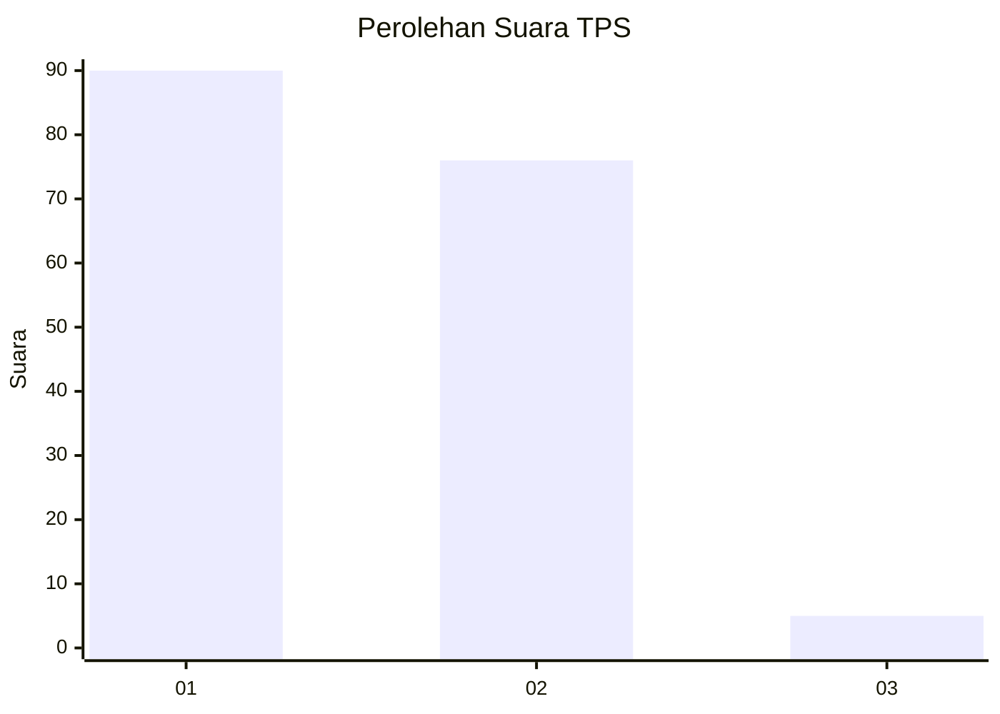
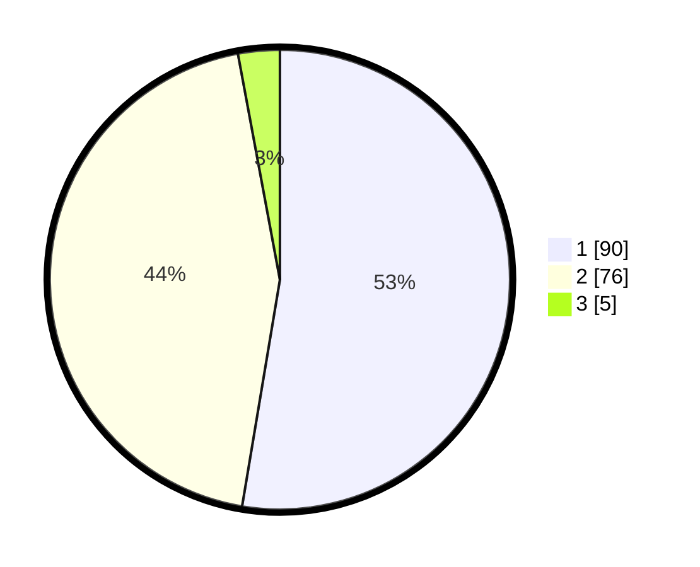

# Hasil

## Grafik

## Tabel

| No. | Nama Paslon    | Suara | Suara (raw) | Persentase |
|:--- |:-------------- | -----:| -----------:| ----------:|
| 1   | ANIES MUHAIMIN | 90    | [90][p-1]   | 52,63      |
| 2   | PRABOWO GIBRAN | 76    | [76][p-2]   | 44,44      |
| 3   | GANJAR MAHFUD  | 5     | [5][p-3]    | 2,92       |

[p-1]: https://github.com/gigit-pemilu/pemilu-2024-63-kalimantan-selatan/blob/main/pilpres/hitung-suara/sub/63-kalimantan-selatan/sub/01-tanah-laut/sub/01-takisung/sub/2001-benua-lawas/sub/002-tps/sub/paslon-1.txt
[p-2]: https://github.com/gigit-pemilu/pemilu-2024-63-kalimantan-selatan/blob/main/pilpres/hitung-suara/sub/63-kalimantan-selatan/sub/01-tanah-laut/sub/01-takisung/sub/2001-benua-lawas/sub/002-tps/sub/paslon-2.txt
[p-3]: https://github.com/gigit-pemilu/pemilu-2024-63-kalimantan-selatan/blob/main/pilpres/hitung-suara/sub/63-kalimantan-selatan/sub/01-tanah-laut/sub/01-takisung/sub/2001-benua-lawas/sub/002-tps/sub/paslon-3.txt

## Foto C Plano

https://sirekap-obj-formc.kpu.go.id/c3af/pemilu/ppwp/63/01/01/20/01/6301012001002-20240216-211519--7954aec0-b5d3-4356-9f52-db2c51a80b50.jpg

https://sirekap-obj-formc.kpu.go.id/c3af/pemilu/ppwp/63/01/01/20/01/6301012001002-20240216-174955--9548d90b-6b93-407b-9a9e-f7bd1594ab98.jpg

https://sirekap-obj-formc.kpu.go.id/c3af/pemilu/ppwp/63/01/01/20/01/6301012001002-20240216-211520--fad7f36a-4dcd-4a89-ac06-464e9d4272d4.jpg

## Metadata

| Key        | Value               |
| ---------- | ------------------- |
| Time Stamp | 2024-02-16 22:01:00 |

## DATA PEMILIH TETAP

Jumlah pemilih dalam DPT: **207**.
 * L: **100**.
 * P: **107**.

## DATA PENGGUNA HAK PILIH

Jumlah pengguna hak pilih dalam DPT: **182**.
 * L: **85**.
 * P: **97**.

Jumlah pengguna hak pilih dalam DPTb: **0**.
 * L: **0**.
 * P: **0**.

Jumlah pengguna hak pilih dalam DPK: **3**.
 * L: **3**.
 * P: **0**.

Jumlah pengguna hak pilih: **185**.
 * L: **88**.
 * P: **97**.

## JUMLAH SUARA SAH DAN TIDAK SAH

JUMLAH SELURUH SUARA SAH: **171**.

JUMLAH SUARA TIDAK SAH: **14**.

JUMLAH SELURUH SUARA SAH DAN SUARA TIDAK SAH: **185**.

