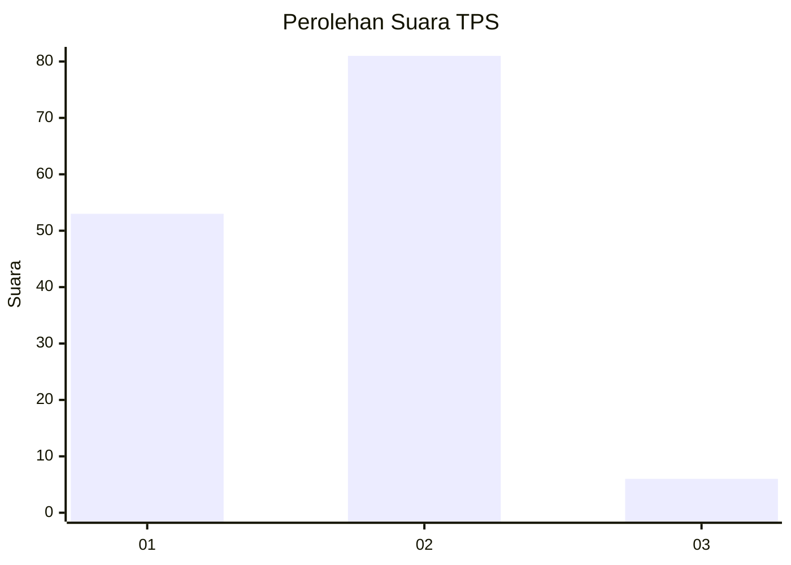
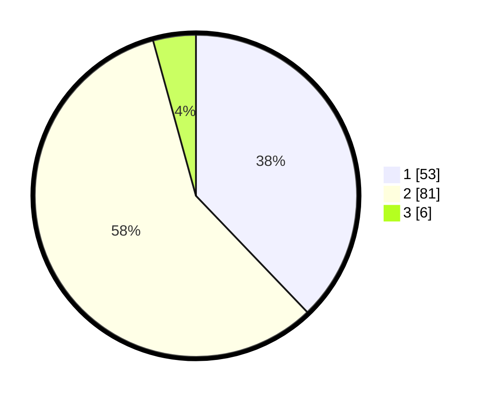

# Hasil

## Grafik

## Tabel

| No. | Nama Paslon    | Suara | Suara (raw) | Persentase |
|:--- |:-------------- | -----:| -----------:| ----------:|
| 1   | ANIES MUHAIMIN | 53    | [53][p-1]   | 37,86      |
| 2   | PRABOWO GIBRAN | 81    | [81][p-2]   | 57,86      |
| 3   | GANJAR MAHFUD  | 6     | [6][p-3]    | 4,29       |

[p-1]: https://github.com/gigit-pemilu/pemilu-2024-63-kalimantan-selatan/blob/main/pilpres/hitung-suara/sub/63-kalimantan-selatan/sub/01-tanah-laut/sub/01-takisung/sub/2001-benua-lawas/sub/003-tps/sub/paslon-1.txt
[p-2]: https://github.com/gigit-pemilu/pemilu-2024-63-kalimantan-selatan/blob/main/pilpres/hitung-suara/sub/63-kalimantan-selatan/sub/01-tanah-laut/sub/01-takisung/sub/2001-benua-lawas/sub/003-tps/sub/paslon-2.txt
[p-3]: https://github.com/gigit-pemilu/pemilu-2024-63-kalimantan-selatan/blob/main/pilpres/hitung-suara/sub/63-kalimantan-selatan/sub/01-tanah-laut/sub/01-takisung/sub/2001-benua-lawas/sub/003-tps/sub/paslon-3.txt

## Foto C Plano

https://sirekap-obj-formc.kpu.go.id/fa9b/pemilu/ppwp/63/01/01/20/01/6301012001003-20240215-001510--4e286b4f-df88-4c55-997b-b7d1c63830e7.jpg

https://sirekap-obj-formc.kpu.go.id/fa9b/pemilu/ppwp/63/01/01/20/01/6301012001003-20240218-154757--1d92582b-a366-473b-a0f5-b89137dfecd8.jpg

https://sirekap-obj-formc.kpu.go.id/fa9b/pemilu/ppwp/63/01/01/20/01/6301012001003-20240215-001237--27c06fd4-c6b9-460b-aa8e-f03951dfe810.jpg

## Metadata

| Key        | Value               |
| ---------- | ------------------- |
| Time Stamp | 2024-02-19 09:00:00 |

## DATA PEMILIH TETAP

Jumlah pemilih dalam DPT: **197**.
 * L: **101**.
 * P: **96**.

## DATA PENGGUNA HAK PILIH

Jumlah pengguna hak pilih dalam DPT: **152**.
 * L: **76**.
 * P: **16**.

Jumlah pengguna hak pilih dalam DPTb: **4**.
 * L: **2**.
 * P: **2**.

Jumlah pengguna hak pilih dalam DPK: **0**.
 * L: **0**.
 * P: **0**.

Jumlah pengguna hak pilih: **0**.
 * L: **0**.
 * P: **0**.

## JUMLAH SUARA SAH DAN TIDAK SAH

JUMLAH SELURUH SUARA SAH: **140**.

JUMLAH SUARA TIDAK SAH: **16**.

JUMLAH SELURUH SUARA SAH DAN SUARA TIDAK SAH: **156**.

