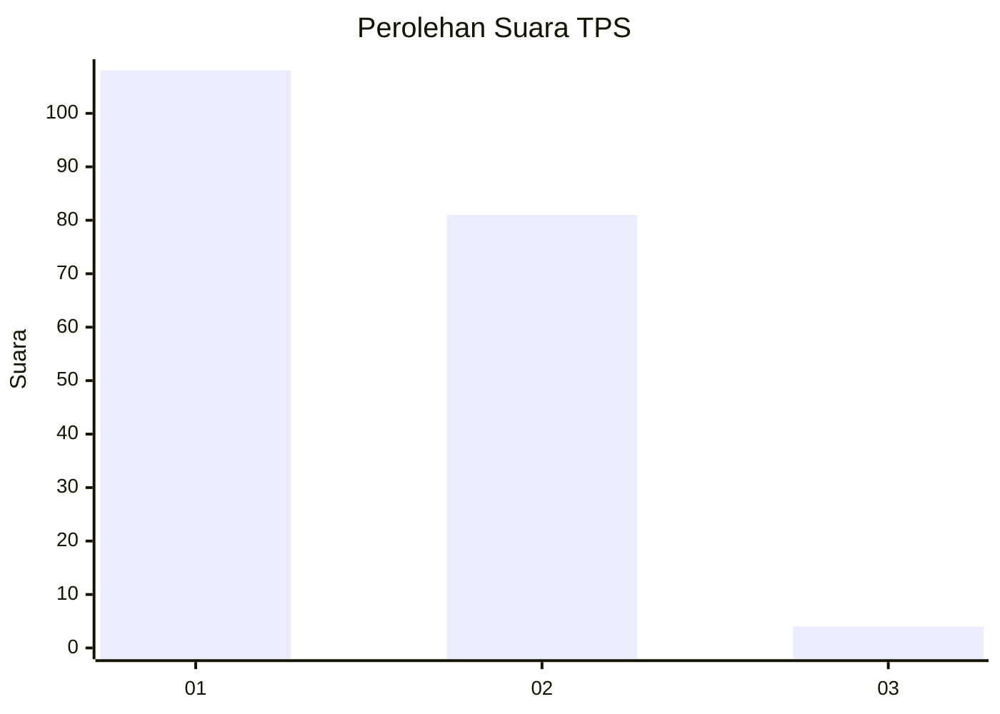
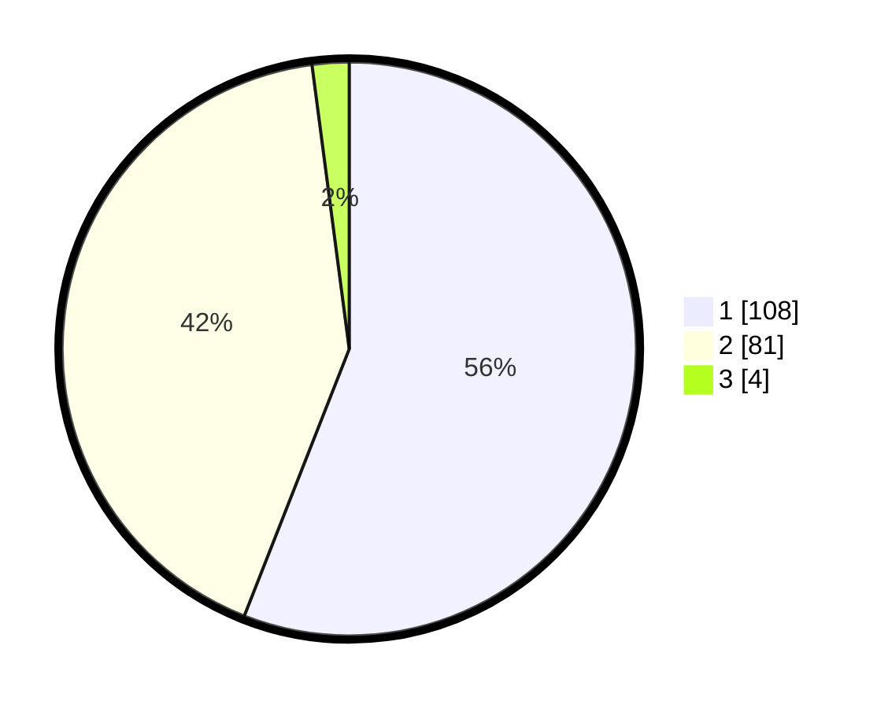

# Hasil

## Grafik

## Tabel

| No. | Nama Paslon    | Suara | Suara (raw) | Persentase |
|:--- |:-------------- | -----:| -----------:| ----------:|
| 1   | ANIES MUHAIMIN | 108   | [108][p-1]  | 55,96      |
| 2   | PRABOWO GIBRAN | 81    | [81][p-2]   | 41,97      |
| 3   | GANJAR MAHFUD  | 4     | [4][p-3]    | 2,07       |

[p-1]: https://github.com/gigit-pemilu/pemilu-2024-63-kalimantan-selatan/blob/main/pilpres/hitung-suara/sub/63-kalimantan-selatan/sub/01-tanah-laut/sub/01-takisung/sub/2001-benua-lawas/sub/004-tps/sub/paslon-1.txt
[p-2]: https://github.com/gigit-pemilu/pemilu-2024-63-kalimantan-selatan/blob/main/pilpres/hitung-suara/sub/63-kalimantan-selatan/sub/01-tanah-laut/sub/01-takisung/sub/2001-benua-lawas/sub/004-tps/sub/paslon-2.txt
[p-3]: https://github.com/gigit-pemilu/pemilu-2024-63-kalimantan-selatan/blob/main/pilpres/hitung-suara/sub/63-kalimantan-selatan/sub/01-tanah-laut/sub/01-takisung/sub/2001-benua-lawas/sub/004-tps/sub/paslon-3.txt

## Foto C Plano

https://sirekap-obj-formc.kpu.go.id/0224/pemilu/ppwp/63/01/01/20/01/6301012001004-20240214-234413--ec9adfb8-e5f0-4606-9306-f488395e2d36.jpg

https://sirekap-obj-formc.kpu.go.id/0224/pemilu/ppwp/63/01/01/20/01/6301012001004-20240214-193402--4b4bfc18-be51-4095-b9fa-1c1c36965702.jpg

https://sirekap-obj-formc.kpu.go.id/0224/pemilu/ppwp/63/01/01/20/01/6301012001004-20240214-234719--f46d1402-ef41-428a-9e42-dcc0f4e15f2c.jpg

## Metadata

| Key        | Value               |
| ---------- | ------------------- |
| Time Stamp | 2024-02-15 15:00:29 |

## DATA PEMILIH TETAP

Jumlah pemilih dalam DPT: **243**.
 * L: **123**.
 * P: **120**.

## DATA PENGGUNA HAK PILIH

Jumlah pengguna hak pilih dalam DPT: **204**.
 * L: **98**.
 * P: **106**.

Jumlah pengguna hak pilih dalam DPTb: **2**.
 * L: **0**.
 * P: **2**.

Jumlah pengguna hak pilih dalam DPK: **0**.
 * L: **0**.
 * P: **0**.

Jumlah pengguna hak pilih: **206**.
 * L: **98**.
 * P: **108**.

## JUMLAH SUARA SAH DAN TIDAK SAH

JUMLAH SELURUH SUARA SAH: **193**.

JUMLAH SUARA TIDAK SAH: **13**.

JUMLAH SELURUH SUARA SAH DAN SUARA TIDAK SAH: **206**.

