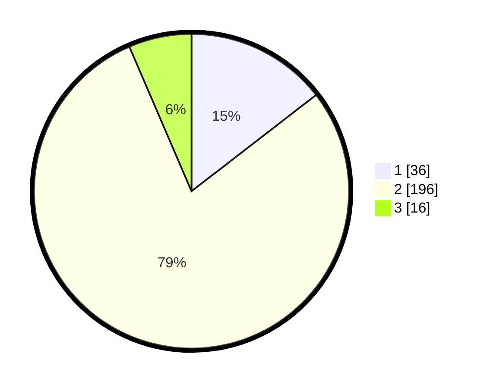

# Hasil

## Grafik

## Tabel

| No. | Nama Paslon    | Suara | Suara (raw) | Persentase |
|:--- |:-------------- | -----:| -----------:| ----------:|
| 1   | ANIES MUHAIMIN | 36    | [36][p-1]   | 14,52      |
| 2   | PRABOWO GIBRAN | 196   | [196][p-2]  | 79,03      |
| 3   | GANJAR MAHFUD  | 16    | [16][p-3]   | 6,45       |

[p-1]: https://github.com/gigit-pemilu/pemilu-2024/blob/main/pilpres/hitung-suara/sub/63-kalimantan-selatan/sub/01-tanah-laut/sub/02-jorong/sub/2001-sabuhur/sub/012-tps/sub/paslon-1.txt
[p-2]: https://github.com/gigit-pemilu/pemilu-2024/blob/main/pilpres/hitung-suara/sub/63-kalimantan-selatan/sub/01-tanah-laut/sub/02-jorong/sub/2001-sabuhur/sub/012-tps/sub/paslon-2.txt
[p-3]: https://github.com/gigit-pemilu/pemilu-2024/blob/main/pilpres/hitung-suara/sub/63-kalimantan-selatan/sub/01-tanah-laut/sub/02-jorong/sub/2001-sabuhur/sub/012-tps/sub/paslon-3.txt

## Foto C Plano

https://sirekap-obj-formc.kpu.go.id/20af/pemilu/ppwp/63/01/02/20/01/6301022001012-20240215-025255--d2c127e9-eb06-471c-85c5-1b5ee7aad533.jpg

https://sirekap-obj-formc.kpu.go.id/20af/pemilu/ppwp/63/01/02/20/01/6301022001012-20240215-025339--782040e3-308e-4132-8874-e2e3ec1f7de7.jpg

https://sirekap-obj-formc.kpu.go.id/20af/pemilu/ppwp/63/01/02/20/01/6301022001012-20240215-025415--05400860-20b3-4db3-89f3-85d64e89bb72.jpg

## Metadata

| Key        | Value               |
| ---------- | ------------------- |
| Time Stamp | 2024-02-15 15:00:29 |

