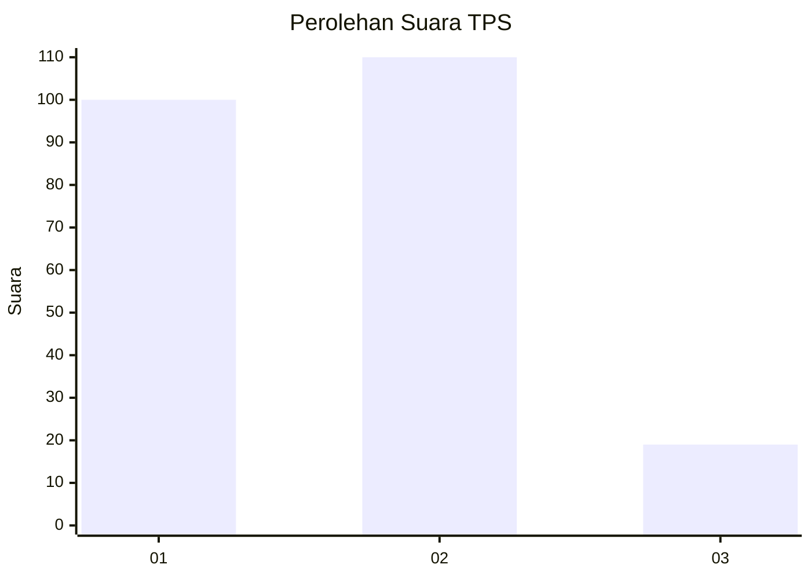
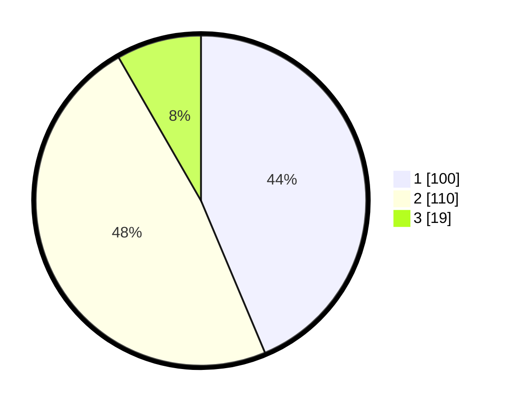

# Hasil

## Grafik

## Tabel

| No. | Nama Paslon    | Suara | Suara (raw) | Persentase |
|:--- |:-------------- | -----:| -----------:| ----------:|
| 1   | ANIES MUHAIMIN | 100   | [100][p-1]  | 43,67      |
| 2   | PRABOWO GIBRAN | 110   | [110][p-2]  | 48,03      |
| 3   | GANJAR MAHFUD  | 19    | [19][p-3]   | 8,30       |

[p-1]: https://github.com/gigit-pemilu/pemilu-2024-63-kalimantan-selatan/blob/main/pilpres/hitung-suara/sub/63-kalimantan-selatan/sub/01-tanah-laut/sub/03-pelaihari/sub/1001-sarang-halang/sub/002-tps/sub/paslon-1.txt
[p-2]: https://github.com/gigit-pemilu/pemilu-2024-63-kalimantan-selatan/blob/main/pilpres/hitung-suara/sub/63-kalimantan-selatan/sub/01-tanah-laut/sub/03-pelaihari/sub/1001-sarang-halang/sub/002-tps/sub/paslon-2.txt
[p-3]: https://github.com/gigit-pemilu/pemilu-2024-63-kalimantan-selatan/blob/main/pilpres/hitung-suara/sub/63-kalimantan-selatan/sub/01-tanah-laut/sub/03-pelaihari/sub/1001-sarang-halang/sub/002-tps/sub/paslon-3.txt

## Foto C Plano

https://sirekap-obj-formc.kpu.go.id/a9d0/pemilu/ppwp/63/01/03/10/01/6301031001002-20240214-192332--ebce294f-8931-4d57-b9d0-d672e5f70f99.jpg

https://sirekap-obj-formc.kpu.go.id/a9d0/pemilu/ppwp/63/01/03/10/01/6301031001002-20240214-192511--1572df16-0e5e-40f7-9948-a3f0e1b22905.jpg

https://sirekap-obj-formc.kpu.go.id/a9d0/pemilu/ppwp/63/01/03/10/01/6301031001002-20240214-192746--0b4a4e7a-fd01-4447-8789-be778f7a8641.jpg

## Metadata

| Key        | Value               |
| ---------- | ------------------- |
| Time Stamp | 2024-02-14 21:46:01 |

