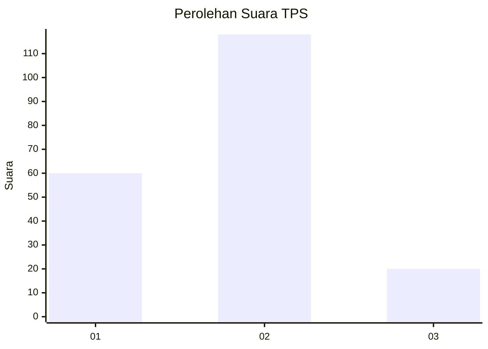
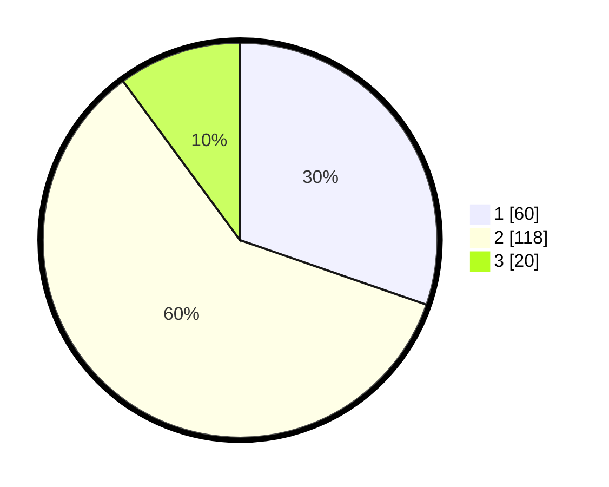

# Hasil

## Grafik

## Tabel

| No. | Nama Paslon    | Suara | Suara (raw) | Persentase |
|:--- |:-------------- | -----:| -----------:| ----------:|
| 1   | ANIES MUHAIMIN | 60    | [60][p-1]   | 30,30      |
| 2   | PRABOWO GIBRAN | 118   | [118][p-2]  | 59,60      |
| 3   | GANJAR MAHFUD  | 20    | [20][p-3]   | 10,10      |

[p-1]: https://github.com/gigit-pemilu/pemilu-2024-63-kalimantan-selatan/blob/main/pilpres/hitung-suara/sub/63-kalimantan-selatan/sub/01-tanah-laut/sub/03-pelaihari/sub/1001-sarang-halang/sub/006-tps/sub/paslon-1.txt
[p-2]: https://github.com/gigit-pemilu/pemilu-2024-63-kalimantan-selatan/blob/main/pilpres/hitung-suara/sub/63-kalimantan-selatan/sub/01-tanah-laut/sub/03-pelaihari/sub/1001-sarang-halang/sub/006-tps/sub/paslon-2.txt
[p-3]: https://github.com/gigit-pemilu/pemilu-2024-63-kalimantan-selatan/blob/main/pilpres/hitung-suara/sub/63-kalimantan-selatan/sub/01-tanah-laut/sub/03-pelaihari/sub/1001-sarang-halang/sub/006-tps/sub/paslon-3.txt

## Foto C Plano

https://sirekap-obj-formc.kpu.go.id/4ef3/pemilu/ppwp/63/01/03/10/01/6301031001006-20240214-215203--0e88ba7a-65e2-4ae0-bbfe-8681014dded8.jpg

https://sirekap-obj-formc.kpu.go.id/4ef3/pemilu/ppwp/63/01/03/10/01/6301031001006-20240214-215339--cfc54da3-8a5c-4a2e-9c2c-1f780a20508e.jpg

https://sirekap-obj-formc.kpu.go.id/4ef3/pemilu/ppwp/63/01/03/10/01/6301031001006-20240214-215447--f506d2b6-9446-4669-ad77-1a1853e7b54c.jpg

## Metadata

| Key        | Value               |
| ---------- | ------------------- |
| Time Stamp | 2024-02-15 19:00:26 |

