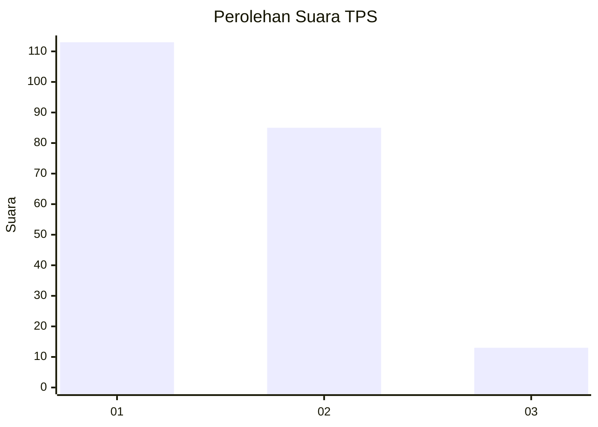
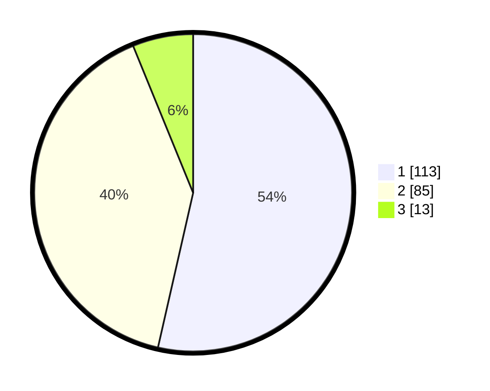

# Hasil

## Grafik

## Tabel

| No. | Nama Paslon    | Suara | Suara (raw) | Persentase |
|:--- |:-------------- | -----:| -----------:| ----------:|
| 1   | ANIES MUHAIMIN | 113   | [113][p-1]  | 53,55      |
| 2   | PRABOWO GIBRAN | 85    | [85][p-2]   | 40,28      |
| 3   | GANJAR MAHFUD  | 13    | [13][p-3]   | 6,16       |

[p-1]: https://github.com/gigit-pemilu/pemilu-2024/blob/main/pilpres/hitung-suara/sub/63-kalimantan-selatan/sub/01-tanah-laut/sub/03-pelaihari/sub/1001-sarang-halang/sub/010-tps/sub/paslon-1.txt
[p-2]: https://github.com/gigit-pemilu/pemilu-2024/blob/main/pilpres/hitung-suara/sub/63-kalimantan-selatan/sub/01-tanah-laut/sub/03-pelaihari/sub/1001-sarang-halang/sub/010-tps/sub/paslon-2.txt
[p-3]: https://github.com/gigit-pemilu/pemilu-2024/blob/main/pilpres/hitung-suara/sub/63-kalimantan-selatan/sub/01-tanah-laut/sub/03-pelaihari/sub/1001-sarang-halang/sub/010-tps/sub/paslon-3.txt

## Foto C Plano

https://sirekap-obj-formc.kpu.go.id/d951/pemilu/ppwp/63/01/03/10/01/6301031001010-20240214-193030--a7261e56-26b7-4697-aa29-8a478446d39b.jpg

https://sirekap-obj-formc.kpu.go.id/d951/pemilu/ppwp/63/01/03/10/01/6301031001010-20240214-193131--76703148-d342-4be1-a5cf-a193ef640e12.jpg

https://sirekap-obj-formc.kpu.go.id/d951/pemilu/ppwp/63/01/03/10/01/6301031001010-20240214-193257--e2ced1b9-0dd3-4d42-95cc-669dfea80d89.jpg

## Metadata

| Key        | Value               |
| ---------- | ------------------- |
| Time Stamp | 2024-02-15 15:00:29 |

