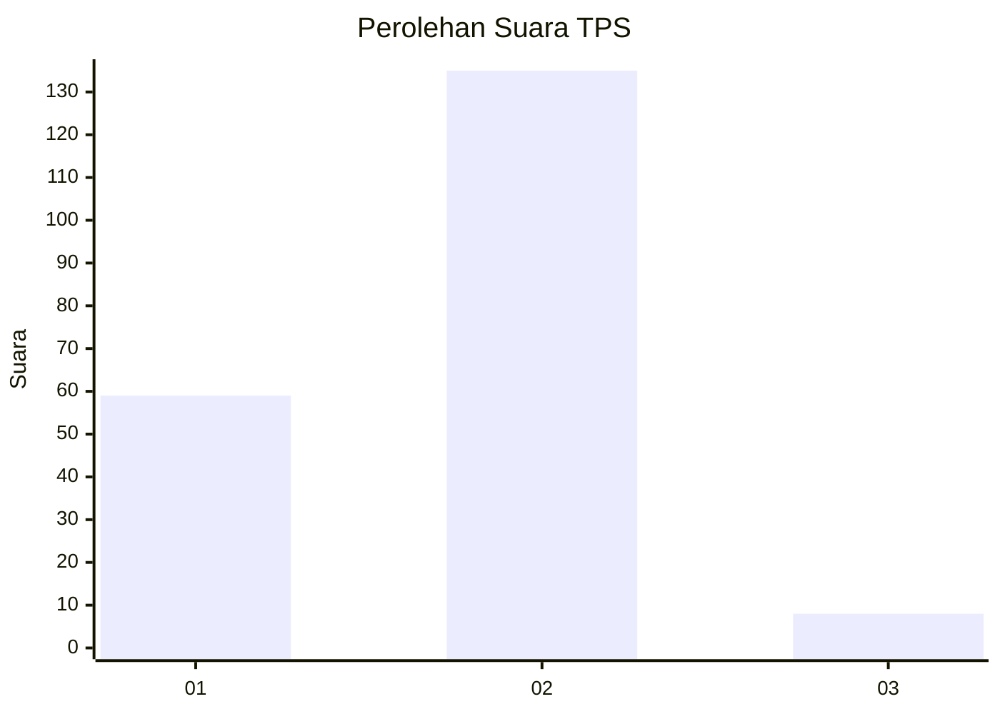
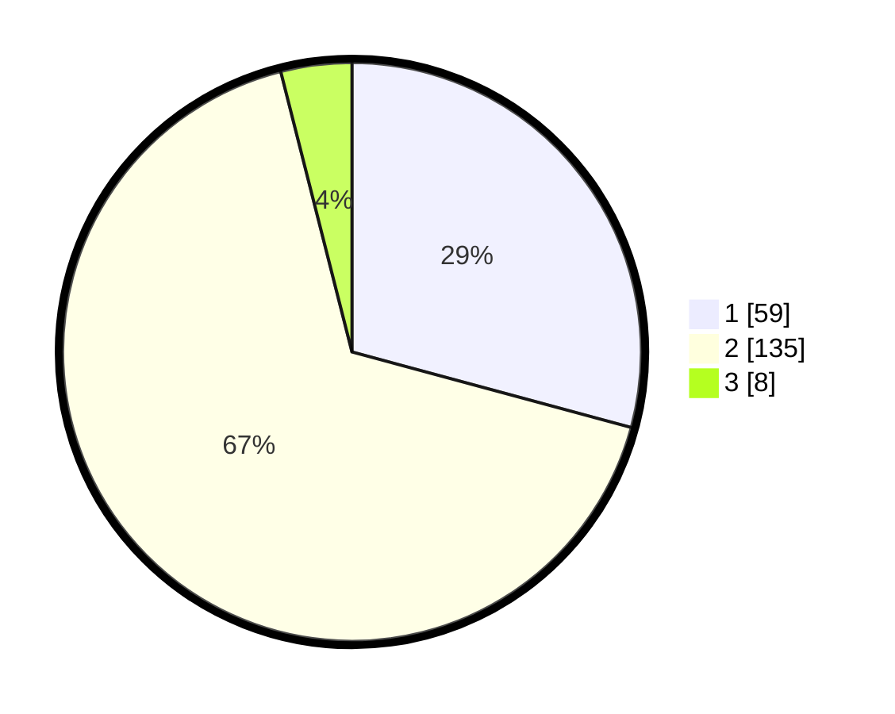

# Hasil

## Grafik

## Tabel

| No. | Nama Paslon    | Suara | Suara (raw) | Persentase |
|:--- |:-------------- | -----:| -----------:| ----------:|
| 1   | ANIES MUHAIMIN | 59    | [59][p-1]   | 29,21      |
| 2   | PRABOWO GIBRAN | 135   | [135][p-2]  | 66,83      |
| 3   | GANJAR MAHFUD  | 8     | [8][p-3]    | 3,96       |

[p-1]: https://github.com/gigit-pemilu/pemilu-2024/blob/main/pilpres/hitung-suara/sub/63-kalimantan-selatan/sub/01-tanah-laut/sub/03-pelaihari/sub/2010-telaga/sub/002-tps/sub/paslon-1.txt
[p-2]: https://github.com/gigit-pemilu/pemilu-2024/blob/main/pilpres/hitung-suara/sub/63-kalimantan-selatan/sub/01-tanah-laut/sub/03-pelaihari/sub/2010-telaga/sub/002-tps/sub/paslon-2.txt
[p-3]: https://github.com/gigit-pemilu/pemilu-2024/blob/main/pilpres/hitung-suara/sub/63-kalimantan-selatan/sub/01-tanah-laut/sub/03-pelaihari/sub/2010-telaga/sub/002-tps/sub/paslon-3.txt

## Foto C Plano

https://sirekap-obj-formc.kpu.go.id/13ec/pemilu/ppwp/63/01/03/20/10/6301032010002-20240216-193734--6550acbd-fc69-4898-b865-3f985121519a.jpg

https://sirekap-obj-formc.kpu.go.id/13ec/pemilu/ppwp/63/01/03/20/10/6301032010002-20240216-194248--88b627ba-4027-4abf-8056-f14787975340.jpg

https://sirekap-obj-formc.kpu.go.id/13ec/pemilu/ppwp/63/01/03/20/10/6301032010002-20240216-195021--962a5f13-d9c3-4b8c-8ff6-b600ed2d87dc.jpg

## Metadata

| Key        | Value               |
| ---------- | ------------------- |
| Time Stamp | 2024-02-17 09:00:02 |

## DATA PEMILIH TETAP

Jumlah pemilih dalam DPT: **264**.
 * L: **437**.
 * P: **524**.

## DATA PENGGUNA HAK PILIH

Jumlah pengguna hak pilih dalam DPT: **204**.
 * L: **407**.
 * P: **499**.

Jumlah pengguna hak pilih dalam DPTb: **0**.
 * L: **880**.
 * P: **400**.

Jumlah pengguna hak pilih dalam DPK: **44**.
 * L: **332**.
 * P: **84**.

Jumlah pengguna hak pilih: **244**.
 * L: **499**.
 * P: **499**.

## JUMLAH SUARA SAH DAN TIDAK SAH

JUMLAH SELURUH SUARA SAH: **202**.

JUMLAH SUARA TIDAK SAH: **7**.

JUMLAH SELURUH SUARA SAH DAN SUARA TIDAK SAH: **209**.

