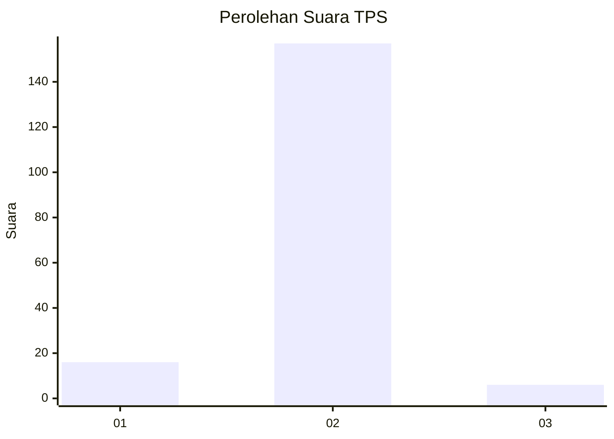
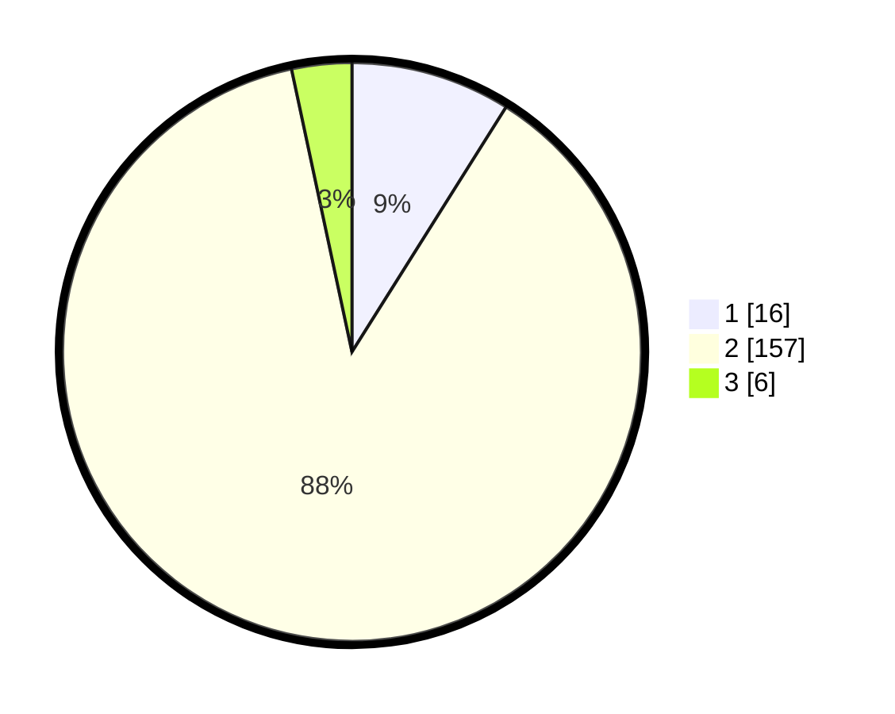

# Hasil

## Grafik

## Tabel

| No. | Nama Paslon    | Suara | Suara (raw) | Persentase |
|:--- |:-------------- | -----:| -----------:| ----------:|
| 1   | ANIES MUHAIMIN | 16    | [16][p-1]   | 8,94       |
| 2   | PRABOWO GIBRAN | 157   | [157][p-2]  | 87,71      |
| 3   | GANJAR MAHFUD  | 6     | [6][p-3]    | 3,35       |

[p-1]: https://github.com/gigit-pemilu/pemilu-2024-63-kalimantan-selatan/blob/main/pilpres/hitung-suara/sub/63-kalimantan-selatan/sub/01-tanah-laut/sub/04-kurau/sub/2002-maluka-baulin/sub/002-tps/sub/paslon-1.txt
[p-2]: https://github.com/gigit-pemilu/pemilu-2024-63-kalimantan-selatan/blob/main/pilpres/hitung-suara/sub/63-kalimantan-selatan/sub/01-tanah-laut/sub/04-kurau/sub/2002-maluka-baulin/sub/002-tps/sub/paslon-2.txt
[p-3]: https://github.com/gigit-pemilu/pemilu-2024-63-kalimantan-selatan/blob/main/pilpres/hitung-suara/sub/63-kalimantan-selatan/sub/01-tanah-laut/sub/04-kurau/sub/2002-maluka-baulin/sub/002-tps/sub/paslon-3.txt

## Foto C Plano

https://sirekap-obj-formc.kpu.go.id/0f27/pemilu/ppwp/63/01/04/20/02/6301042002002-20240218-192304--89eac483-a0f9-461f-8bf0-3d5def5c5029.jpg

https://sirekap-obj-formc.kpu.go.id/0f27/pemilu/ppwp/63/01/04/20/02/6301042002002-20240218-193014--63d76993-d25f-4734-aba9-3f9a1bbcc61e.jpg

https://sirekap-obj-formc.kpu.go.id/0f27/pemilu/ppwp/63/01/04/20/02/6301042002002-20240218-193130--f09d72a3-5e32-4cf3-b8fc-b9f8cc9d1fd4.jpg

## Metadata

| Key        | Value               |
| ---------- | ------------------- |
| Time Stamp | 2024-02-25 20:00:00 |

