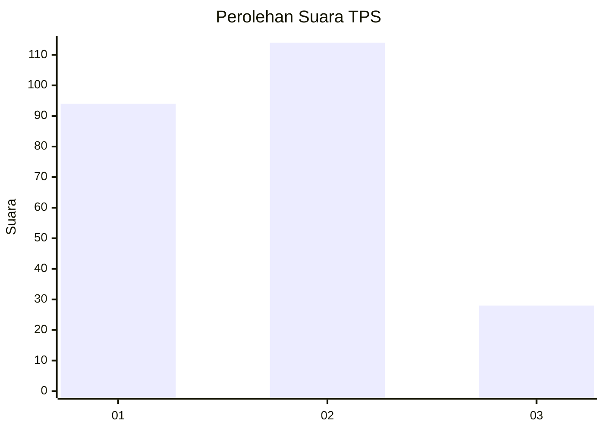
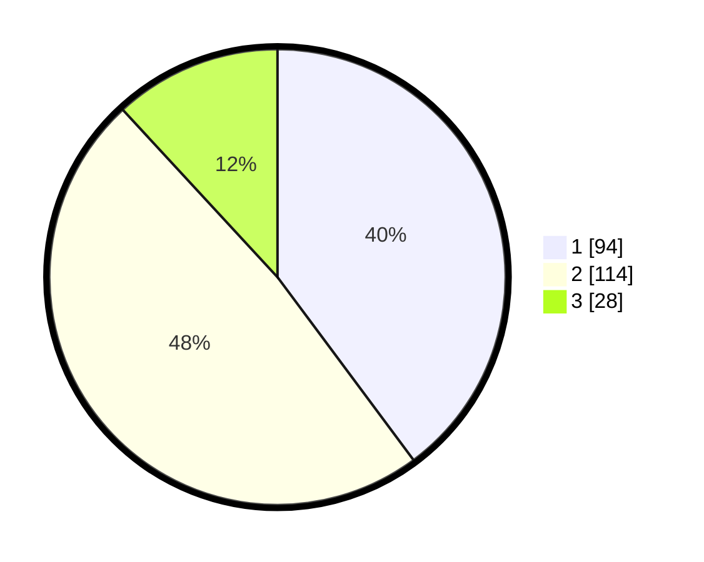

# Hasil

## Grafik

## Tabel

| No. | Nama Paslon    | Suara | Suara (raw) | Persentase |
|:--- |:-------------- | -----:| -----------:| ----------:|
| 1   | ANIES MUHAIMIN | 94    | [94][p-1]   | 39,83      |
| 2   | PRABOWO GIBRAN | 114   | [114][p-2]  | 48,31      |
| 3   | GANJAR MAHFUD  | 28    | [28][p-3]   | 11,86      |

[p-1]: https://github.com/gigit-pemilu/pemilu-2024/blob/main/pilpres/hitung-suara/sub/63-kalimantan-selatan/sub/01-tanah-laut/sub/04-kurau/sub/2002-maluka-baulin/sub/003-tps/sub/paslon-1.txt
[p-2]: https://github.com/gigit-pemilu/pemilu-2024/blob/main/pilpres/hitung-suara/sub/63-kalimantan-selatan/sub/01-tanah-laut/sub/04-kurau/sub/2002-maluka-baulin/sub/003-tps/sub/paslon-2.txt
[p-3]: https://github.com/gigit-pemilu/pemilu-2024/blob/main/pilpres/hitung-suara/sub/63-kalimantan-selatan/sub/01-tanah-laut/sub/04-kurau/sub/2002-maluka-baulin/sub/003-tps/sub/paslon-3.txt

## Foto C Plano

https://sirekap-obj-formc.kpu.go.id/7296/pemilu/ppwp/63/01/04/20/02/6301042002003-20240218-195530--4ec8db02-5a0a-4852-9e52-ae24cf3c81d4.jpg

https://sirekap-obj-formc.kpu.go.id/7296/pemilu/ppwp/63/01/04/20/02/6301042002003-20240218-195637--dc1b54ca-aa5e-455d-9aaa-4b070132eff8.jpg

https://sirekap-obj-formc.kpu.go.id/7296/pemilu/ppwp/63/01/04/20/02/6301042002003-20240218-195729--8304ffd7-0ff3-4c65-9872-ea9945480798.jpg

## Metadata

| Key        | Value               |
| ---------- | ------------------- |
| Time Stamp | 2024-02-25 15:00:00 |

