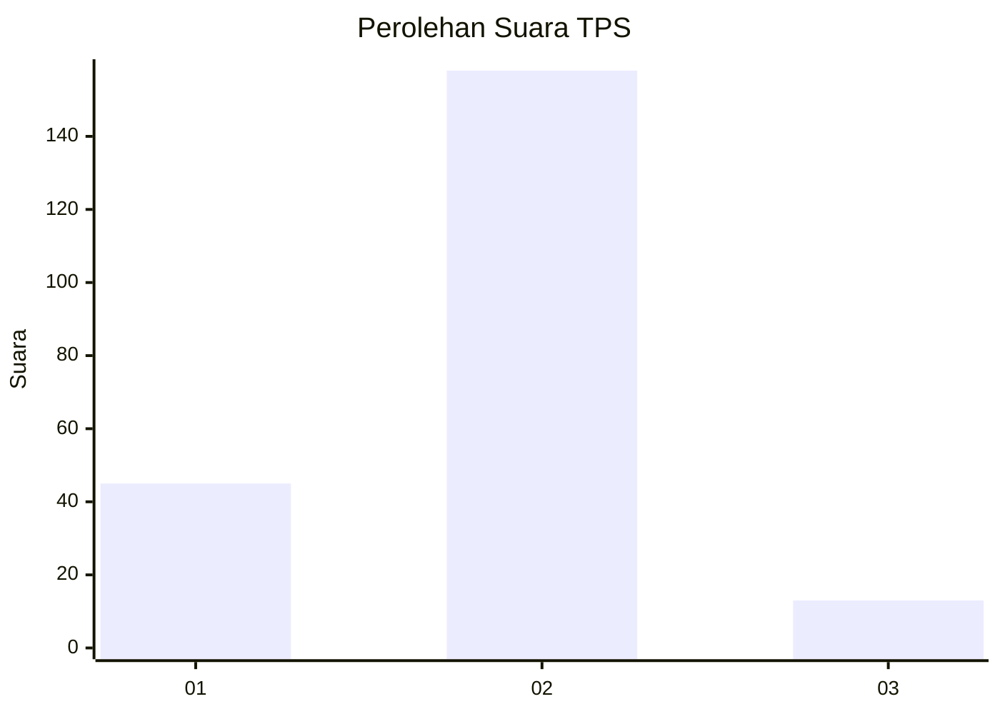

# Hasil

## Grafik

## Tabel

| No. | Nama Paslon    | Suara | Suara (raw) | Persentase |
|:--- |:-------------- | -----:| -----------:| ----------:|
| 1   | ANIES MUHAIMIN | 45    | [45][p-1]   | 20,83      |
| 2   | PRABOWO GIBRAN | 158   | [158][p-2]  | 73,15      |
| 3   | GANJAR MAHFUD  | 13    | [13][p-3]   | 6,02       |

[p-1]: https://github.com/gigit-pemilu/pemilu-2024/blob/main/pilpres/hitung-suara/sub/63-kalimantan-selatan/sub/01-tanah-laut/sub/07-kintap/sub/2001-pandan-sari/sub/002-tps/sub/paslon-1.txt
[p-2]: https://github.com/gigit-pemilu/pemilu-2024/blob/main/pilpres/hitung-suara/sub/63-kalimantan-selatan/sub/01-tanah-laut/sub/07-kintap/sub/2001-pandan-sari/sub/002-tps/sub/paslon-2.txt
[p-3]: https://github.com/gigit-pemilu/pemilu-2024/blob/main/pilpres/hitung-suara/sub/63-kalimantan-selatan/sub/01-tanah-laut/sub/07-kintap/sub/2001-pandan-sari/sub/002-tps/sub/paslon-3.txt

## Foto C Plano

https://sirekap-obj-formc.kpu.go.id/af13/pemilu/ppwp/63/01/07/20/01/6301072001002-20240215-154458--f0b7f596-a9f8-4299-96b8-5a59198b15e7.jpg

https://sirekap-obj-formc.kpu.go.id/af13/pemilu/ppwp/63/01/07/20/01/6301072001002-20240215-154806--a1784443-4a10-48fc-87a8-c182e59cf118.jpg

https://sirekap-obj-formc.kpu.go.id/af13/pemilu/ppwp/63/01/07/20/01/6301072001002-20240217-095206--2ebc5e20-c10d-4cdf-b27a-a5bfdc36f760.jpg

## Metadata

| Key        | Value               |
| ---------- | ------------------- |
| Time Stamp | 2024-02-17 17:00:04 |

