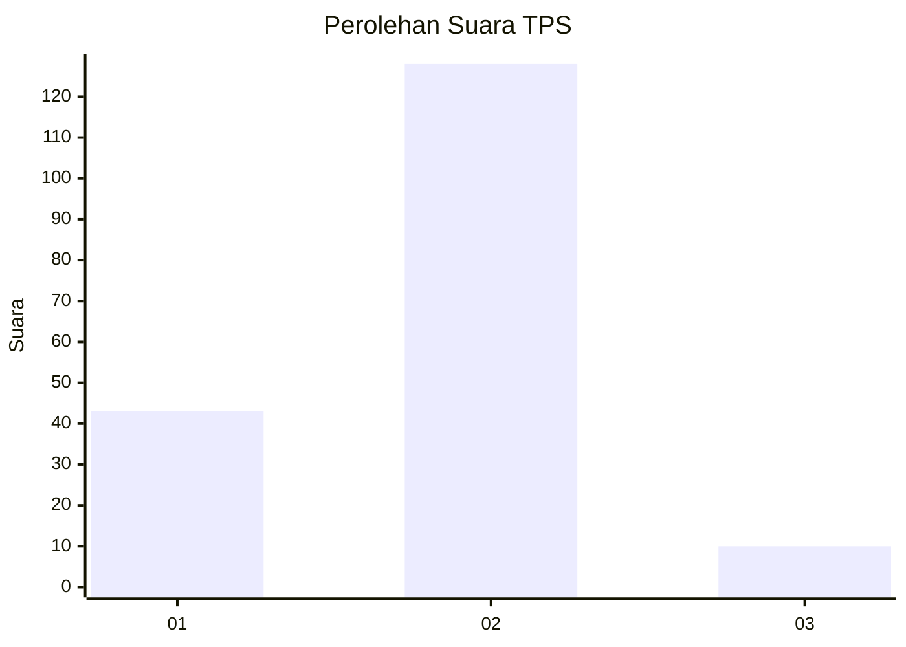
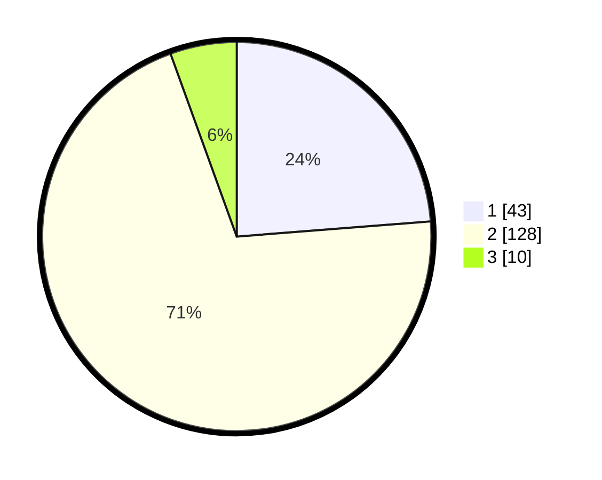

# Hasil

## Grafik

## Tabel

| No. | Nama Paslon    | Suara | Suara (raw) | Persentase |
|:--- |:-------------- | -----:| -----------:| ----------:|
| 1   | ANIES MUHAIMIN | 43    | [43][p-1]   | 23,76      |
| 2   | PRABOWO GIBRAN | 128   | [128][p-2]  | 70,72      |
| 3   | GANJAR MAHFUD  | 10    | [10][p-3]   | 5,52       |

[p-1]: https://github.com/gigit-pemilu/pemilu-2024/blob/main/pilpres/hitung-suara/sub/63-kalimantan-selatan/sub/01-tanah-laut/sub/07-kintap/sub/2001-pandan-sari/sub/006-tps/sub/paslon-1.txt
[p-2]: https://github.com/gigit-pemilu/pemilu-2024/blob/main/pilpres/hitung-suara/sub/63-kalimantan-selatan/sub/01-tanah-laut/sub/07-kintap/sub/2001-pandan-sari/sub/006-tps/sub/paslon-2.txt
[p-3]: https://github.com/gigit-pemilu/pemilu-2024/blob/main/pilpres/hitung-suara/sub/63-kalimantan-selatan/sub/01-tanah-laut/sub/07-kintap/sub/2001-pandan-sari/sub/006-tps/sub/paslon-3.txt

## Foto C Plano

https://sirekap-obj-formc.kpu.go.id/1fe9/pemilu/ppwp/63/01/07/20/01/6301072001006-20240215-155227--d40a15d8-b1b0-41d0-9b28-2fb4f8453306.jpg

https://sirekap-obj-formc.kpu.go.id/1fe9/pemilu/ppwp/63/01/07/20/01/6301072001006-20240219-083950--79ccc2b8-3485-4e68-86b6-8c02db6262bb.jpg

https://sirekap-obj-formc.kpu.go.id/1fe9/pemilu/ppwp/63/01/07/20/01/6301072001006-20240215-155905--14305dba-bc14-4e45-84ff-497b6facd63a.jpg

## Metadata

| Key        | Value               |
| ---------- | ------------------- |
| Time Stamp | 2024-02-19 14:00:00 |

