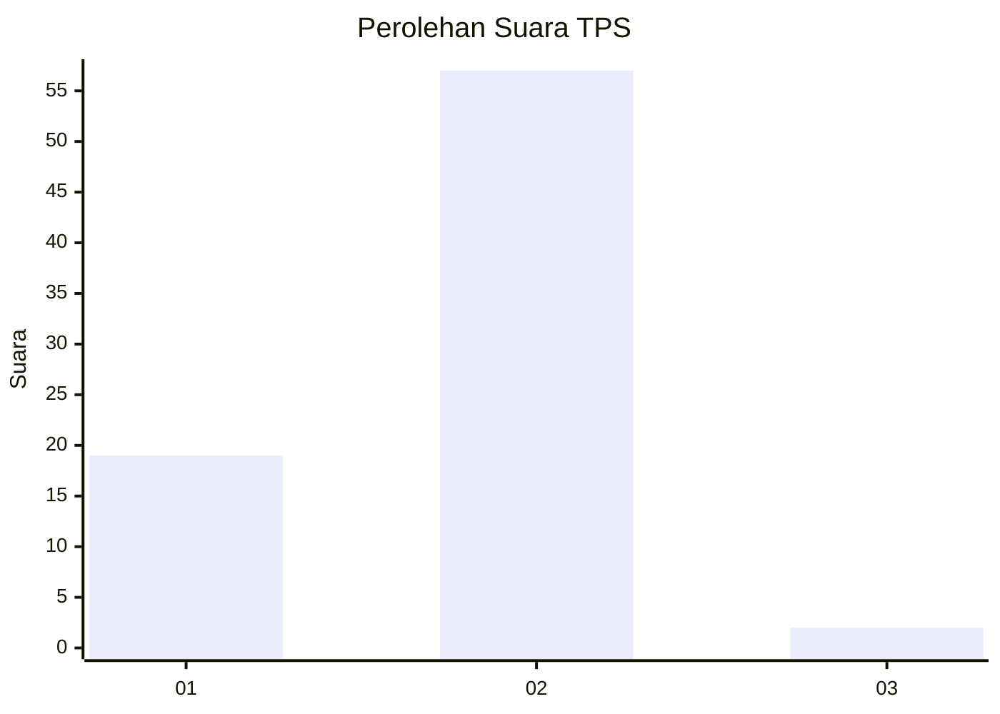
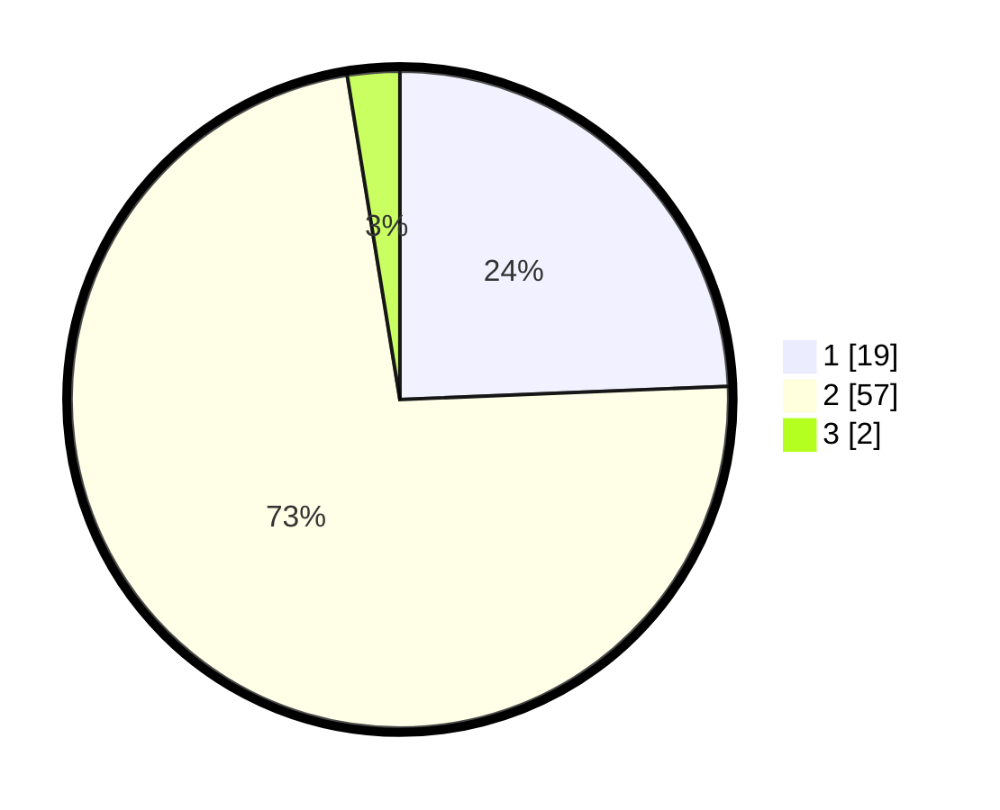

# Hasil

## Grafik

## Tabel

| No. | Nama Paslon    | Suara | Suara (raw) | Persentase |
|:--- |:-------------- | -----:| -----------:| ----------:|
| 1   | ANIES MUHAIMIN | 19    | [19][p-1]   | 24,36      |
| 2   | PRABOWO GIBRAN | 57    | [57][p-2]   | 73,08      |
| 3   | GANJAR MAHFUD  | 2     | [2][p-3]    | 2,56       |

[p-1]: https://github.com/gigit-pemilu/pemilu-2024/blob/main/pilpres/hitung-suara/sub/63-kalimantan-selatan/sub/02-kotabaru/sub/01-pulau-sembilan/sub/2003-maradapan/sub/001-tps/sub/paslon-1.txt
[p-2]: https://github.com/gigit-pemilu/pemilu-2024/blob/main/pilpres/hitung-suara/sub/63-kalimantan-selatan/sub/02-kotabaru/sub/01-pulau-sembilan/sub/2003-maradapan/sub/001-tps/sub/paslon-2.txt
[p-3]: https://github.com/gigit-pemilu/pemilu-2024/blob/main/pilpres/hitung-suara/sub/63-kalimantan-selatan/sub/02-kotabaru/sub/01-pulau-sembilan/sub/2003-maradapan/sub/001-tps/sub/paslon-3.txt

## Foto C Plano

https://sirekap-obj-formc.kpu.go.id/b03b/pemilu/ppwp/63/02/01/20/03/6302012003001-20240221-163836--b60cdfdf-885a-4ddf-8fec-94fc131697ca.jpg

https://sirekap-obj-formc.kpu.go.id/b03b/pemilu/ppwp/63/02/01/20/03/6302012003001-20240221-164144--b999d1ff-4851-4219-a9da-13633e954a27.jpg

## Metadata

| Key        | Value               |
| ---------- | ------------------- |
| Time Stamp | 2024-02-25 23:00:00 |

