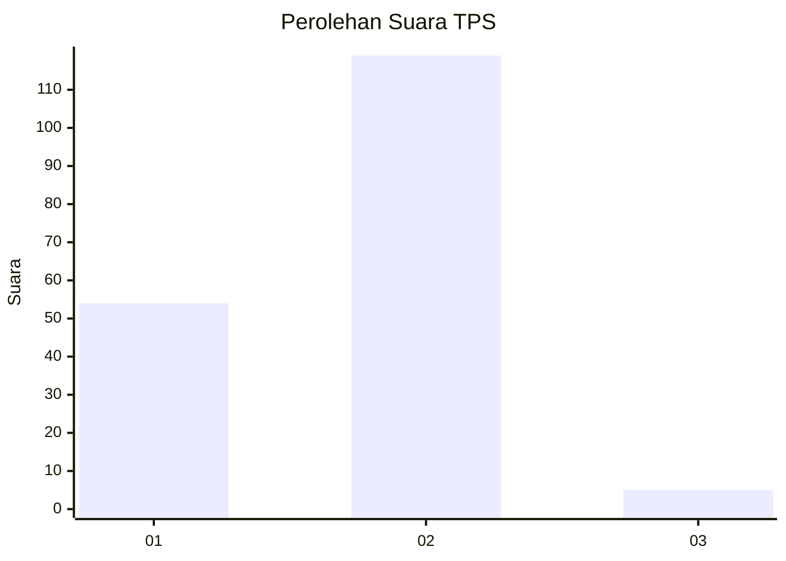
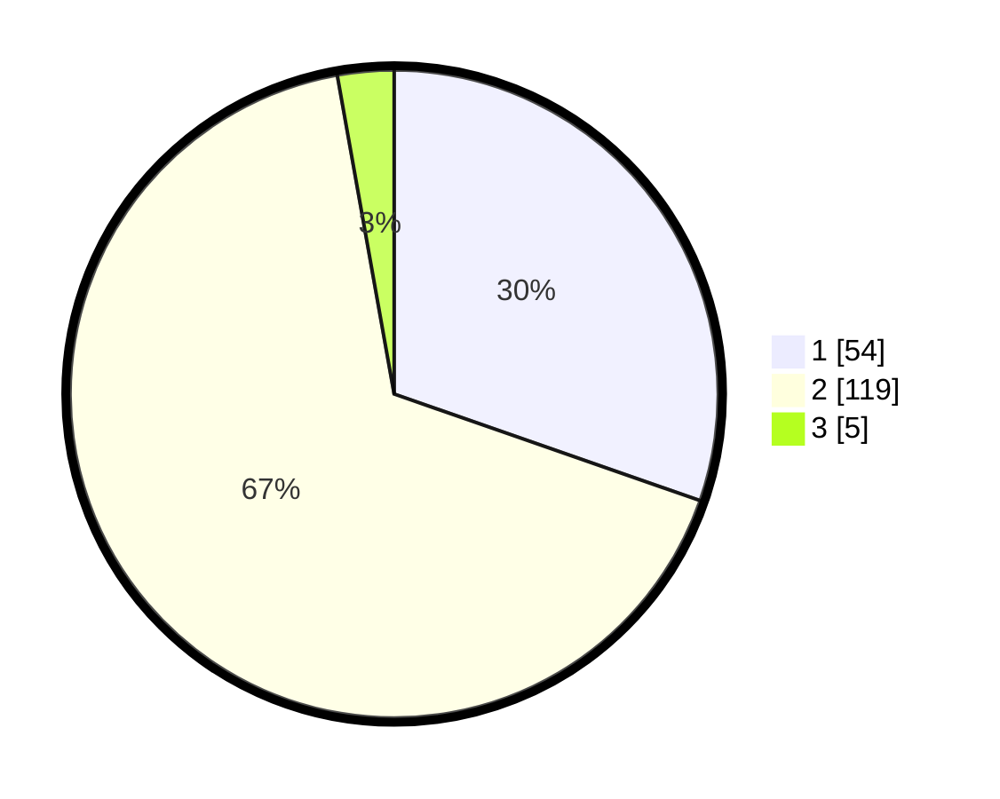

# Hasil

## Grafik

## Tabel

| No. | Nama Paslon    | Suara | Suara (raw) | Persentase |
|:--- |:-------------- | -----:| -----------:| ----------:|
| 1   | ANIES MUHAIMIN | 54    | [54][p-1]   | 30,34      |
| 2   | PRABOWO GIBRAN | 119   | [119][p-2]  | 66,85      |
| 3   | GANJAR MAHFUD  | 5     | [5][p-3]    | 2,81       |

[p-1]: https://github.com/gigit-pemilu/pemilu-2024/blob/main/pilpres/hitung-suara/sub/63-kalimantan-selatan/sub/02-kotabaru/sub/02-pulau-laut-barat/sub/2005-lontar-selatan/sub/002-tps/sub/paslon-1.txt
[p-2]: https://github.com/gigit-pemilu/pemilu-2024/blob/main/pilpres/hitung-suara/sub/63-kalimantan-selatan/sub/02-kotabaru/sub/02-pulau-laut-barat/sub/2005-lontar-selatan/sub/002-tps/sub/paslon-2.txt
[p-3]: https://github.com/gigit-pemilu/pemilu-2024/blob/main/pilpres/hitung-suara/sub/63-kalimantan-selatan/sub/02-kotabaru/sub/02-pulau-laut-barat/sub/2005-lontar-selatan/sub/002-tps/sub/paslon-3.txt

## Foto C Plano

https://sirekap-obj-formc.kpu.go.id/fad3/pemilu/ppwp/63/02/02/20/05/6302022005002-20240215-053943--d11966de-9502-4332-b54c-5d83d273bf43.jpg

https://sirekap-obj-formc.kpu.go.id/fad3/pemilu/ppwp/63/02/02/20/05/6302022005002-20240215-015604--e6f38669-5c5e-4486-ad5a-17abcad1c16f.jpg

https://sirekap-obj-formc.kpu.go.id/fad3/pemilu/ppwp/63/02/02/20/05/6302022005002-20240215-015636--c89da438-eaab-4c4f-a7f6-4e8d344b34d2.jpg

## Metadata

| Key        | Value               |
| ---------- | ------------------- |
| Time Stamp | 2024-02-15 15:00:29 |

