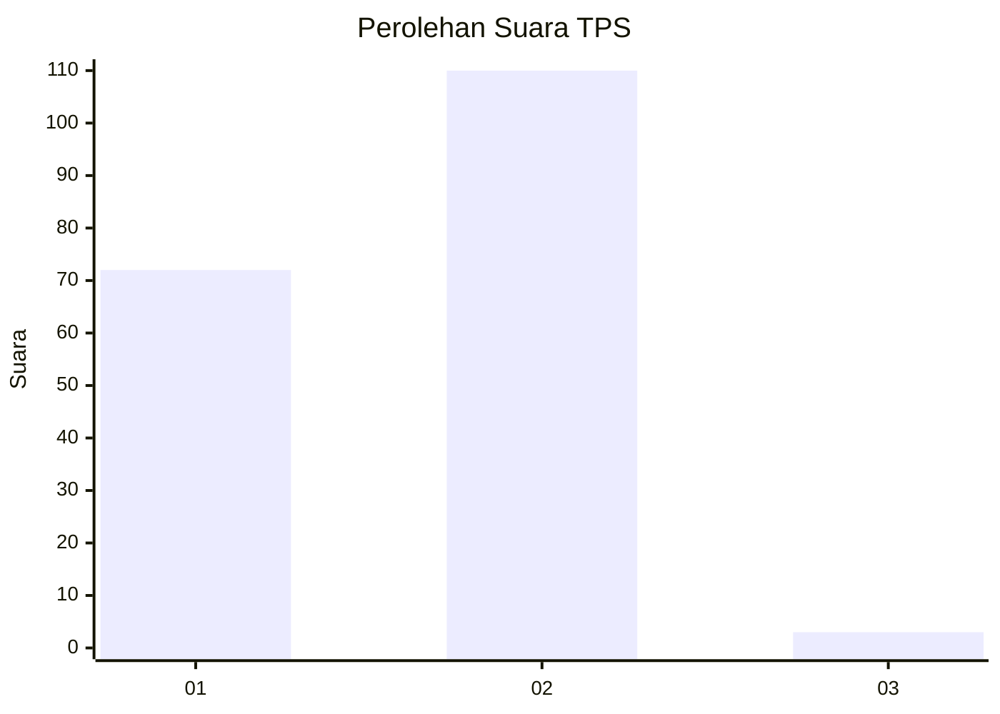
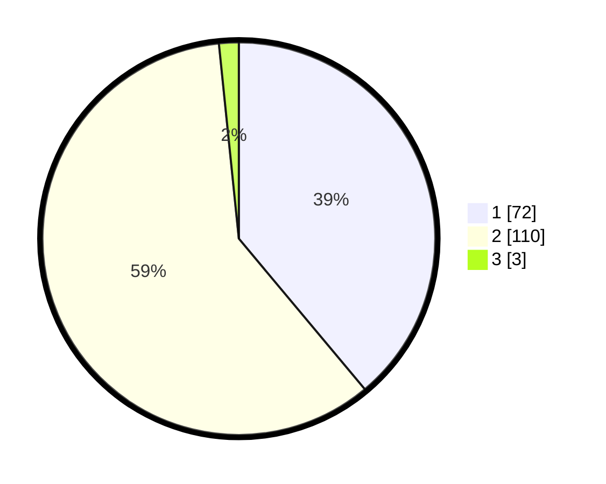

# Hasil

## Grafik

## Tabel

| No. | Nama Paslon    | Suara | Suara (raw) | Persentase |
|:--- |:-------------- | -----:| -----------:| ----------:|
| 1   | ANIES MUHAIMIN | 72    | [72][p-1]   | 38,92      |
| 2   | PRABOWO GIBRAN | 110   | [110][p-2]  | 59,46      |
| 3   | GANJAR MAHFUD  | 3     | [3][p-3]    | 1,62       |

[p-1]: https://github.com/gigit-pemilu/pemilu-2024/blob/main/pilpres/hitung-suara/sub/63-kalimantan-selatan/sub/02-kotabaru/sub/03-pulau-laut-selatan/sub/2007-sungai-bahim/sub/002-tps/sub/paslon-1.txt
[p-2]: https://github.com/gigit-pemilu/pemilu-2024/blob/main/pilpres/hitung-suara/sub/63-kalimantan-selatan/sub/02-kotabaru/sub/03-pulau-laut-selatan/sub/2007-sungai-bahim/sub/002-tps/sub/paslon-2.txt
[p-3]: https://github.com/gigit-pemilu/pemilu-2024/blob/main/pilpres/hitung-suara/sub/63-kalimantan-selatan/sub/02-kotabaru/sub/03-pulau-laut-selatan/sub/2007-sungai-bahim/sub/002-tps/sub/paslon-3.txt

## Foto C Plano

https://sirekap-obj-formc.kpu.go.id/79b1/pemilu/ppwp/63/02/03/20/07/6302032007002-20240214-225718--2bdc451d-962e-4b08-af02-7044a2bb0156.jpg

https://sirekap-obj-formc.kpu.go.id/79b1/pemilu/ppwp/63/02/03/20/07/6302032007002-20240214-201924--20a04aa2-c932-4948-b834-15dbd4d0816a.jpg

https://sirekap-obj-formc.kpu.go.id/79b1/pemilu/ppwp/63/02/03/20/07/6302032007002-20240214-202400--d26acfdc-8dd5-456b-865c-f6c3d9ea5e53.jpg

## Metadata

| Key        | Value               |
| ---------- | ------------------- |
| Time Stamp | 2024-02-17 16:00:02 |

