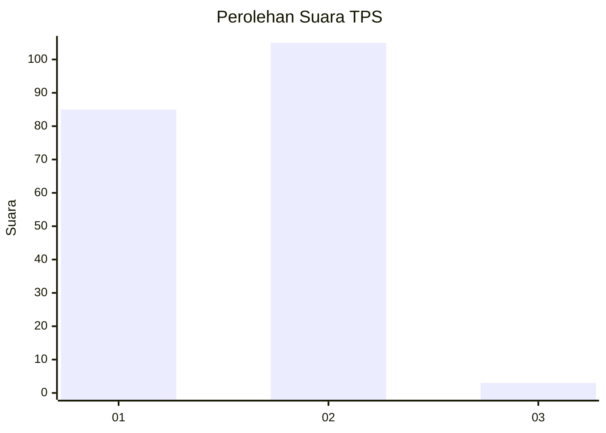
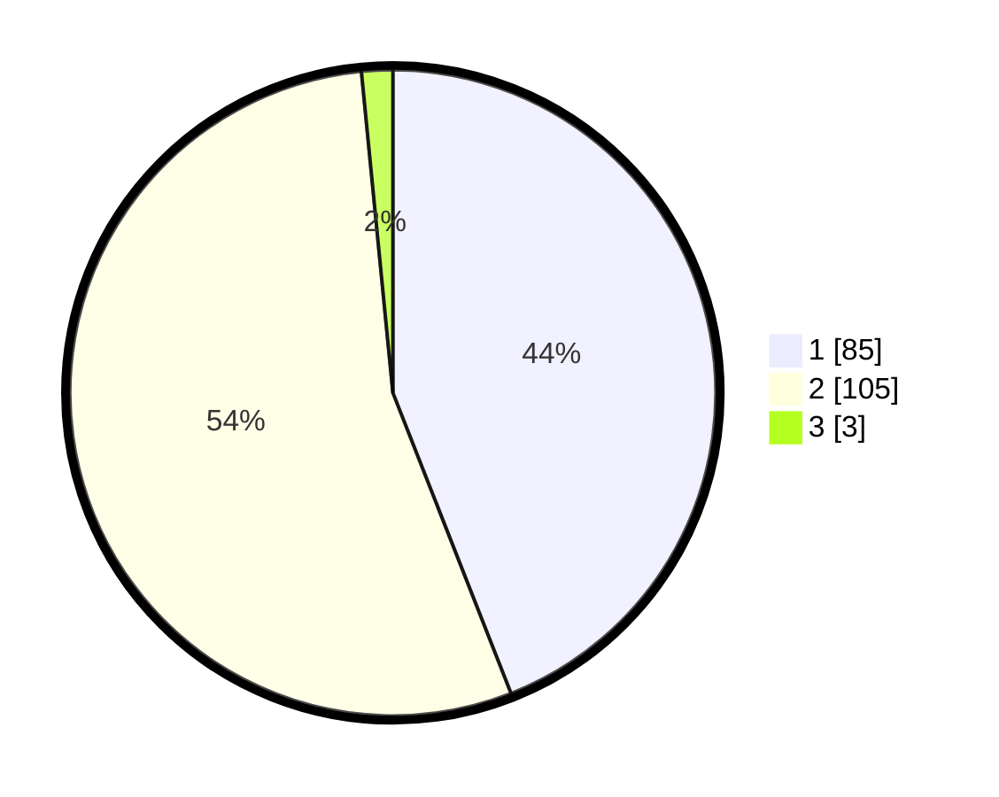

# Hasil

## Grafik

## Tabel

| No. | Nama Paslon    | Suara | Suara (raw) | Persentase |
|:--- |:-------------- | -----:| -----------:| ----------:|
| 1   | ANIES MUHAIMIN | 85    | [85][p-1]   | 44,04      |
| 2   | PRABOWO GIBRAN | 105   | [105][p-2]  | 54,40      |
| 3   | GANJAR MAHFUD  | 3     | [3][p-3]    | 1,55       |

[p-1]: https://github.com/gigit-pemilu/pemilu-2024/blob/main/pilpres/hitung-suara/sub/63-kalimantan-selatan/sub/02-kotabaru/sub/03-pulau-laut-selatan/sub/2007-sungai-bahim/sub/003-tps/sub/paslon-1.txt
[p-2]: https://github.com/gigit-pemilu/pemilu-2024/blob/main/pilpres/hitung-suara/sub/63-kalimantan-selatan/sub/02-kotabaru/sub/03-pulau-laut-selatan/sub/2007-sungai-bahim/sub/003-tps/sub/paslon-2.txt
[p-3]: https://github.com/gigit-pemilu/pemilu-2024/blob/main/pilpres/hitung-suara/sub/63-kalimantan-selatan/sub/02-kotabaru/sub/03-pulau-laut-selatan/sub/2007-sungai-bahim/sub/003-tps/sub/paslon-3.txt

## Foto C Plano

https://sirekap-obj-formc.kpu.go.id/a159/pemilu/ppwp/63/02/03/20/07/6302032007003-20240215-003139--c47205f1-2980-4fd3-b530-074bc6fb60b2.jpg

https://sirekap-obj-formc.kpu.go.id/a159/pemilu/ppwp/63/02/03/20/07/6302032007003-20240215-003313--a2553bb0-e175-4d1a-9099-91fbd4f054b0.jpg

https://sirekap-obj-formc.kpu.go.id/a159/pemilu/ppwp/63/02/03/20/07/6302032007003-20240215-003434--265d41f3-6263-470e-bef0-990a72906dde.jpg

## Metadata

| Key        | Value               |
| ---------- | ------------------- |
| Time Stamp | 2024-02-15 21:01:18 |

