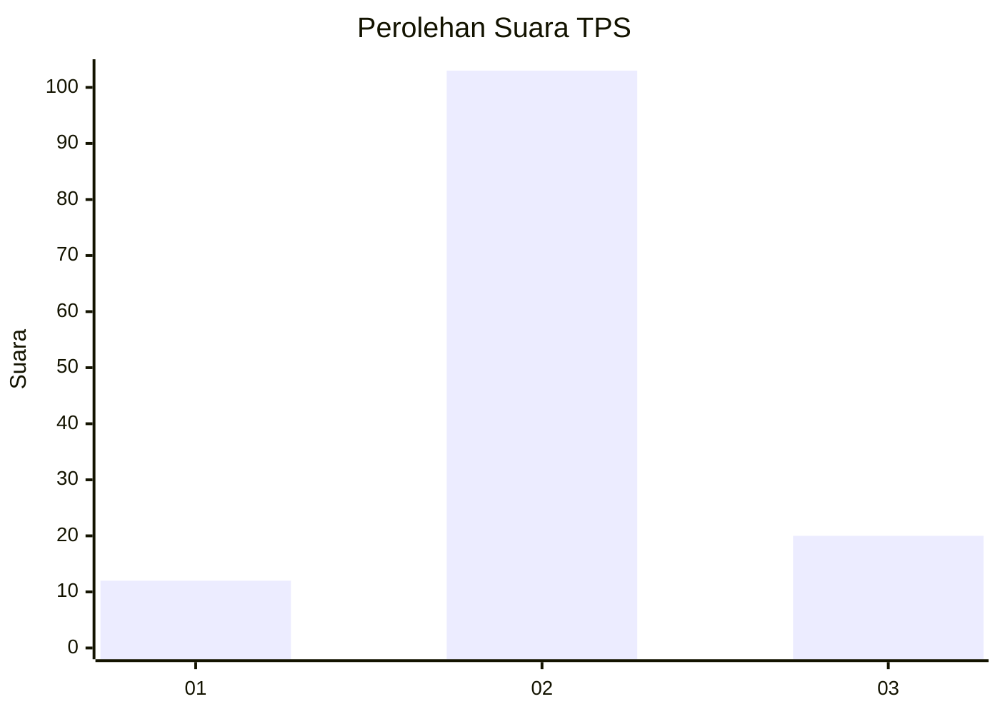

# Hasil

## Grafik

## Tabel

| No. | Nama Paslon    | Suara | Suara (raw) | Persentase |
|:--- |:-------------- | -----:| -----------:| ----------:|
| 1   | ANIES MUHAIMIN | 12    | [12][p-1]   | 8,89       |
| 2   | PRABOWO GIBRAN | 103   | [103][p-2]  | 76,30      |
| 3   | GANJAR MAHFUD  | 20    | [20][p-3]   | 14,81      |

[p-1]: https://github.com/gigit-pemilu/pemilu-2024-63-kalimantan-selatan/blob/main/pilpres/hitung-suara/sub/63-kalimantan-selatan/sub/02-kotabaru/sub/04-pulau-laut-timur/sub/2001-batu-tunau/sub/003-tps/sub/paslon-1.txt
[p-2]: https://github.com/gigit-pemilu/pemilu-2024-63-kalimantan-selatan/blob/main/pilpres/hitung-suara/sub/63-kalimantan-selatan/sub/02-kotabaru/sub/04-pulau-laut-timur/sub/2001-batu-tunau/sub/003-tps/sub/paslon-2.txt
[p-3]: https://github.com/gigit-pemilu/pemilu-2024-63-kalimantan-selatan/blob/main/pilpres/hitung-suara/sub/63-kalimantan-selatan/sub/02-kotabaru/sub/04-pulau-laut-timur/sub/2001-batu-tunau/sub/003-tps/sub/paslon-3.txt

## Foto C Plano

https://sirekap-obj-formc.kpu.go.id/f1cf/pemilu/ppwp/63/02/04/20/01/6302042001003-20240215-021050--74ca8ed2-a743-4413-8cd3-72efd2c7533c.jpg

https://sirekap-obj-formc.kpu.go.id/f1cf/pemilu/ppwp/63/02/04/20/01/6302042001003-20240215-020649--cc90b7ef-f268-42d6-9429-1256e0f25d60.jpg

https://sirekap-obj-formc.kpu.go.id/f1cf/pemilu/ppwp/63/02/04/20/01/6302042001003-20240215-021856--d2a1c978-7038-4efd-ab34-b99b6330ff51.jpg

## Metadata

| Key        | Value               |
| ---------- | ------------------- |
| Time Stamp | 2024-02-25 13:00:00 |

