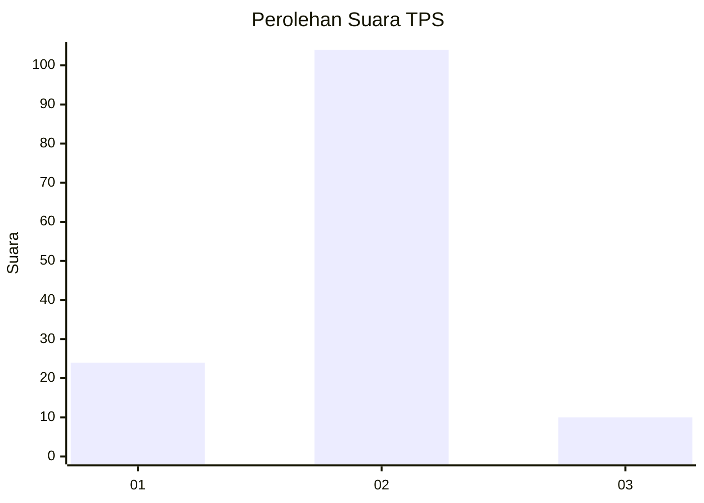
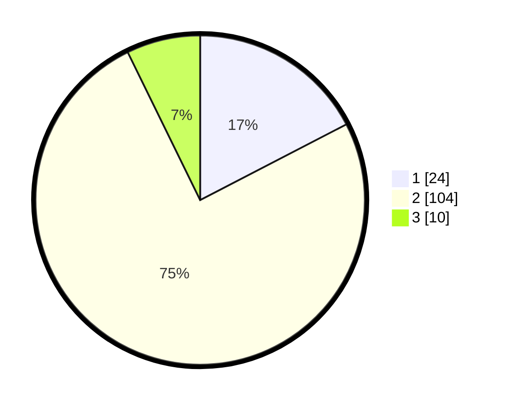

# Hasil

## Grafik

## Tabel

| No. | Nama Paslon    | Suara | Suara (raw) | Persentase |
|:--- |:-------------- | -----:| -----------:| ----------:|
| 1   | ANIES MUHAIMIN | 24    | [24][p-1]   | 17,39      |
| 2   | PRABOWO GIBRAN | 104   | [104][p-2]  | 75,36      |
| 3   | GANJAR MAHFUD  | 10    | [10][p-3]   | 7,25       |

[p-1]: https://github.com/gigit-pemilu/pemilu-2024/blob/main/pilpres/hitung-suara/sub/63-kalimantan-selatan/sub/02-kotabaru/sub/04-pulau-laut-timur/sub/2003-bekambit/sub/002-tps/sub/paslon-1.txt
[p-2]: https://github.com/gigit-pemilu/pemilu-2024/blob/main/pilpres/hitung-suara/sub/63-kalimantan-selatan/sub/02-kotabaru/sub/04-pulau-laut-timur/sub/2003-bekambit/sub/002-tps/sub/paslon-2.txt
[p-3]: https://github.com/gigit-pemilu/pemilu-2024/blob/main/pilpres/hitung-suara/sub/63-kalimantan-selatan/sub/02-kotabaru/sub/04-pulau-laut-timur/sub/2003-bekambit/sub/002-tps/sub/paslon-3.txt

## Foto C Plano

https://sirekap-obj-formc.kpu.go.id/8244/pemilu/ppwp/63/02/04/20/03/6302042003002-20240215-045435--cd8e3310-e28d-44d3-b927-3e7c425f9f22.jpg

https://sirekap-obj-formc.kpu.go.id/8244/pemilu/ppwp/63/02/04/20/03/6302042003002-20240215-052135--0c726f15-cffc-4452-8524-0a82b7d01216.jpg

https://sirekap-obj-formc.kpu.go.id/8244/pemilu/ppwp/63/02/04/20/03/6302042003002-20240215-052217--c8f3c633-2517-440b-9149-8b907dc137de.jpg

## Metadata

| Key        | Value               |
| ---------- | ------------------- |
| Time Stamp | 2024-02-17 16:00:02 |

