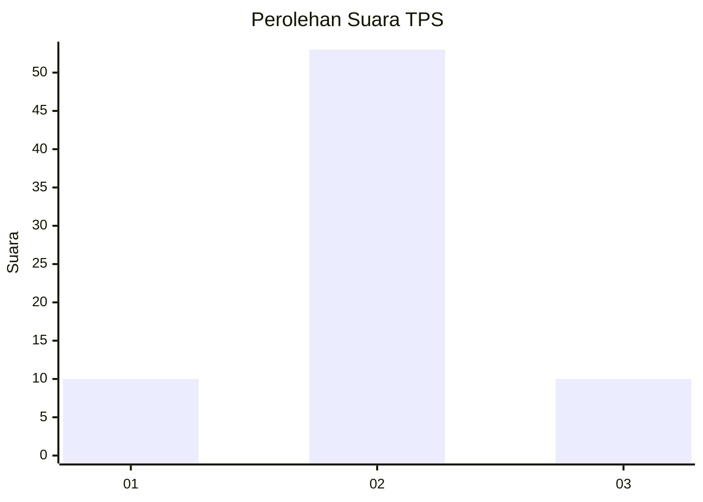
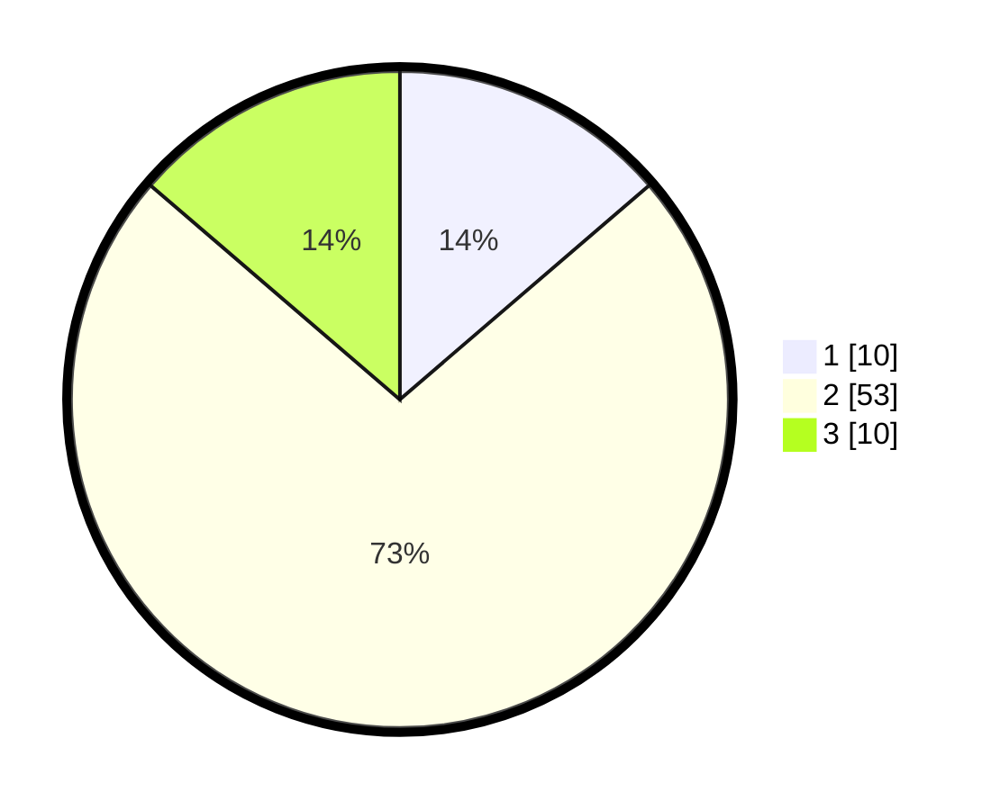

# Hasil

## Grafik

## Tabel

| No. | Nama Paslon    | Suara | Suara (raw) | Persentase |
|:--- |:-------------- | -----:| -----------:| ----------:|
| 1   | ANIES MUHAIMIN | 10    | [10][p-1]   | 13,70      |
| 2   | PRABOWO GIBRAN | 53    | [53][p-2]   | 72,60      |
| 3   | GANJAR MAHFUD  | 10    | [10][p-3]   | 13,70      |

[p-1]: https://github.com/gigit-pemilu/pemilu-2024-63-kalimantan-selatan/blob/main/pilpres/hitung-suara/sub/63-kalimantan-selatan/sub/02-kotabaru/sub/04-pulau-laut-timur/sub/2014-bekambit-asri/sub/001-tps/sub/paslon-1.txt
[p-2]: https://github.com/gigit-pemilu/pemilu-2024-63-kalimantan-selatan/blob/main/pilpres/hitung-suara/sub/63-kalimantan-selatan/sub/02-kotabaru/sub/04-pulau-laut-timur/sub/2014-bekambit-asri/sub/001-tps/sub/paslon-2.txt
[p-3]: https://github.com/gigit-pemilu/pemilu-2024-63-kalimantan-selatan/blob/main/pilpres/hitung-suara/sub/63-kalimantan-selatan/sub/02-kotabaru/sub/04-pulau-laut-timur/sub/2014-bekambit-asri/sub/001-tps/sub/paslon-3.txt

## Foto C Plano

https://sirekap-obj-formc.kpu.go.id/872e/pemilu/ppwp/63/02/04/20/14/6302042014001-20240215-104752--6364f21a-6cbb-477d-9e66-c788041d0ec7.jpg

https://sirekap-obj-formc.kpu.go.id/872e/pemilu/ppwp/63/02/04/20/14/6302042014001-20240215-104932--063ef74d-6f0d-4a27-8beb-0385334d64cd.jpg

https://sirekap-obj-formc.kpu.go.id/872e/pemilu/ppwp/63/02/04/20/14/6302042014001-20240215-105109--569100ad-86bc-4165-81a8-e2dbd9678492.jpg

## Metadata

| Key        | Value               |
| ---------- | ------------------- |
| Time Stamp | 2024-02-15 23:29:50 |

