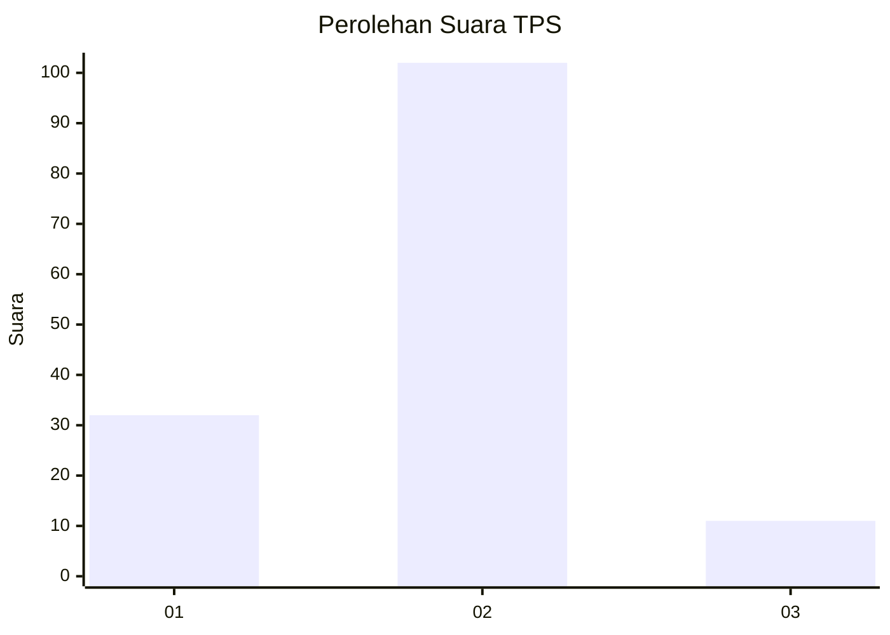
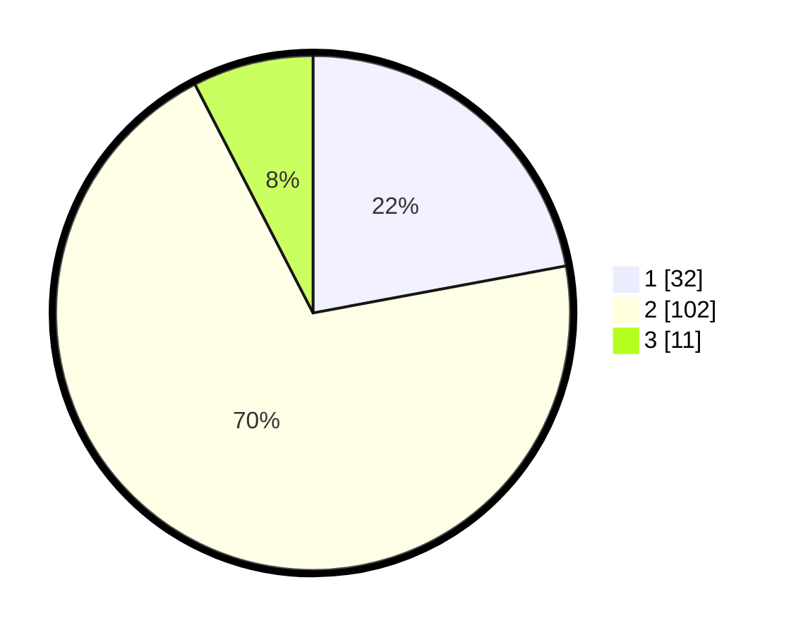

# Hasil

## Grafik

## Tabel

| No. | Nama Paslon    | Suara | Suara (raw) | Persentase |
|:--- |:-------------- | -----:| -----------:| ----------:|
| 1   | ANIES MUHAIMIN | 32    | [32][p-1]   | 22,07      |
| 2   | PRABOWO GIBRAN | 102   | [102][p-2]  | 70,34      |
| 3   | GANJAR MAHFUD  | 11    | [11][p-3]   | 7,59       |

[p-1]: https://github.com/gigit-pemilu/pemilu-2024/blob/main/pilpres/hitung-suara/sub/63-kalimantan-selatan/sub/02-kotabaru/sub/06-pulaulaut-utara/sub/1001-kotabaru-hulu/sub/001-tps/sub/paslon-1.txt
[p-2]: https://github.com/gigit-pemilu/pemilu-2024/blob/main/pilpres/hitung-suara/sub/63-kalimantan-selatan/sub/02-kotabaru/sub/06-pulaulaut-utara/sub/1001-kotabaru-hulu/sub/001-tps/sub/paslon-2.txt
[p-3]: https://github.com/gigit-pemilu/pemilu-2024/blob/main/pilpres/hitung-suara/sub/63-kalimantan-selatan/sub/02-kotabaru/sub/06-pulaulaut-utara/sub/1001-kotabaru-hulu/sub/001-tps/sub/paslon-3.txt

## Foto C Plano

https://sirekap-obj-formc.kpu.go.id/b091/pemilu/ppwp/63/02/06/10/01/6302061001001-20240215-000938--21735064-1959-4624-8c15-a49336b09b2e.jpg

https://sirekap-obj-formc.kpu.go.id/b091/pemilu/ppwp/63/02/06/10/01/6302061001001-20240215-001302--6be3770b-f5bb-4753-8ac4-404b2fa7a5f7.jpg

https://sirekap-obj-formc.kpu.go.id/b091/pemilu/ppwp/63/02/06/10/01/6302061001001-20240215-001556--dba46ace-8246-4504-8fd5-1ec903da4463.jpg

## Metadata

| Key        | Value               |
| ---------- | ------------------- |
| Time Stamp | 2024-02-19 06:16:00 |

