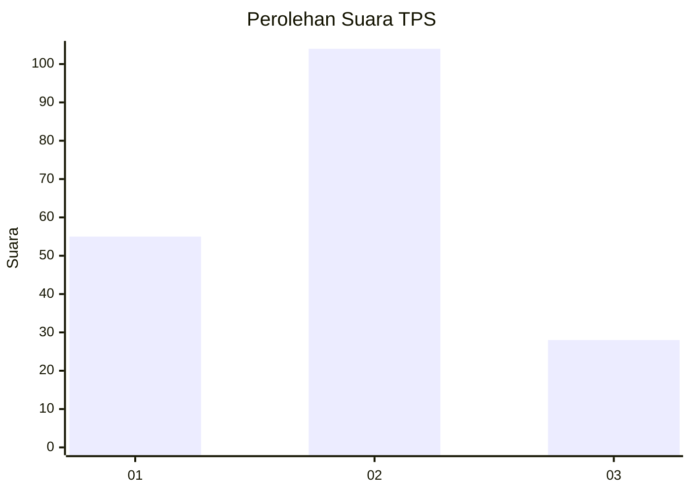
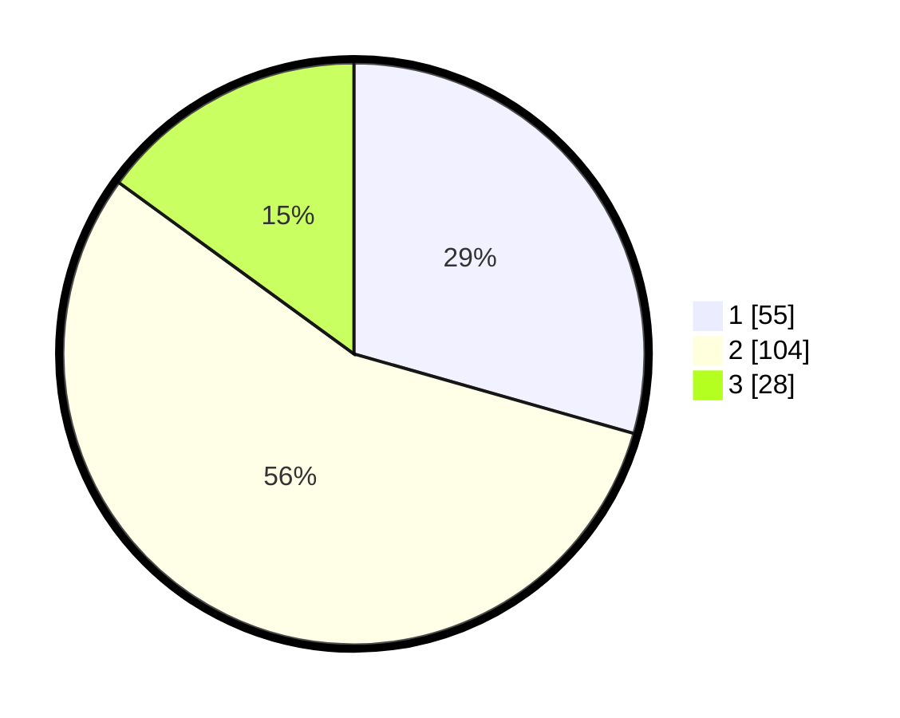

# Hasil

## Grafik

## Tabel

| No. | Nama Paslon    | Suara | Suara (raw) | Persentase |
|:--- |:-------------- | -----:| -----------:| ----------:|
| 1   | ANIES MUHAIMIN | 55    | [55][p-1]   | 29,41      |
| 2   | PRABOWO GIBRAN | 104   | [104][p-2]  | 55,61      |
| 3   | GANJAR MAHFUD  | 28    | [28][p-3]   | 14,97      |

[p-1]: https://github.com/gigit-pemilu/pemilu-2024/blob/main/pilpres/hitung-suara/sub/63-kalimantan-selatan/sub/02-kotabaru/sub/06-pulaulaut-utara/sub/1001-kotabaru-hulu/sub/005-tps/sub/paslon-1.txt
[p-2]: https://github.com/gigit-pemilu/pemilu-2024/blob/main/pilpres/hitung-suara/sub/63-kalimantan-selatan/sub/02-kotabaru/sub/06-pulaulaut-utara/sub/1001-kotabaru-hulu/sub/005-tps/sub/paslon-2.txt
[p-3]: https://github.com/gigit-pemilu/pemilu-2024/blob/main/pilpres/hitung-suara/sub/63-kalimantan-selatan/sub/02-kotabaru/sub/06-pulaulaut-utara/sub/1001-kotabaru-hulu/sub/005-tps/sub/paslon-3.txt

## Foto C Plano

https://sirekap-obj-formc.kpu.go.id/297f/pemilu/ppwp/63/02/06/10/01/6302061001005-20240214-201048--0a43f145-1305-4039-9e75-cbd53c05bc66.jpg

https://sirekap-obj-formc.kpu.go.id/297f/pemilu/ppwp/63/02/06/10/01/6302061001005-20240214-155048--897b345c-5c1a-4ab4-b501-6971054841cc.jpg

https://sirekap-obj-formc.kpu.go.id/297f/pemilu/ppwp/63/02/06/10/01/6302061001005-20240214-200919--7478e125-fbaf-4171-b7c1-518d5b5f7d6f.jpg

## Metadata

| Key        | Value               |
| ---------- | ------------------- |
| Time Stamp | 2024-02-15 00:41:44 |

