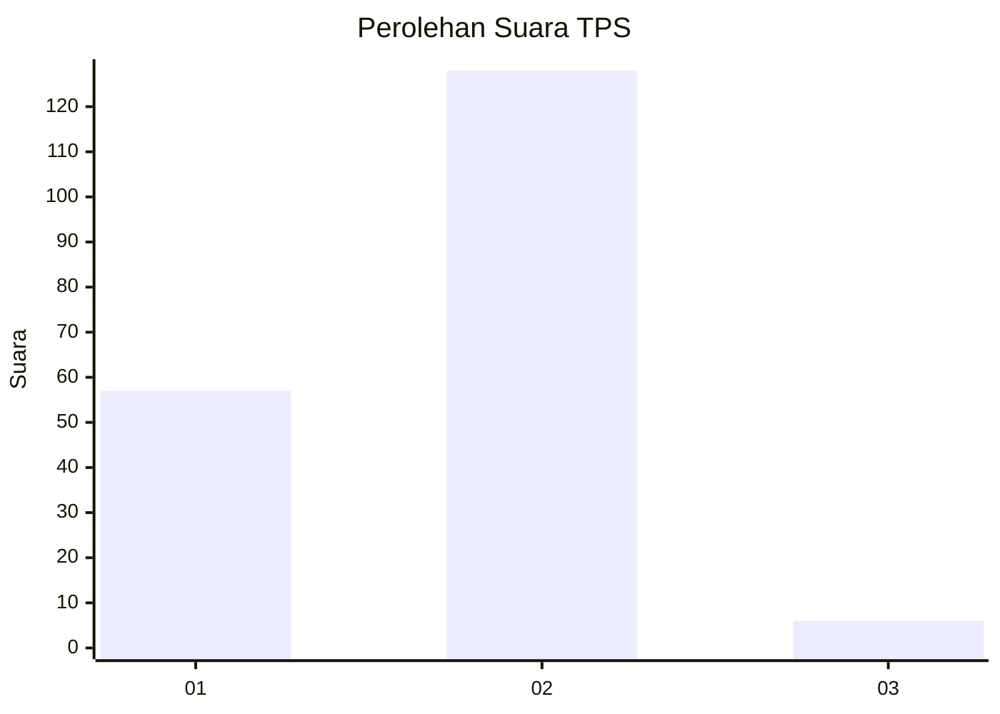
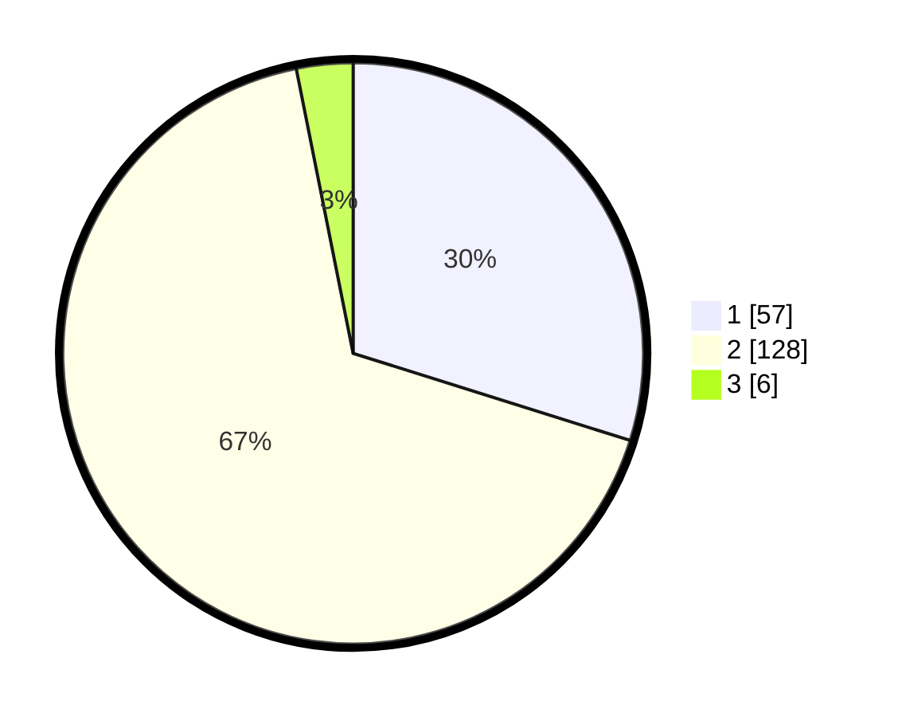

# Hasil

## Grafik

## Tabel

| No. | Nama Paslon    | Suara | Suara (raw) | Persentase |
|:--- |:-------------- | -----:| -----------:| ----------:|
| 1   | ANIES MUHAIMIN | 57    | [57][p-1]   | 29,84      |
| 2   | PRABOWO GIBRAN | 128   | [128][p-2]  | 67,02      |
| 3   | GANJAR MAHFUD  | 6     | [6][p-3]    | 3,14       |

[p-1]: https://github.com/gigit-pemilu/pemilu-2024/blob/main/pilpres/hitung-suara/sub/63-kalimantan-selatan/sub/02-kotabaru/sub/07-kelumpang-selatan/sub/2006-sungai-nipah/sub/003-tps/sub/paslon-1.txt
[p-2]: https://github.com/gigit-pemilu/pemilu-2024/blob/main/pilpres/hitung-suara/sub/63-kalimantan-selatan/sub/02-kotabaru/sub/07-kelumpang-selatan/sub/2006-sungai-nipah/sub/003-tps/sub/paslon-2.txt
[p-3]: https://github.com/gigit-pemilu/pemilu-2024/blob/main/pilpres/hitung-suara/sub/63-kalimantan-selatan/sub/02-kotabaru/sub/07-kelumpang-selatan/sub/2006-sungai-nipah/sub/003-tps/sub/paslon-3.txt

## Foto C Plano

https://sirekap-obj-formc.kpu.go.id/c217/pemilu/ppwp/63/02/07/20/06/6302072006003-20240214-141849--193b8c6a-b7da-467c-9c06-216865930c05.jpg

https://sirekap-obj-formc.kpu.go.id/c217/pemilu/ppwp/63/02/07/20/06/6302072006003-20240215-013911--c2674cc6-7a4f-4181-834f-3461cb9dc771.jpg

https://sirekap-obj-formc.kpu.go.id/c217/pemilu/ppwp/63/02/07/20/06/6302072006003-20240215-014009--bf783f7c-fb5a-4b03-adac-2dae93521bcf.jpg

## Metadata

| Key        | Value               |
| ---------- | ------------------- |
| Time Stamp | 2024-02-15 23:29:50 |

