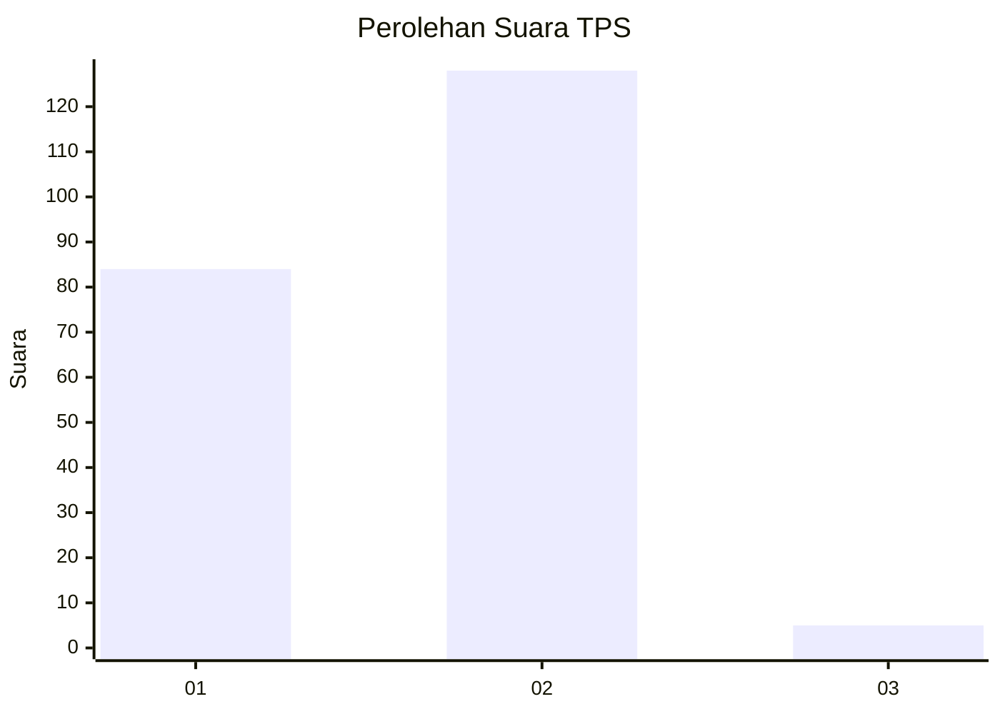
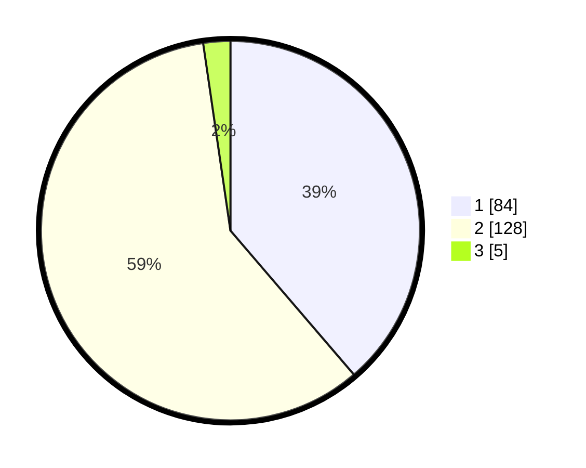

# Hasil

## Grafik

## Tabel

| No. | Nama Paslon    | Suara | Suara (raw) | Persentase |
|:--- |:-------------- | -----:| -----------:| ----------:|
| 1   | ANIES MUHAIMIN | 84    | [84][p-1]   | 38,71      |
| 2   | PRABOWO GIBRAN | 128   | [128][p-2]  | 58,99      |
| 3   | GANJAR MAHFUD  | 5     | [5][p-3]    | 2,30       |

[p-1]: https://github.com/gigit-pemilu/pemilu-2024/blob/main/pilpres/hitung-suara/sub/63-kalimantan-selatan/sub/02-kotabaru/sub/07-kelumpang-selatan/sub/2007-pantai/sub/001-tps/sub/paslon-1.txt
[p-2]: https://github.com/gigit-pemilu/pemilu-2024/blob/main/pilpres/hitung-suara/sub/63-kalimantan-selatan/sub/02-kotabaru/sub/07-kelumpang-selatan/sub/2007-pantai/sub/001-tps/sub/paslon-2.txt
[p-3]: https://github.com/gigit-pemilu/pemilu-2024/blob/main/pilpres/hitung-suara/sub/63-kalimantan-selatan/sub/02-kotabaru/sub/07-kelumpang-selatan/sub/2007-pantai/sub/001-tps/sub/paslon-3.txt

## Foto C Plano

https://sirekap-obj-formc.kpu.go.id/3b1e/pemilu/ppwp/63/02/07/20/07/6302072007001-20240215-000342--76a20056-c65e-471c-a9e4-637637944cfc.jpg

https://sirekap-obj-formc.kpu.go.id/3b1e/pemilu/ppwp/63/02/07/20/07/6302072007001-20240215-000819--6e5f921b-ed4a-40d0-a314-2d3d306630df.jpg

https://sirekap-obj-formc.kpu.go.id/3b1e/pemilu/ppwp/63/02/07/20/07/6302072007001-20240215-000823--2b95889a-e6ea-4bbd-8ee2-b4211ab0ad4a.jpg

## Metadata

| Key        | Value               |
| ---------- | ------------------- |
| Time Stamp | 2024-02-15 23:29:50 |

