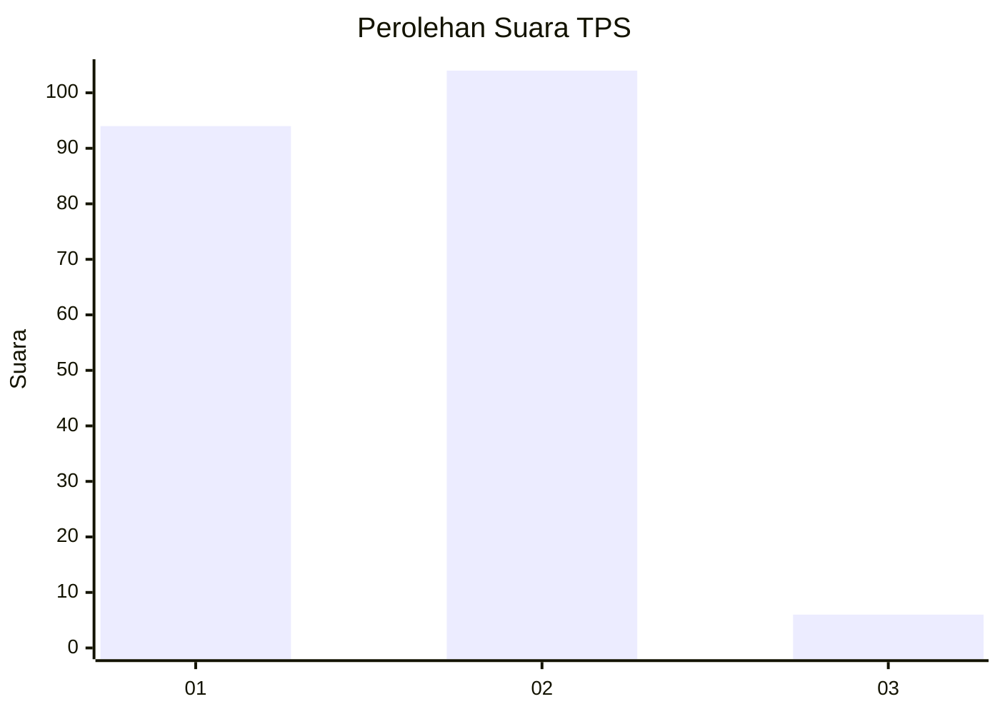
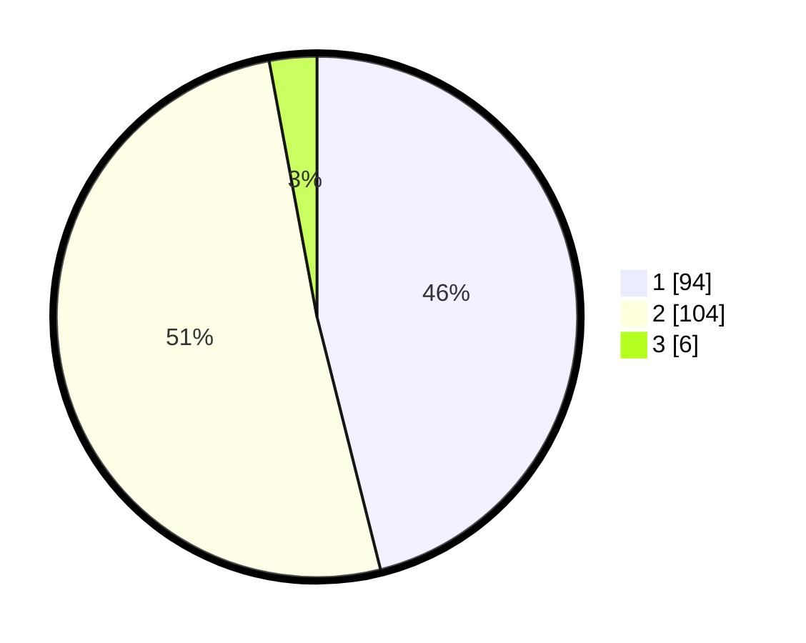

# Hasil

## Grafik

## Tabel

| No. | Nama Paslon    | Suara | Suara (raw) | Persentase |
|:--- |:-------------- | -----:| -----------:| ----------:|
| 1   | ANIES MUHAIMIN | 94    | [94][p-1]   | 46,08      |
| 2   | PRABOWO GIBRAN | 104   | [104][p-2]  | 50,98      |
| 3   | GANJAR MAHFUD  | 6     | [6][p-3]    | 2,94       |

[p-1]: https://github.com/gigit-pemilu/pemilu-2024/blob/main/pilpres/hitung-suara/sub/63-kalimantan-selatan/sub/02-kotabaru/sub/07-kelumpang-selatan/sub/2007-pantai/sub/002-tps/sub/paslon-1.txt
[p-2]: https://github.com/gigit-pemilu/pemilu-2024/blob/main/pilpres/hitung-suara/sub/63-kalimantan-selatan/sub/02-kotabaru/sub/07-kelumpang-selatan/sub/2007-pantai/sub/002-tps/sub/paslon-2.txt
[p-3]: https://github.com/gigit-pemilu/pemilu-2024/blob/main/pilpres/hitung-suara/sub/63-kalimantan-selatan/sub/02-kotabaru/sub/07-kelumpang-selatan/sub/2007-pantai/sub/002-tps/sub/paslon-3.txt

## Foto C Plano

https://sirekap-obj-formc.kpu.go.id/4d74/pemilu/ppwp/63/02/07/20/07/6302072007002-20240214-155827--be117e9a-6b00-4f69-b92e-303c87100e63.jpg

https://sirekap-obj-formc.kpu.go.id/4d74/pemilu/ppwp/63/02/07/20/07/6302072007002-20240214-160054--2befedf9-6343-4f1e-9ecf-a0d28f10e904.jpg

https://sirekap-obj-formc.kpu.go.id/4d74/pemilu/ppwp/63/02/07/20/07/6302072007002-20240214-160059--c1834944-3b6f-49ad-a259-5a3501af66f8.jpg

## Metadata

| Key        | Value               |
| ---------- | ------------------- |
| Time Stamp | 2024-02-14 21:46:01 |

