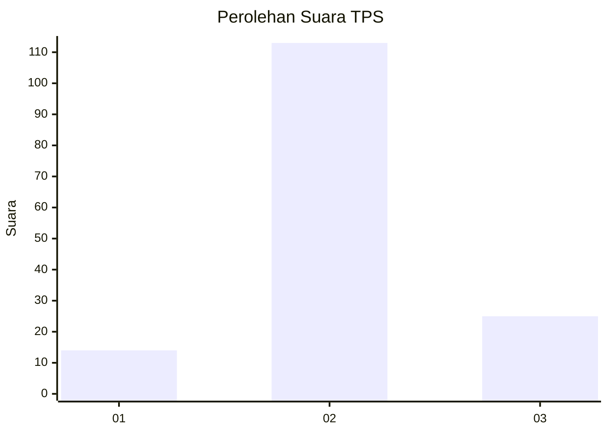
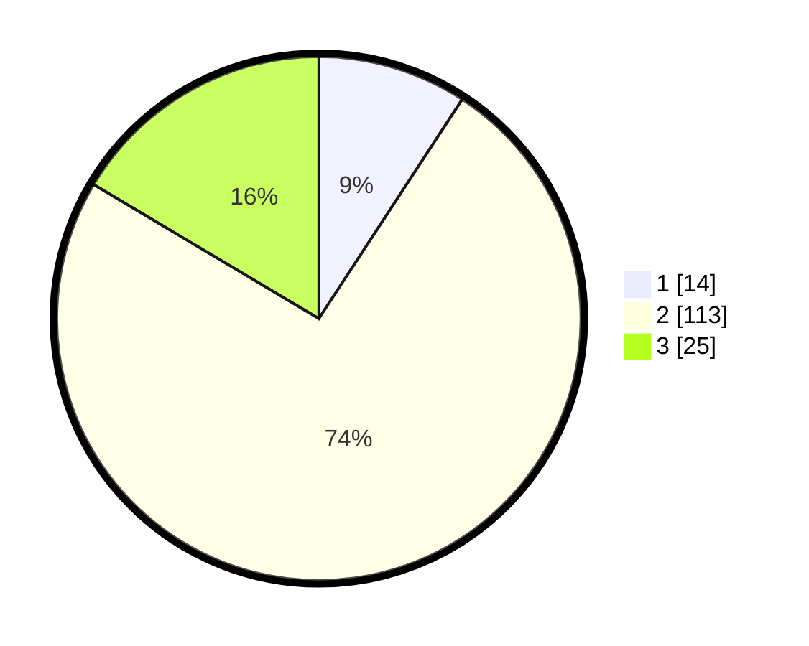

# Hasil

## Grafik

## Tabel

| No. | Nama Paslon    | Suara | Suara (raw) | Persentase |
|:--- |:-------------- | -----:| -----------:| ----------:|
| 1   | ANIES MUHAIMIN | 14    | [14][p-1]   | 9,21       |
| 2   | PRABOWO GIBRAN | 113   | [113][p-2]  | 74,34      |
| 3   | GANJAR MAHFUD  | 25    | [25][p-3]   | 16,45      |

[p-1]: https://github.com/gigit-pemilu/pemilu-2024-63-kalimantan-selatan/blob/main/pilpres/hitung-suara/sub/63-kalimantan-selatan/sub/02-kotabaru/sub/07-kelumpang-selatan/sub/2007-pantai/sub/007-tps/sub/paslon-1.txt
[p-2]: https://github.com/gigit-pemilu/pemilu-2024-63-kalimantan-selatan/blob/main/pilpres/hitung-suara/sub/63-kalimantan-selatan/sub/02-kotabaru/sub/07-kelumpang-selatan/sub/2007-pantai/sub/007-tps/sub/paslon-2.txt
[p-3]: https://github.com/gigit-pemilu/pemilu-2024-63-kalimantan-selatan/blob/main/pilpres/hitung-suara/sub/63-kalimantan-selatan/sub/02-kotabaru/sub/07-kelumpang-selatan/sub/2007-pantai/sub/007-tps/sub/paslon-3.txt

## Foto C Plano

https://sirekap-obj-formc.kpu.go.id/f6c3/pemilu/ppwp/63/02/07/20/07/6302072007007-20240214-234000--7038f549-cc10-4366-8f20-568a9796669a.jpg

https://sirekap-obj-formc.kpu.go.id/f6c3/pemilu/ppwp/63/02/07/20/07/6302072007007-20240217-191854--ea996624-ed6a-4ace-8849-cb5154063e51.jpg

https://sirekap-obj-formc.kpu.go.id/f6c3/pemilu/ppwp/63/02/07/20/07/6302072007007-20240216-213012--48f93708-cc76-4fa6-9c9a-1fb18aa546b9.jpg

## Metadata

| Key        | Value               |
| ---------- | ------------------- |
| Time Stamp | 2024-02-19 06:16:00 |

