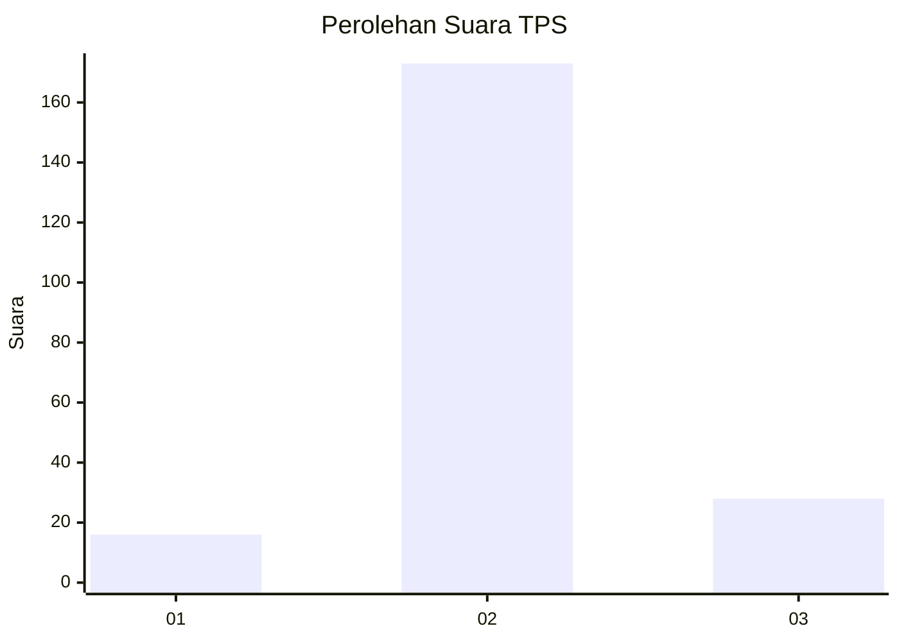
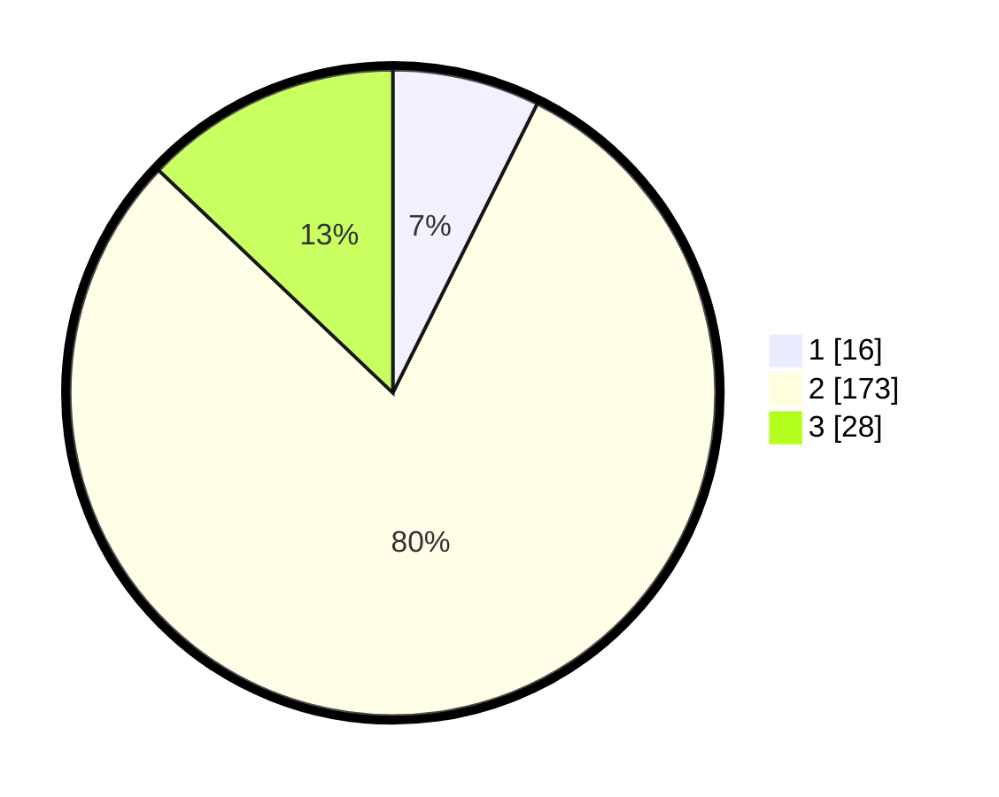

# Hasil

## Grafik

## Tabel

| No. | Nama Paslon    | Suara | Suara (raw) | Persentase |
|:--- |:-------------- | -----:| -----------:| ----------:|
| 1   | ANIES MUHAIMIN | 16    | [16][p-1]   | 7,37       |
| 2   | PRABOWO GIBRAN | 173   | [173][p-2]  | 79,72      |
| 3   | GANJAR MAHFUD  | 28    | [28][p-3]   | 12,90      |

[p-1]: https://github.com/gigit-pemilu/pemilu-2024/blob/main/pilpres/hitung-suara/sub/63-kalimantan-selatan/sub/02-kotabaru/sub/08-kelumpang-hulu/sub/2001-cantung-kiri-hilir/sub/002-tps/sub/paslon-1.txt
[p-2]: https://github.com/gigit-pemilu/pemilu-2024/blob/main/pilpres/hitung-suara/sub/63-kalimantan-selatan/sub/02-kotabaru/sub/08-kelumpang-hulu/sub/2001-cantung-kiri-hilir/sub/002-tps/sub/paslon-2.txt
[p-3]: https://github.com/gigit-pemilu/pemilu-2024/blob/main/pilpres/hitung-suara/sub/63-kalimantan-selatan/sub/02-kotabaru/sub/08-kelumpang-hulu/sub/2001-cantung-kiri-hilir/sub/002-tps/sub/paslon-3.txt

## Foto C Plano

https://sirekap-obj-formc.kpu.go.id/ac6e/pemilu/ppwp/63/02/08/20/01/6302082001002-20240215-102410--72277d63-1eda-42f9-b2d0-c79297d42511.jpg

https://sirekap-obj-formc.kpu.go.id/ac6e/pemilu/ppwp/63/02/08/20/01/6302082001002-20240215-102715--b751632a-519f-4805-b801-dcab6f4d2c61.jpg

https://sirekap-obj-formc.kpu.go.id/ac6e/pemilu/ppwp/63/02/08/20/01/6302082001002-20240215-102801--973357c8-d9ab-461b-b98b-7218670ad8c7.jpg

## Metadata

| Key        | Value               |
| ---------- | ------------------- |
| Time Stamp | 2024-02-17 18:00:00 |

