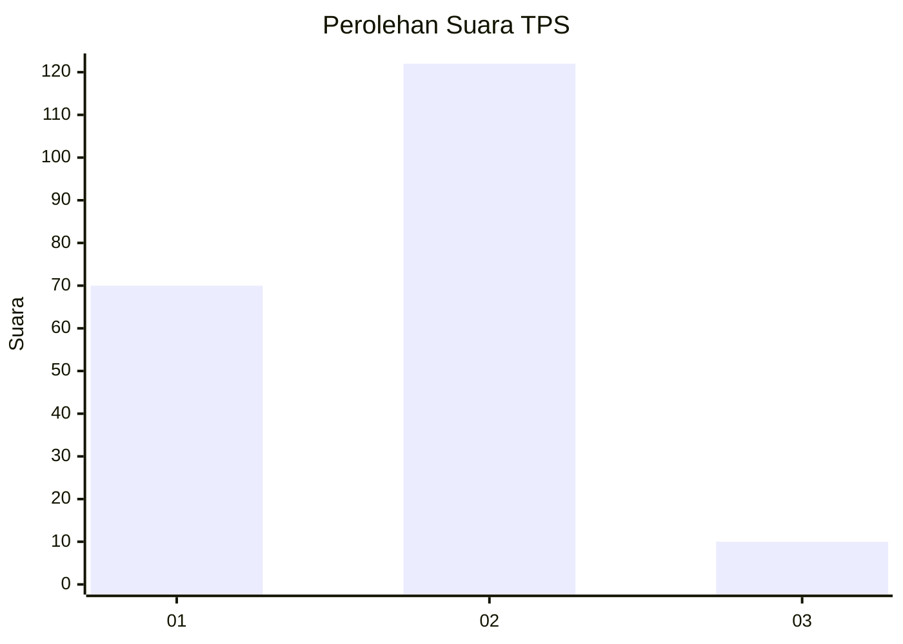
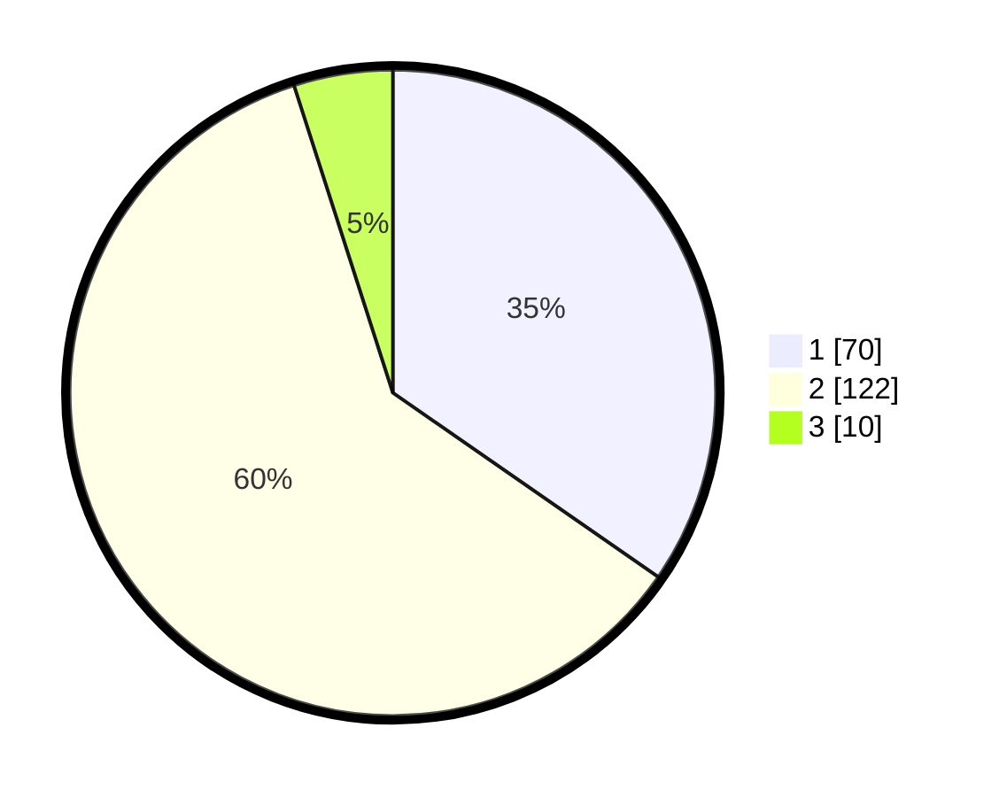

# Hasil

## Grafik

## Tabel

| No. | Nama Paslon    | Suara | Suara (raw) | Persentase |
|:--- |:-------------- | -----:| -----------:| ----------:|
| 1   | ANIES MUHAIMIN | 70    | [70][p-1]   | 34,65      |
| 2   | PRABOWO GIBRAN | 122   | [122][p-2]  | 60,40      |
| 3   | GANJAR MAHFUD  | 10    | [10][p-3]   | 4,95       |

[p-1]: https://github.com/gigit-pemilu/pemilu-2024-63-kalimantan-selatan/blob/main/pilpres/hitung-suara/sub/63-kalimantan-selatan/sub/02-kotabaru/sub/09-kelumpang-tengah/sub/2005-sembilang/sub/003-tps/sub/paslon-1.txt
[p-2]: https://github.com/gigit-pemilu/pemilu-2024-63-kalimantan-selatan/blob/main/pilpres/hitung-suara/sub/63-kalimantan-selatan/sub/02-kotabaru/sub/09-kelumpang-tengah/sub/2005-sembilang/sub/003-tps/sub/paslon-2.txt
[p-3]: https://github.com/gigit-pemilu/pemilu-2024-63-kalimantan-selatan/blob/main/pilpres/hitung-suara/sub/63-kalimantan-selatan/sub/02-kotabaru/sub/09-kelumpang-tengah/sub/2005-sembilang/sub/003-tps/sub/paslon-3.txt

## Foto C Plano

https://sirekap-obj-formc.kpu.go.id/806d/pemilu/ppwp/63/02/09/20/05/6302092005003-20240215-020353--4935f11d-7496-4a70-9bb0-0f4c523b7655.jpg

https://sirekap-obj-formc.kpu.go.id/806d/pemilu/ppwp/63/02/09/20/05/6302092005003-20240214-223121--76424f29-3d8c-4b60-ac29-a7c7939b0185.jpg

https://sirekap-obj-formc.kpu.go.id/806d/pemilu/ppwp/63/02/09/20/05/6302092005003-20240215-020613--3926035c-1f76-475b-a909-2d483b634986.jpg

## Metadata

| Key        | Value               |
| ---------- | ------------------- |
| Time Stamp | 2024-02-19 06:16:00 |

