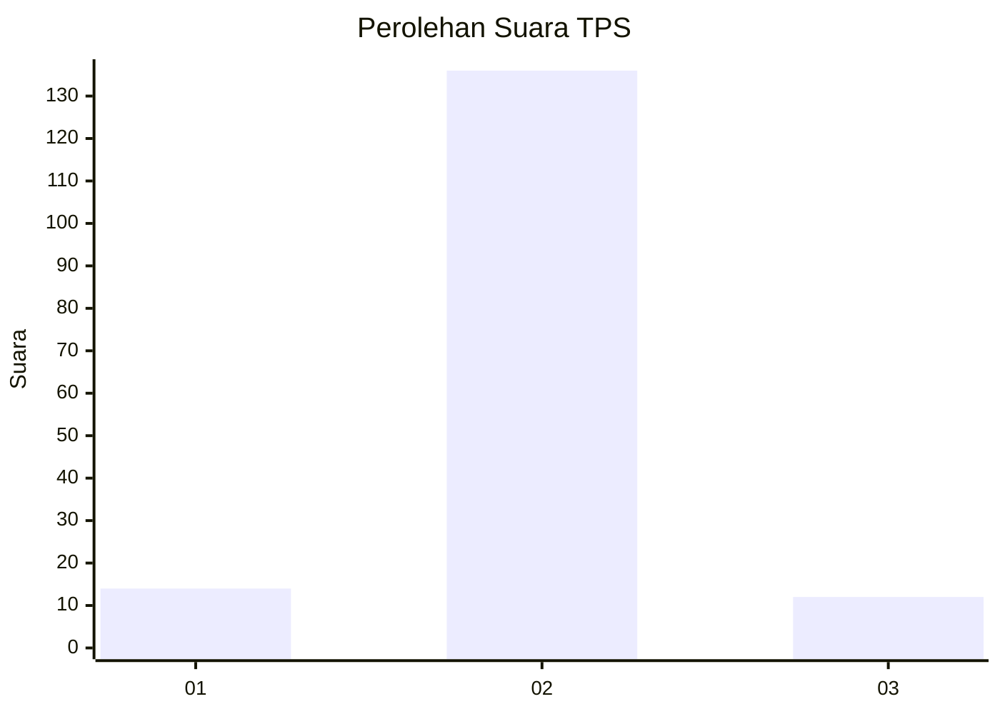
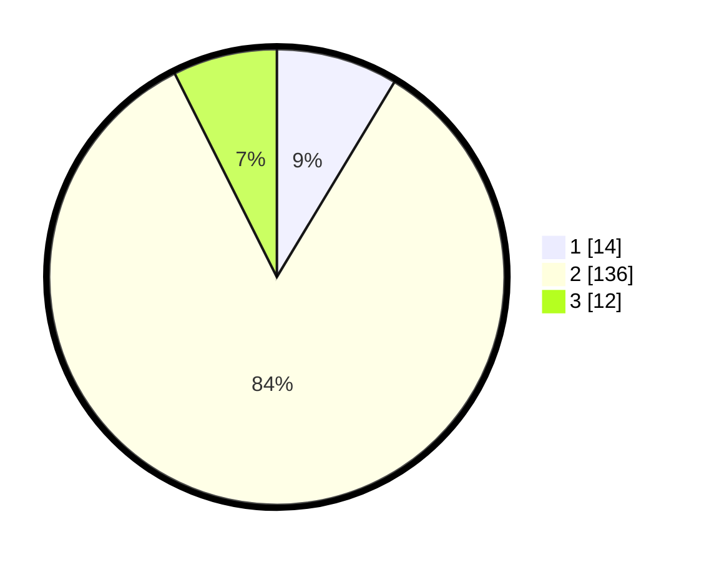

# Hasil

## Grafik

## Tabel

| No. | Nama Paslon    | Suara | Suara (raw) | Persentase |
|:--- |:-------------- | -----:| -----------:| ----------:|
| 1   | ANIES MUHAIMIN | 14    | [14][p-1]   | 8,64       |
| 2   | PRABOWO GIBRAN | 136   | [136][p-2]  | 83,95      |
| 3   | GANJAR MAHFUD  | 12    | [12][p-3]   | 7,41       |

[p-1]: https://github.com/gigit-pemilu/pemilu-2024/blob/main/pilpres/hitung-suara/sub/63-kalimantan-selatan/sub/02-kotabaru/sub/09-kelumpang-tengah/sub/2006-tamiang-bakung/sub/001-tps/sub/paslon-1.txt
[p-2]: https://github.com/gigit-pemilu/pemilu-2024/blob/main/pilpres/hitung-suara/sub/63-kalimantan-selatan/sub/02-kotabaru/sub/09-kelumpang-tengah/sub/2006-tamiang-bakung/sub/001-tps/sub/paslon-2.txt
[p-3]: https://github.com/gigit-pemilu/pemilu-2024/blob/main/pilpres/hitung-suara/sub/63-kalimantan-selatan/sub/02-kotabaru/sub/09-kelumpang-tengah/sub/2006-tamiang-bakung/sub/001-tps/sub/paslon-3.txt

## Foto C Plano

https://sirekap-obj-formc.kpu.go.id/d3f1/pemilu/ppwp/63/02/09/20/06/6302092006001-20240214-155306--0d0e4c6b-4b7d-4a5c-95f0-e4adc107f252.jpg

https://sirekap-obj-formc.kpu.go.id/d3f1/pemilu/ppwp/63/02/09/20/06/6302092006001-20240214-155508--5a6983cb-125e-4850-a77a-808bc460297e.jpg

https://sirekap-obj-formc.kpu.go.id/d3f1/pemilu/ppwp/63/02/09/20/06/6302092006001-20240214-155715--167a2684-1538-4d05-a323-2a9494e74bd6.jpg

## Metadata

| Key        | Value               |
| ---------- | ------------------- |
| Time Stamp | 2024-02-19 06:16:00 |

