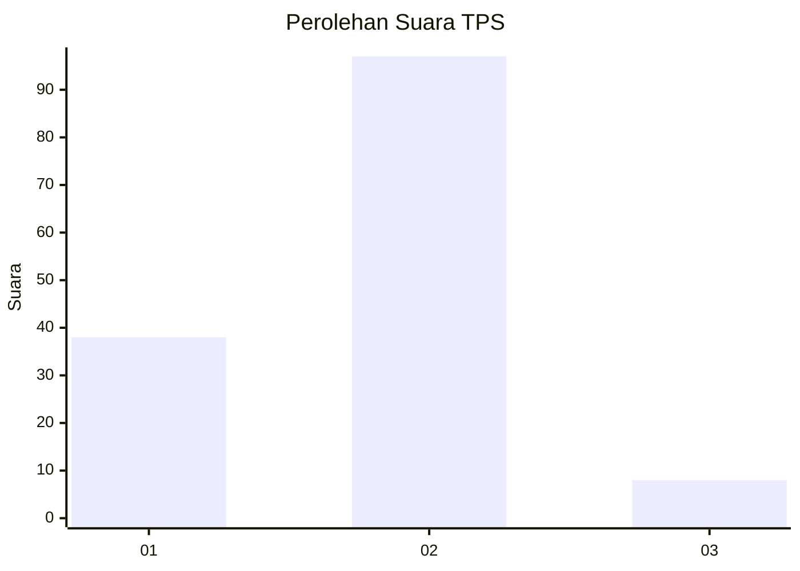
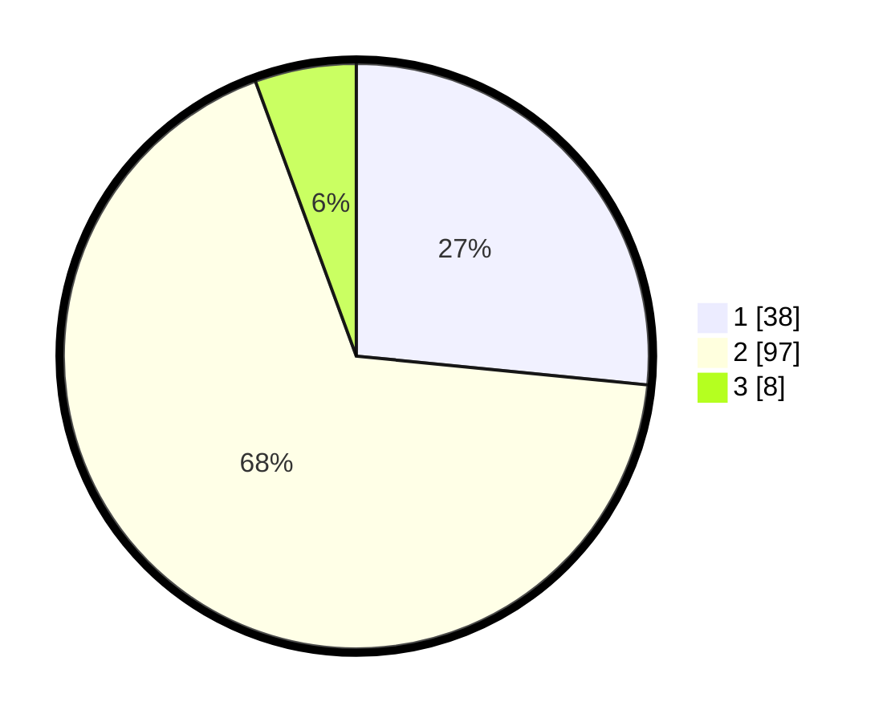

# Hasil

## Grafik

## Tabel

| No. | Nama Paslon    | Suara | Suara (raw) | Persentase |
|:--- |:-------------- | -----:| -----------:| ----------:|
| 1   | ANIES MUHAIMIN | 38    | [38][p-1]   | 26,57      |
| 2   | PRABOWO GIBRAN | 97    | [97][p-2]   | 67,83      |
| 3   | GANJAR MAHFUD  | 8     | [8][p-3]    | 5,59       |

[p-1]: https://github.com/gigit-pemilu/pemilu-2024/blob/main/pilpres/hitung-suara/sub/63-kalimantan-selatan/sub/02-kotabaru/sub/09-kelumpang-tengah/sub/2006-tamiang-bakung/sub/002-tps/sub/paslon-1.txt
[p-2]: https://github.com/gigit-pemilu/pemilu-2024/blob/main/pilpres/hitung-suara/sub/63-kalimantan-selatan/sub/02-kotabaru/sub/09-kelumpang-tengah/sub/2006-tamiang-bakung/sub/002-tps/sub/paslon-2.txt
[p-3]: https://github.com/gigit-pemilu/pemilu-2024/blob/main/pilpres/hitung-suara/sub/63-kalimantan-selatan/sub/02-kotabaru/sub/09-kelumpang-tengah/sub/2006-tamiang-bakung/sub/002-tps/sub/paslon-3.txt

## Foto C Plano

https://sirekap-obj-formc.kpu.go.id/70bb/pemilu/ppwp/63/02/09/20/06/6302092006002-20240214-194956--25204a3e-13fe-4d09-9b2b-9c0be0fa1800.jpg

https://sirekap-obj-formc.kpu.go.id/70bb/pemilu/ppwp/63/02/09/20/06/6302092006002-20240214-195018--656ad8e1-2cce-46c8-9293-d28009996d6b.jpg

https://sirekap-obj-formc.kpu.go.id/70bb/pemilu/ppwp/63/02/09/20/06/6302092006002-20240214-184700--fc2a7a22-e66e-4478-a6e9-47f232233c68.jpg

## Metadata

| Key        | Value               |
| ---------- | ------------------- |
| Time Stamp | 2024-02-19 06:16:00 |

