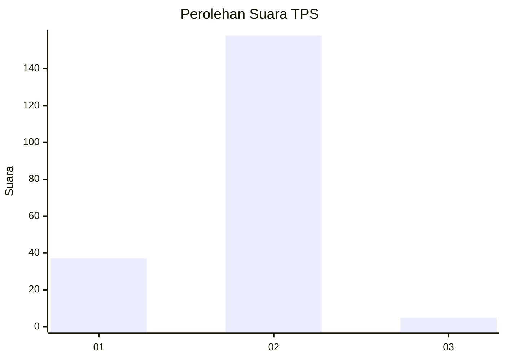
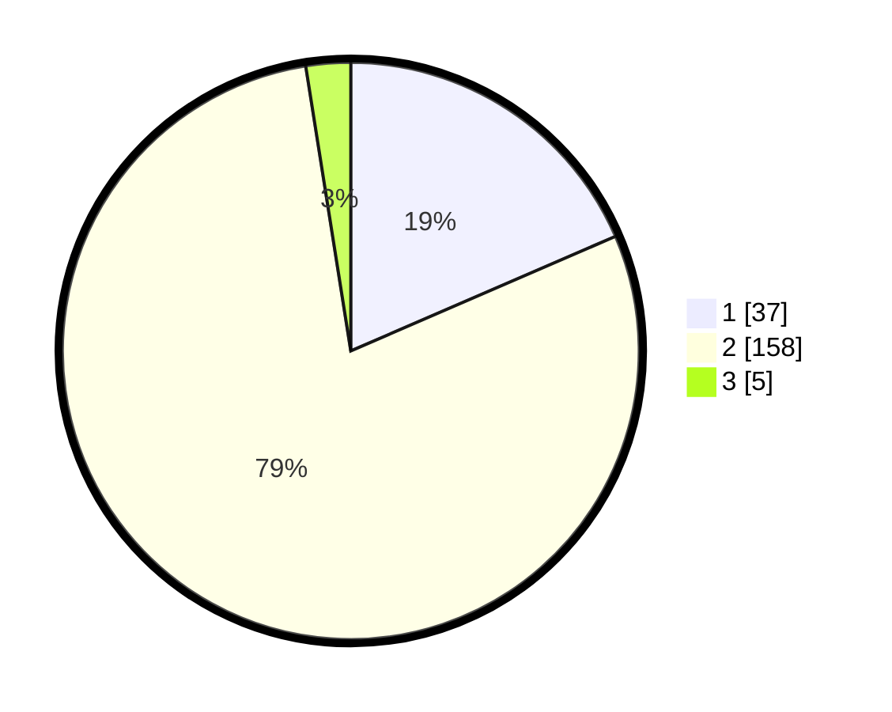

# Hasil

## Grafik

## Tabel

| No. | Nama Paslon    | Suara | Suara (raw) | Persentase |
|:--- |:-------------- | -----:| -----------:| ----------:|
| 1   | ANIES MUHAIMIN | 37    | [37][p-1]   | 18,50      |
| 2   | PRABOWO GIBRAN | 158   | [158][p-2]  | 79,00      |
| 3   | GANJAR MAHFUD  | 5     | [5][p-3]    | 2,50       |

[p-1]: https://github.com/gigit-pemilu/pemilu-2024-63-kalimantan-selatan/blob/main/pilpres/hitung-suara/sub/63-kalimantan-selatan/sub/02-kotabaru/sub/11-pamukan-selatan/sub/2002-gunung-calang/sub/002-tps/sub/paslon-1.txt
[p-2]: https://github.com/gigit-pemilu/pemilu-2024-63-kalimantan-selatan/blob/main/pilpres/hitung-suara/sub/63-kalimantan-selatan/sub/02-kotabaru/sub/11-pamukan-selatan/sub/2002-gunung-calang/sub/002-tps/sub/paslon-2.txt
[p-3]: https://github.com/gigit-pemilu/pemilu-2024-63-kalimantan-selatan/blob/main/pilpres/hitung-suara/sub/63-kalimantan-selatan/sub/02-kotabaru/sub/11-pamukan-selatan/sub/2002-gunung-calang/sub/002-tps/sub/paslon-3.txt

## Foto C Plano

https://sirekap-obj-formc.kpu.go.id/4c1e/pemilu/ppwp/63/02/11/20/02/6302112002002-20240215-155709--6d173858-862e-4ed8-bf94-948b63245ef7.jpg

https://sirekap-obj-formc.kpu.go.id/4c1e/pemilu/ppwp/63/02/11/20/02/6302112002002-20240215-100119--5d749f42-bb25-40d3-bc0c-a645cb390bd9.jpg

https://sirekap-obj-formc.kpu.go.id/4c1e/pemilu/ppwp/63/02/11/20/02/6302112002002-20240214-203204--60825bd8-2c9c-4070-84bb-15397b62d603.jpg

## Metadata

| Key        | Value               |
| ---------- | ------------------- |
| Time Stamp | 2024-02-19 06:16:00 |

