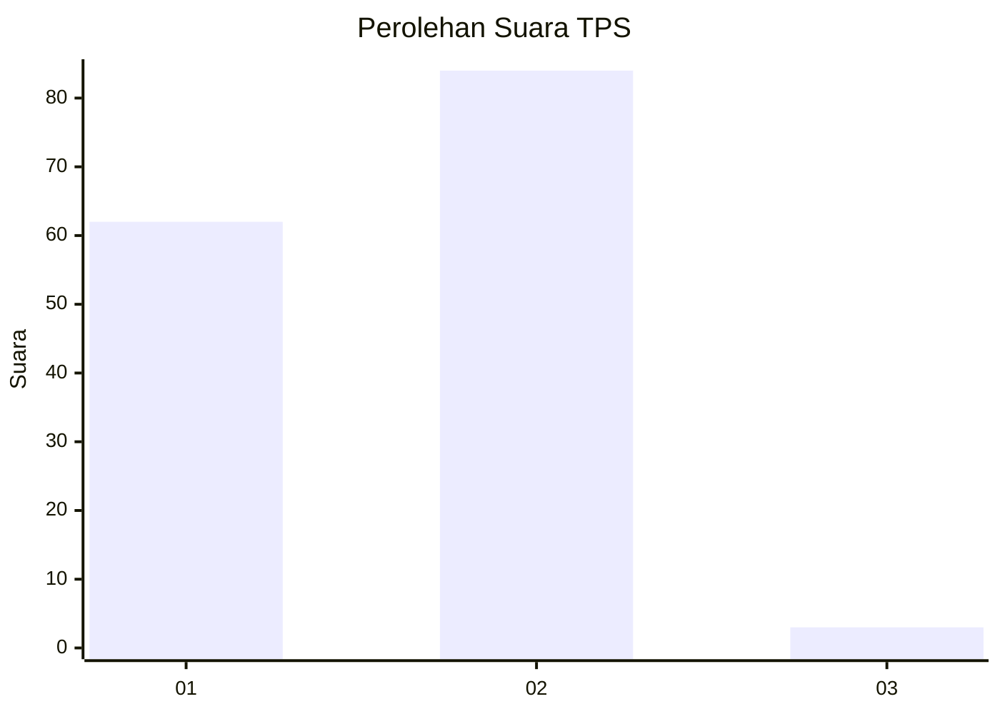
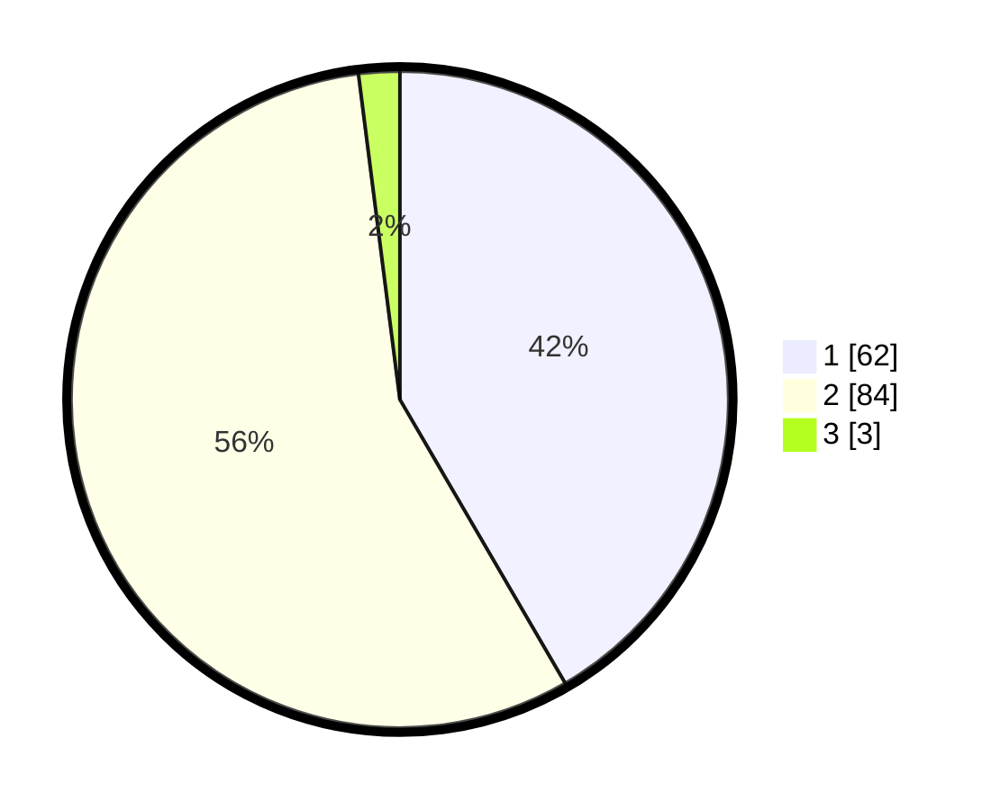

# Hasil

## Grafik

## Tabel

| No. | Nama Paslon    | Suara | Suara (raw) | Persentase |
|:--- |:-------------- | -----:| -----------:| ----------:|
| 1   | ANIES MUHAIMIN | 62    | [62][p-1]   | 41,61      |
| 2   | PRABOWO GIBRAN | 84    | [84][p-2]   | 56,38      |
| 3   | GANJAR MAHFUD  | 3     | [3][p-3]    | 2,01       |

[p-1]: https://github.com/gigit-pemilu/pemilu-2024-63-kalimantan-selatan/blob/main/pilpres/hitung-suara/sub/63-kalimantan-selatan/sub/02-kotabaru/sub/12-sampanahan/sub/2005-sampanahan/sub/002-tps/sub/paslon-1.txt
[p-2]: https://github.com/gigit-pemilu/pemilu-2024-63-kalimantan-selatan/blob/main/pilpres/hitung-suara/sub/63-kalimantan-selatan/sub/02-kotabaru/sub/12-sampanahan/sub/2005-sampanahan/sub/002-tps/sub/paslon-2.txt
[p-3]: https://github.com/gigit-pemilu/pemilu-2024-63-kalimantan-selatan/blob/main/pilpres/hitung-suara/sub/63-kalimantan-selatan/sub/02-kotabaru/sub/12-sampanahan/sub/2005-sampanahan/sub/002-tps/sub/paslon-3.txt

## Foto C Plano

https://sirekap-obj-formc.kpu.go.id/bcbf/pemilu/ppwp/63/02/12/20/05/6302122005002-20240214-190808--e76536e3-f9d1-43f0-a679-65180c00a673.jpg

https://sirekap-obj-formc.kpu.go.id/bcbf/pemilu/ppwp/63/02/12/20/05/6302122005002-20240214-191025--1940eb98-ebfb-43b2-bbb5-4caae4604196.jpg

https://sirekap-obj-formc.kpu.go.id/bcbf/pemilu/ppwp/63/02/12/20/05/6302122005002-20240214-190545--484c49c1-1ae4-463d-b59e-d1d9a83ce92f.jpg

## Metadata

| Key        | Value               |
| ---------- | ------------------- |
| Time Stamp | 2024-02-15 04:00:24 |

## DATA PEMILIH TETAP

Jumlah pemilih dalam DPT: **223**.
 * L: **501**.
 * P: **302**.

## DATA PENGGUNA HAK PILIH

Jumlah pengguna hak pilih dalam DPT: **350**.
 * L: **72**.
 * P: **72**.

Jumlah pengguna hak pilih dalam DPTb: **2**.
 * L: **5**.
 * P: **3**.

Jumlah pengguna hak pilih dalam DPK: **0**.
 * L: **0**.
 * P: **0**.

Jumlah pengguna hak pilih: **853**.
 * L: **33**.
 * P: **73**.

## JUMLAH SUARA SAH DAN TIDAK SAH

JUMLAH SELURUH SUARA SAH: **249**.

JUMLAH SUARA TIDAK SAH: **3**.

JUMLAH SELURUH SUARA SAH DAN SUARA TIDAK SAH: **152**.

