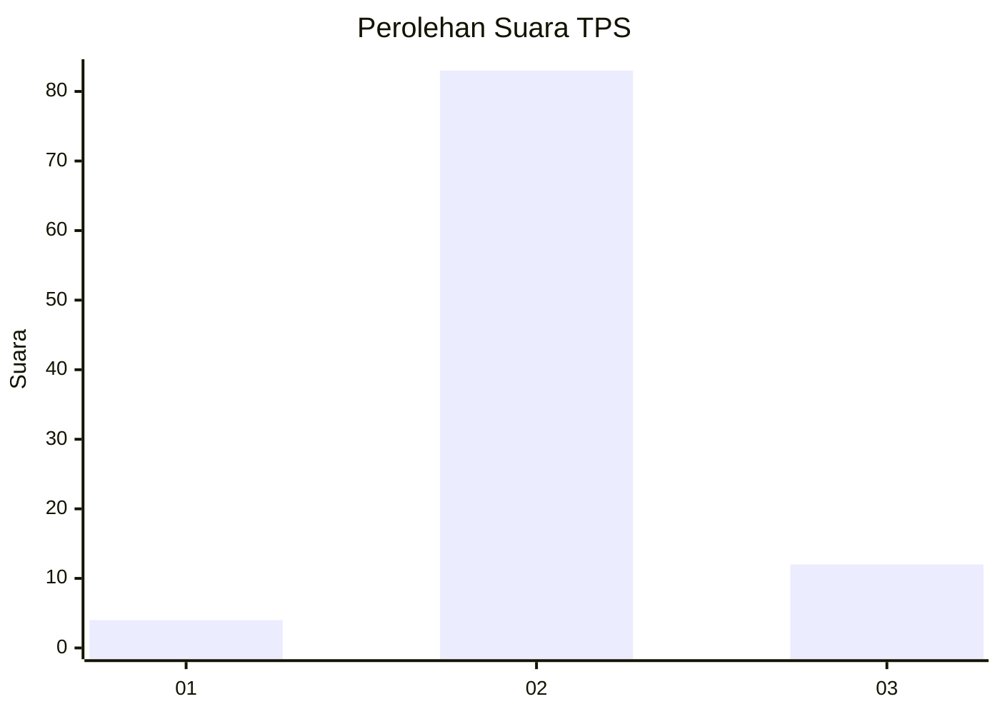
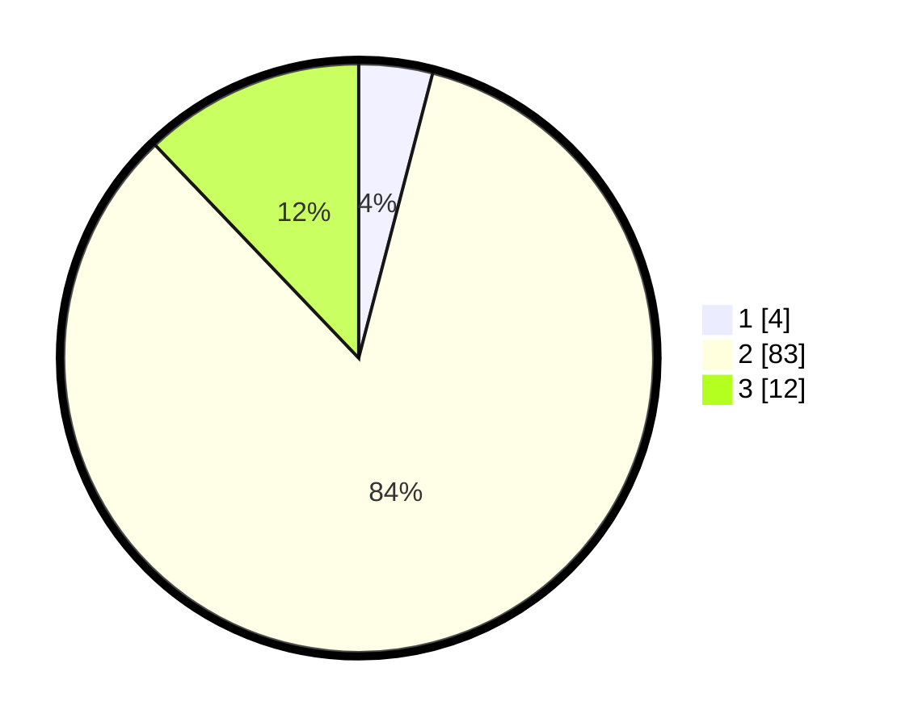

# Hasil

## Grafik

## Tabel

| No. | Nama Paslon    | Suara | Suara (raw) | Persentase |
|:--- |:-------------- | -----:| -----------:| ----------:|
| 1   | ANIES MUHAIMIN | 4     | [4][p-1]    | 4,04       |
| 2   | PRABOWO GIBRAN | 83    | [83][p-2]   | 83,84      |
| 3   | GANJAR MAHFUD  | 12    | [12][p-3]   | 12,12      |

[p-1]: https://github.com/gigit-pemilu/pemilu-2024/blob/main/pilpres/hitung-suara/sub/63-kalimantan-selatan/sub/02-kotabaru/sub/13-pamukan-utara/sub/2002-bepara/sub/002-tps/sub/paslon-1.txt
[p-2]: https://github.com/gigit-pemilu/pemilu-2024/blob/main/pilpres/hitung-suara/sub/63-kalimantan-selatan/sub/02-kotabaru/sub/13-pamukan-utara/sub/2002-bepara/sub/002-tps/sub/paslon-2.txt
[p-3]: https://github.com/gigit-pemilu/pemilu-2024/blob/main/pilpres/hitung-suara/sub/63-kalimantan-selatan/sub/02-kotabaru/sub/13-pamukan-utara/sub/2002-bepara/sub/002-tps/sub/paslon-3.txt

## Foto C Plano

https://sirekap-obj-formc.kpu.go.id/7d9d/pemilu/ppwp/63/02/13/20/02/6302132002002-20240214-221633--9cd83f84-ee32-4e76-aa34-70c5594a9c9c.jpg

https://sirekap-obj-formc.kpu.go.id/7d9d/pemilu/ppwp/63/02/13/20/02/6302132002002-20240214-214042--983b6096-2597-426b-8eae-c26ea0078dca.jpg

https://sirekap-obj-formc.kpu.go.id/7d9d/pemilu/ppwp/63/02/13/20/02/6302132002002-20240215-073454--3c3edf6d-d78f-47c3-91b5-12cb59312d6a.jpg

## Metadata

| Key        | Value               |
| ---------- | ------------------- |
| Time Stamp | 2024-02-19 06:16:00 |

