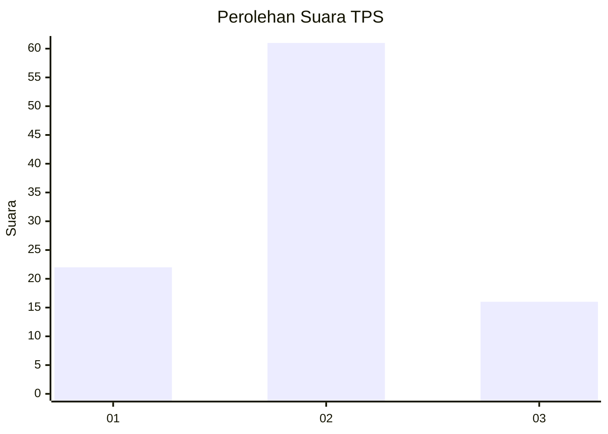
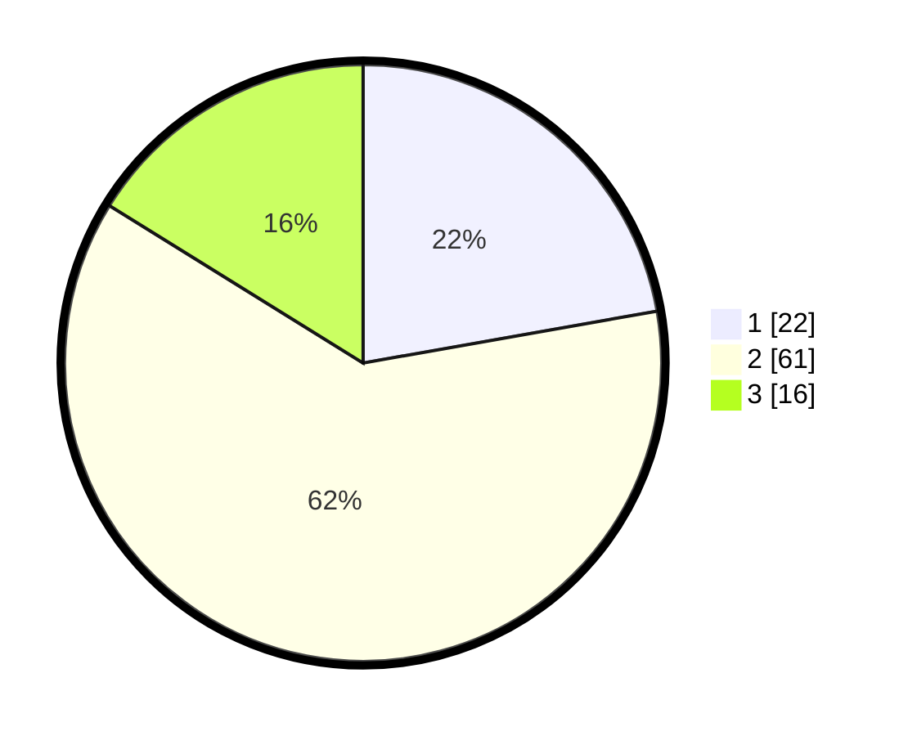

# Hasil

## Grafik

## Tabel

| No. | Nama Paslon    | Suara | Suara (raw) | Persentase |
|:--- |:-------------- | -----:| -----------:| ----------:|
| 1   | ANIES MUHAIMIN | 22    | [22][p-1]   | 22,22      |
| 2   | PRABOWO GIBRAN | 61    | [61][p-2]   | 61,62      |
| 3   | GANJAR MAHFUD  | 16    | [16][p-3]   | 16,16      |

[p-1]: https://github.com/gigit-pemilu/pemilu-2024/blob/main/pilpres/hitung-suara/sub/63-kalimantan-selatan/sub/02-kotabaru/sub/13-pamukan-utara/sub/2009-balaimea/sub/003-tps/sub/paslon-1.txt
[p-2]: https://github.com/gigit-pemilu/pemilu-2024/blob/main/pilpres/hitung-suara/sub/63-kalimantan-selatan/sub/02-kotabaru/sub/13-pamukan-utara/sub/2009-balaimea/sub/003-tps/sub/paslon-2.txt
[p-3]: https://github.com/gigit-pemilu/pemilu-2024/blob/main/pilpres/hitung-suara/sub/63-kalimantan-selatan/sub/02-kotabaru/sub/13-pamukan-utara/sub/2009-balaimea/sub/003-tps/sub/paslon-3.txt

## Foto C Plano

https://sirekap-obj-formc.kpu.go.id/33db/pemilu/ppwp/63/02/13/20/09/6302132009003-20240222-150402--2d00cf80-a695-4e48-a50f-7352a57d6f8d.jpg

https://sirekap-obj-formc.kpu.go.id/33db/pemilu/ppwp/63/02/13/20/09/6302132009003-20240218-195248--e09a4a35-f0d2-4f5c-aa96-ccfb31bf5f75.jpg

https://sirekap-obj-formc.kpu.go.id/33db/pemilu/ppwp/63/02/13/20/09/6302132009003-20240222-151000--2b6b2c07-3ed0-4605-b15b-a1c5fc104be3.jpg

## Metadata

| Key        | Value               |
| ---------- | ------------------- |
| Time Stamp | 2024-02-22 16:00:00 |

