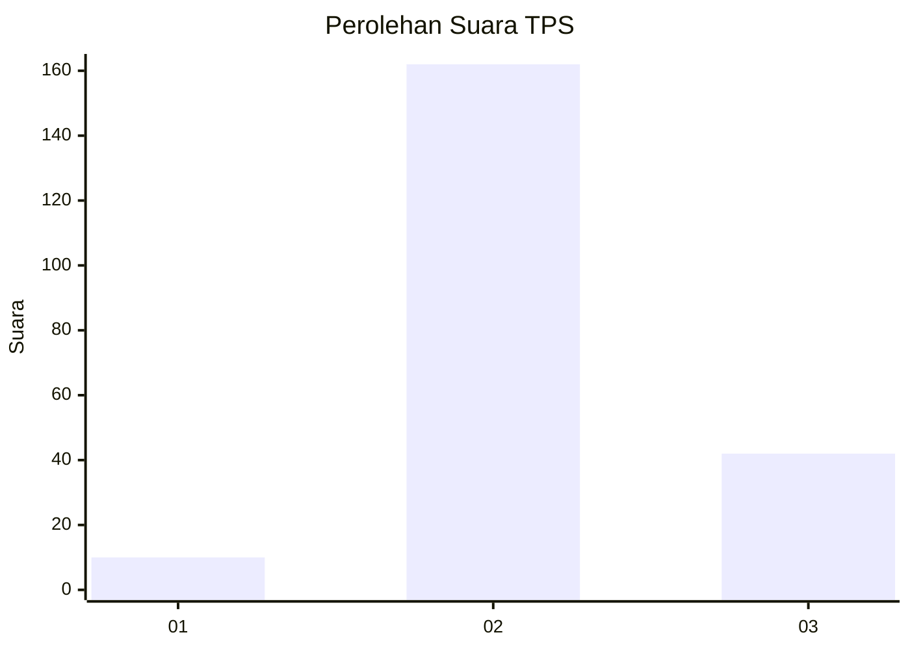

# Hasil

## Grafik

## Tabel

| No. | Nama Paslon    | Suara | Suara (raw) | Persentase |
|:--- |:-------------- | -----:| -----------:| ----------:|
| 1   | ANIES MUHAIMIN | 10    | [10][p-1]   | 4,67       |
| 2   | PRABOWO GIBRAN | 162   | [162][p-2]  | 75,70      |
| 3   | GANJAR MAHFUD  | 42    | [42][p-3]   | 19,63      |

[p-1]: https://github.com/gigit-pemilu/pemilu-2024-63-kalimantan-selatan/blob/main/pilpres/hitung-suara/sub/63-kalimantan-selatan/sub/02-kotabaru/sub/14-hampang/sub/2002-cantung-kiri-hulu/sub/001-tps/sub/paslon-1.txt
[p-2]: https://github.com/gigit-pemilu/pemilu-2024-63-kalimantan-selatan/blob/main/pilpres/hitung-suara/sub/63-kalimantan-selatan/sub/02-kotabaru/sub/14-hampang/sub/2002-cantung-kiri-hulu/sub/001-tps/sub/paslon-2.txt
[p-3]: https://github.com/gigit-pemilu/pemilu-2024-63-kalimantan-selatan/blob/main/pilpres/hitung-suara/sub/63-kalimantan-selatan/sub/02-kotabaru/sub/14-hampang/sub/2002-cantung-kiri-hulu/sub/001-tps/sub/paslon-3.txt

## Foto C Plano

https://sirekap-obj-formc.kpu.go.id/f6cf/pemilu/ppwp/63/02/14/20/02/6302142002001-20240215-091417--15143b2d-44f8-4483-922a-72ff9aec71ee.jpg

https://sirekap-obj-formc.kpu.go.id/f6cf/pemilu/ppwp/63/02/14/20/02/6302142002001-20240215-091431--28648ffd-4bd2-495e-9933-c5d541ae07cc.jpg

https://sirekap-obj-formc.kpu.go.id/f6cf/pemilu/ppwp/63/02/14/20/02/6302142002001-20240215-091435--10337fe4-fa0a-4bee-b27b-cc4b8d183d47.jpg

## Metadata

| Key        | Value               |
| ---------- | ------------------- |
| Time Stamp | 2024-02-15 21:01:18 |

