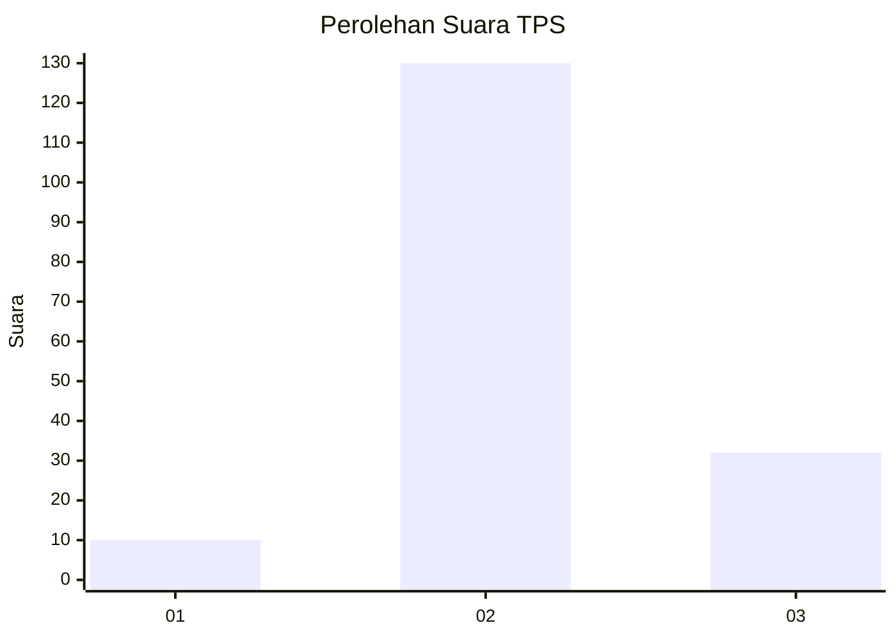
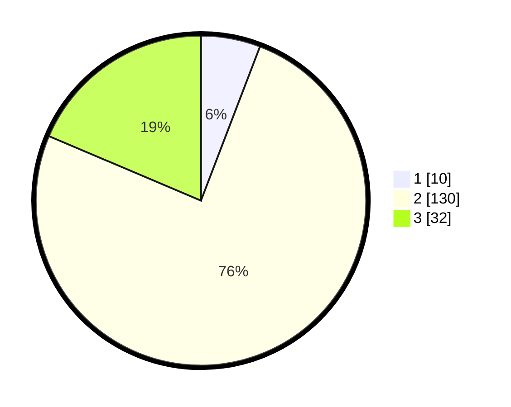

# Hasil

## Grafik

## Tabel

| No. | Nama Paslon    | Suara | Suara (raw) | Persentase |
|:--- |:-------------- | -----:| -----------:| ----------:|
| 1   | ANIES MUHAIMIN | 10    | [10][p-1]   | 5,81       |
| 2   | PRABOWO GIBRAN | 130   | [130][p-2]  | 75,58      |
| 3   | GANJAR MAHFUD  | 32    | [32][p-3]   | 18,60      |

[p-1]: https://github.com/gigit-pemilu/pemilu-2024/blob/main/pilpres/hitung-suara/sub/63-kalimantan-selatan/sub/02-kotabaru/sub/14-hampang/sub/2002-cantung-kiri-hulu/sub/004-tps/sub/paslon-1.txt
[p-2]: https://github.com/gigit-pemilu/pemilu-2024/blob/main/pilpres/hitung-suara/sub/63-kalimantan-selatan/sub/02-kotabaru/sub/14-hampang/sub/2002-cantung-kiri-hulu/sub/004-tps/sub/paslon-2.txt
[p-3]: https://github.com/gigit-pemilu/pemilu-2024/blob/main/pilpres/hitung-suara/sub/63-kalimantan-selatan/sub/02-kotabaru/sub/14-hampang/sub/2002-cantung-kiri-hulu/sub/004-tps/sub/paslon-3.txt

## Foto C Plano

https://sirekap-obj-formc.kpu.go.id/7235/pemilu/ppwp/63/02/14/20/02/6302142002004-20240215-074613--81bdb9fe-1af2-4c9f-aee4-f6260bbff3e9.jpg

https://sirekap-obj-formc.kpu.go.id/7235/pemilu/ppwp/63/02/14/20/02/6302142002004-20240215-101046--319b647f-6eb0-4dfc-bbd8-5baa0c9187b0.jpg

https://sirekap-obj-formc.kpu.go.id/7235/pemilu/ppwp/63/02/14/20/02/6302142002004-20240215-075048--53f78f8a-cb86-4de2-8e8e-6e2af34c0651.jpg

## Metadata

| Key        | Value               |
| ---------- | ------------------- |
| Time Stamp | 2024-02-15 22:00:27 |

