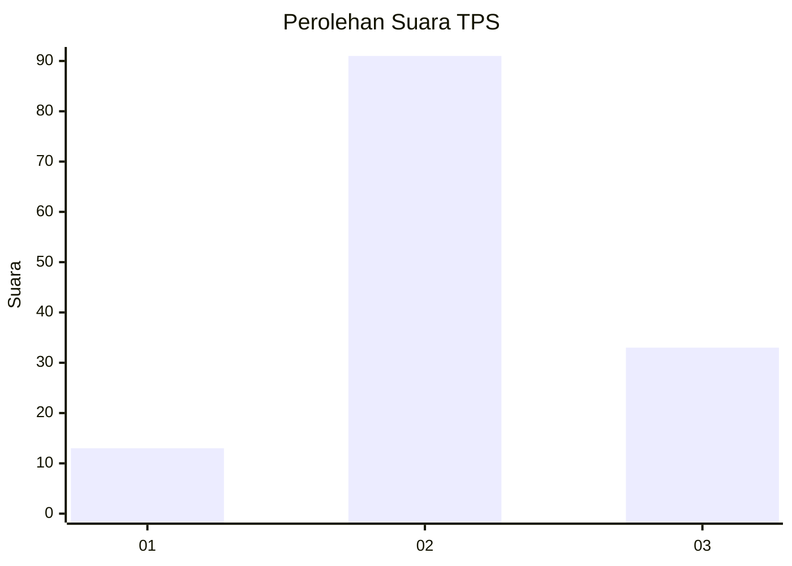
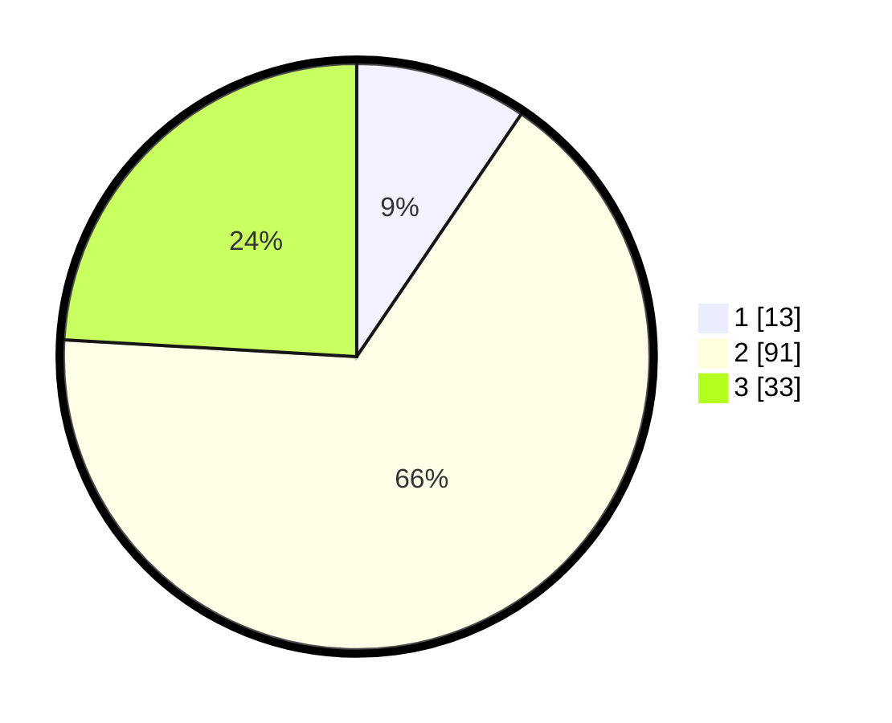

# Hasil

## Grafik

## Tabel

| No. | Nama Paslon    | Suara | Suara (raw) | Persentase |
|:--- |:-------------- | -----:| -----------:| ----------:|
| 1   | ANIES MUHAIMIN | 13    | [13][p-1]   | 9,49       |
| 2   | PRABOWO GIBRAN | 91    | [91][p-2]   | 66,42      |
| 3   | GANJAR MAHFUD  | 33    | [33][p-3]   | 24,09      |

[p-1]: https://github.com/gigit-pemilu/pemilu-2024-63-kalimantan-selatan/blob/main/pilpres/hitung-suara/sub/63-kalimantan-selatan/sub/02-kotabaru/sub/15-sungai-durian/sub/2001-buluh-kuning/sub/001-tps/sub/paslon-1.txt
[p-2]: https://github.com/gigit-pemilu/pemilu-2024-63-kalimantan-selatan/blob/main/pilpres/hitung-suara/sub/63-kalimantan-selatan/sub/02-kotabaru/sub/15-sungai-durian/sub/2001-buluh-kuning/sub/001-tps/sub/paslon-2.txt
[p-3]: https://github.com/gigit-pemilu/pemilu-2024-63-kalimantan-selatan/blob/main/pilpres/hitung-suara/sub/63-kalimantan-selatan/sub/02-kotabaru/sub/15-sungai-durian/sub/2001-buluh-kuning/sub/001-tps/sub/paslon-3.txt

## Foto C Plano

https://sirekap-obj-formc.kpu.go.id/5cdc/pemilu/ppwp/63/02/15/20/01/6302152001001-20240214-202109--8899bead-5cfa-4671-8b7a-aae8c9592419.jpg

https://sirekap-obj-formc.kpu.go.id/5cdc/pemilu/ppwp/63/02/15/20/01/6302152001001-20240214-141635--e85cb8c2-6164-4f1c-9da6-6c7078f30e75.jpg

https://sirekap-obj-formc.kpu.go.id/5cdc/pemilu/ppwp/63/02/15/20/01/6302152001001-20240214-141749--bb72fafe-2334-4c48-bea8-8cb096b62474.jpg

## Metadata

| Key        | Value               |
| ---------- | ------------------- |
| Time Stamp | 2024-02-15 23:29:50 |

