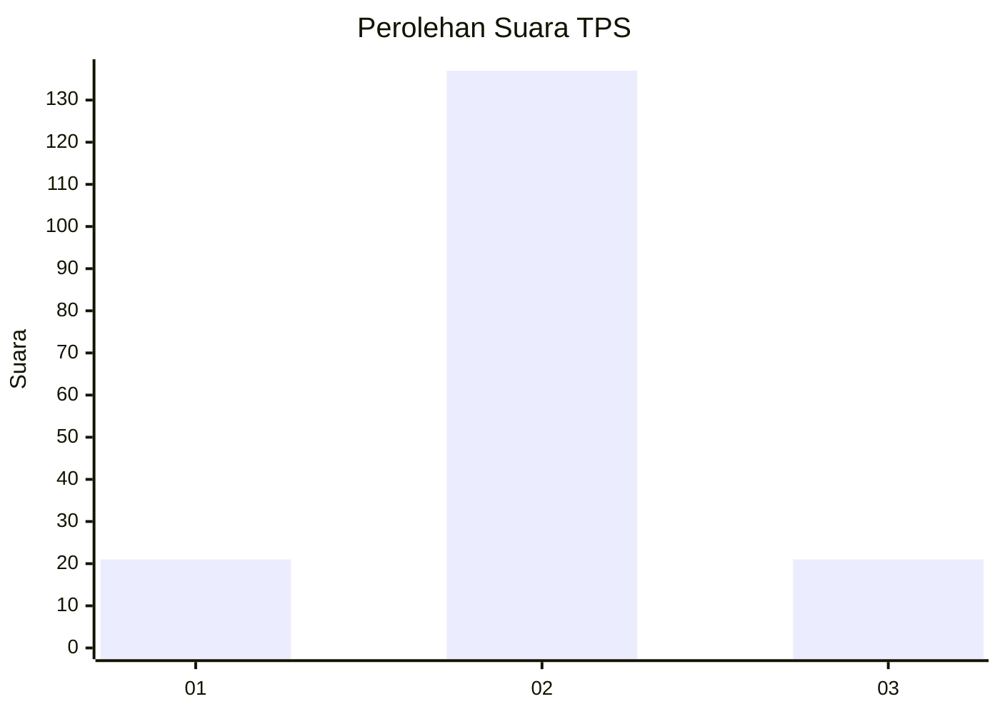
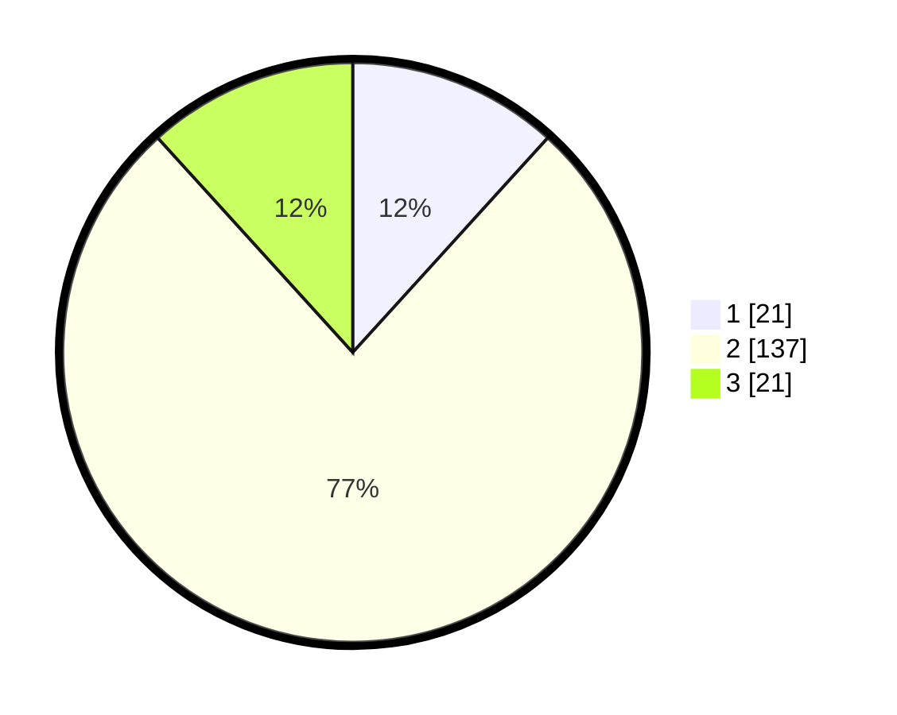

# Hasil

## Grafik

## Tabel

| No. | Nama Paslon    | Suara | Suara (raw) | Persentase |
|:--- |:-------------- | -----:| -----------:| ----------:|
| 1   | ANIES MUHAIMIN | 21    | [21][p-1]   | 11,73      |
| 2   | PRABOWO GIBRAN | 137   | [137][p-2]  | 76,54      |
| 3   | GANJAR MAHFUD  | 21    | [21][p-3]   | 11,73      |

[p-1]: https://github.com/gigit-pemilu/pemilu-2024/blob/main/pilpres/hitung-suara/sub/63-kalimantan-selatan/sub/02-kotabaru/sub/15-sungai-durian/sub/2001-buluh-kuning/sub/003-tps/sub/paslon-1.txt
[p-2]: https://github.com/gigit-pemilu/pemilu-2024/blob/main/pilpres/hitung-suara/sub/63-kalimantan-selatan/sub/02-kotabaru/sub/15-sungai-durian/sub/2001-buluh-kuning/sub/003-tps/sub/paslon-2.txt
[p-3]: https://github.com/gigit-pemilu/pemilu-2024/blob/main/pilpres/hitung-suara/sub/63-kalimantan-selatan/sub/02-kotabaru/sub/15-sungai-durian/sub/2001-buluh-kuning/sub/003-tps/sub/paslon-3.txt

## Foto C Plano

https://sirekap-obj-formc.kpu.go.id/d497/pemilu/ppwp/63/02/15/20/01/6302152001003-20240214-212600--0b5cec8d-ee2f-4ddf-9728-1d794dfc5fee.jpg

https://sirekap-obj-formc.kpu.go.id/d497/pemilu/ppwp/63/02/15/20/01/6302152001003-20240214-141035--bc980bc3-7502-4238-ae4d-2d59468ce911.jpg

https://sirekap-obj-formc.kpu.go.id/d497/pemilu/ppwp/63/02/15/20/01/6302152001003-20240214-230154--fb5620c0-a6f4-48a6-9fb6-edb897cf41a0.jpg

## Metadata

| Key        | Value               |
| ---------- | ------------------- |
| Time Stamp | 2024-02-15 04:00:24 |

