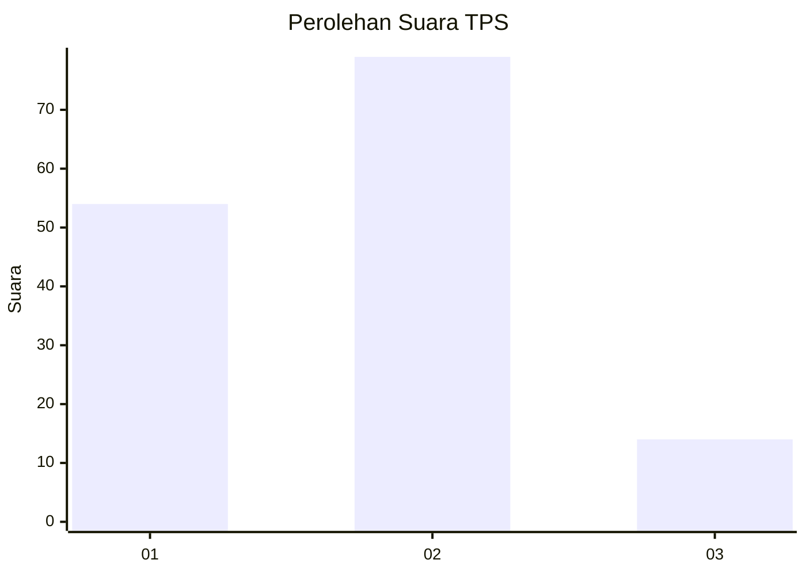

# Hasil

## Grafik

## Tabel

| No. | Nama Paslon    | Suara | Suara (raw) | Persentase |
|:--- |:-------------- | -----:| -----------:| ----------:|
| 1   | ANIES MUHAIMIN | 54    | [54][p-1]   | 36,73      |
| 2   | PRABOWO GIBRAN | 79    | [79][p-2]   | 53,74      |
| 3   | GANJAR MAHFUD  | 14    | [14][p-3]   | 9,52       |

[p-1]: https://github.com/gigit-pemilu/pemilu-2024/blob/main/pilpres/hitung-suara/sub/63-kalimantan-selatan/sub/02-kotabaru/sub/15-sungai-durian/sub/2001-buluh-kuning/sub/005-tps/sub/paslon-1.txt
[p-2]: https://github.com/gigit-pemilu/pemilu-2024/blob/main/pilpres/hitung-suara/sub/63-kalimantan-selatan/sub/02-kotabaru/sub/15-sungai-durian/sub/2001-buluh-kuning/sub/005-tps/sub/paslon-2.txt
[p-3]: https://github.com/gigit-pemilu/pemilu-2024/blob/main/pilpres/hitung-suara/sub/63-kalimantan-selatan/sub/02-kotabaru/sub/15-sungai-durian/sub/2001-buluh-kuning/sub/005-tps/sub/paslon-3.txt

## Foto C Plano

https://sirekap-obj-formc.kpu.go.id/262d/pemilu/ppwp/63/02/15/20/01/6302152001005-20240214-211607--a04cb105-7fec-404e-8718-42298d2218ec.jpg

https://sirekap-obj-formc.kpu.go.id/262d/pemilu/ppwp/63/02/15/20/01/6302152001005-20240214-211835--5f1d3445-f7ec-4ffd-abd2-6b0a95664e66.jpg

https://sirekap-obj-formc.kpu.go.id/262d/pemilu/ppwp/63/02/15/20/01/6302152001005-20240214-212014--6e0eea59-8ed8-461e-811f-c84375207ba1.jpg

## Metadata

| Key        | Value               |
| ---------- | ------------------- |
| Time Stamp | 2024-02-15 00:56:54 |

