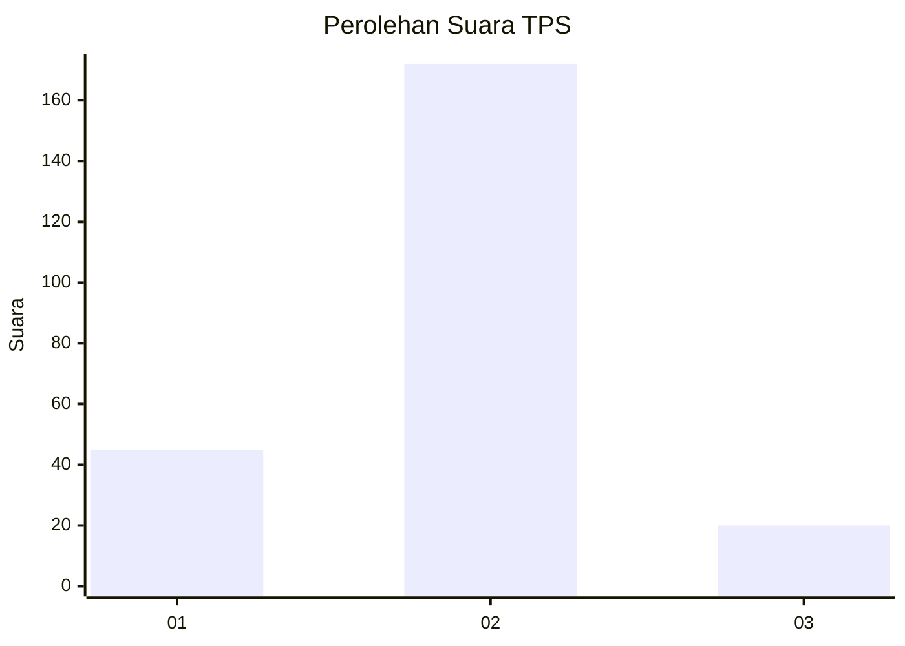
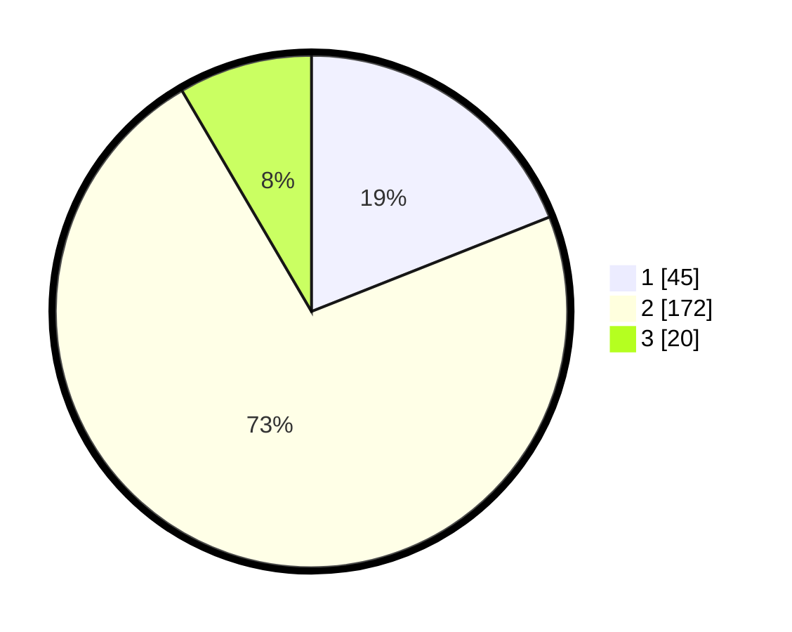

# Hasil

## Grafik

## Tabel

| No. | Nama Paslon    | Suara | Suara (raw) | Persentase |
|:--- |:-------------- | -----:| -----------:| ----------:|
| 1   | ANIES MUHAIMIN | 45    | [45][p-1]   | 18,99      |
| 2   | PRABOWO GIBRAN | 172   | [172][p-2]  | 72,57      |
| 3   | GANJAR MAHFUD  | 20    | [20][p-3]   | 8,44       |

[p-1]: https://github.com/gigit-pemilu/pemilu-2024-63-kalimantan-selatan/blob/main/pilpres/hitung-suara/sub/63-kalimantan-selatan/sub/02-kotabaru/sub/17-kelumpang-hilir/sub/2001-serongga/sub/001-tps/sub/paslon-1.txt
[p-2]: https://github.com/gigit-pemilu/pemilu-2024-63-kalimantan-selatan/blob/main/pilpres/hitung-suara/sub/63-kalimantan-selatan/sub/02-kotabaru/sub/17-kelumpang-hilir/sub/2001-serongga/sub/001-tps/sub/paslon-2.txt
[p-3]: https://github.com/gigit-pemilu/pemilu-2024-63-kalimantan-selatan/blob/main/pilpres/hitung-suara/sub/63-kalimantan-selatan/sub/02-kotabaru/sub/17-kelumpang-hilir/sub/2001-serongga/sub/001-tps/sub/paslon-3.txt

## Foto C Plano

https://sirekap-obj-formc.kpu.go.id/7a98/pemilu/ppwp/63/02/17/20/01/6302172001001-20240215-044956--129b0554-e486-4ebd-9290-d481592e14a2.jpg

https://sirekap-obj-formc.kpu.go.id/7a98/pemilu/ppwp/63/02/17/20/01/6302172001001-20240215-044904--f4f543c2-2634-4a0e-a68e-285b13121972.jpg

https://sirekap-obj-formc.kpu.go.id/7a98/pemilu/ppwp/63/02/17/20/01/6302172001001-20240215-045059--6911271f-b273-4599-83bb-583464cb0207.jpg

## Metadata

| Key        | Value               |
| ---------- | ------------------- |
| Time Stamp | 2024-02-17 16:52:47 |

