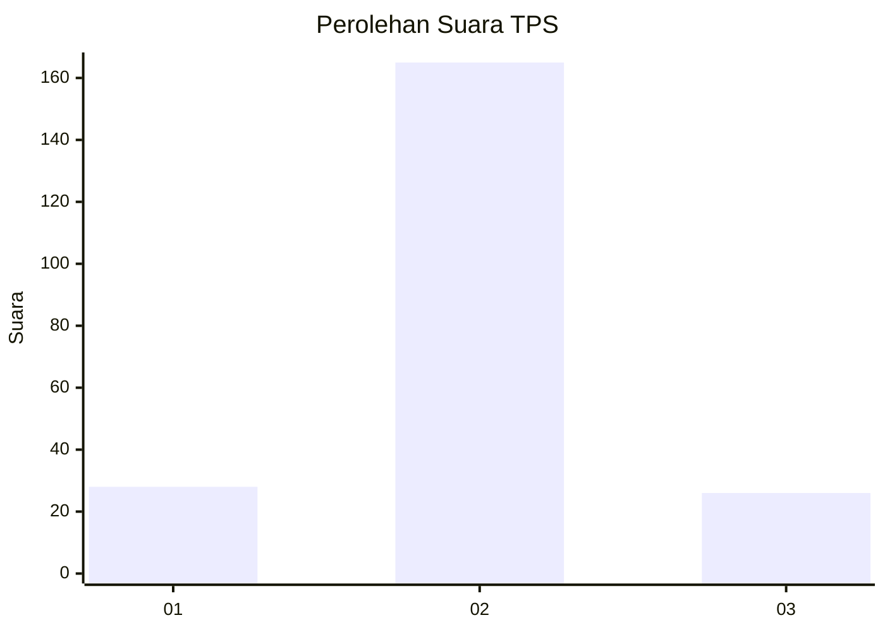
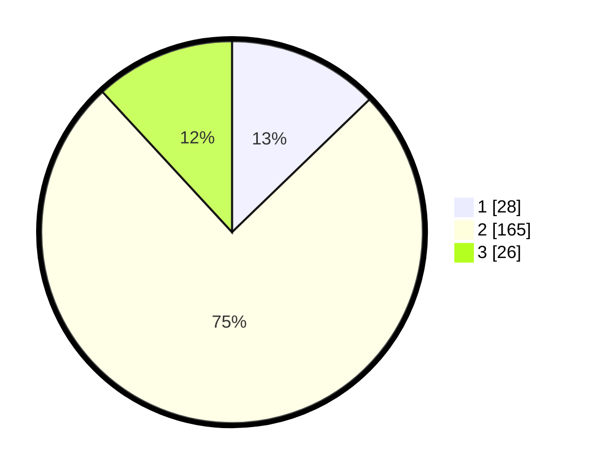

# Hasil

## Grafik

## Tabel

| No. | Nama Paslon    | Suara | Suara (raw) | Persentase |
|:--- |:-------------- | -----:| -----------:| ----------:|
| 1   | ANIES MUHAIMIN | 28    | [28][p-1]   | 12,79      |
| 2   | PRABOWO GIBRAN | 165   | [165][p-2]  | 75,34      |
| 3   | GANJAR MAHFUD  | 26    | [26][p-3]   | 11,87      |

[p-1]: https://github.com/gigit-pemilu/pemilu-2024-63-kalimantan-selatan/blob/main/pilpres/hitung-suara/sub/63-kalimantan-selatan/sub/02-kotabaru/sub/17-kelumpang-hilir/sub/2001-serongga/sub/004-tps/sub/paslon-1.txt
[p-2]: https://github.com/gigit-pemilu/pemilu-2024-63-kalimantan-selatan/blob/main/pilpres/hitung-suara/sub/63-kalimantan-selatan/sub/02-kotabaru/sub/17-kelumpang-hilir/sub/2001-serongga/sub/004-tps/sub/paslon-2.txt
[p-3]: https://github.com/gigit-pemilu/pemilu-2024-63-kalimantan-selatan/blob/main/pilpres/hitung-suara/sub/63-kalimantan-selatan/sub/02-kotabaru/sub/17-kelumpang-hilir/sub/2001-serongga/sub/004-tps/sub/paslon-3.txt

## Foto C Plano

https://sirekap-obj-formc.kpu.go.id/0154/pemilu/ppwp/63/02/17/20/01/6302172001004-20240215-024208--752259cb-930d-4f67-a005-2db28117298d.jpg

https://sirekap-obj-formc.kpu.go.id/0154/pemilu/ppwp/63/02/17/20/01/6302172001004-20240215-161352--29d169b9-2a77-41fd-99bd-ecc8fa3988d5.jpg

https://sirekap-obj-formc.kpu.go.id/0154/pemilu/ppwp/63/02/17/20/01/6302172001004-20240215-161231--0eac2c91-de36-471e-9227-bac270efc51f.jpg

## Metadata

| Key        | Value               |
| ---------- | ------------------- |
| Time Stamp | 2024-02-17 16:52:47 |

