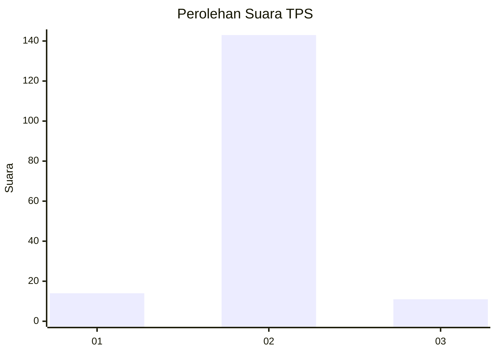
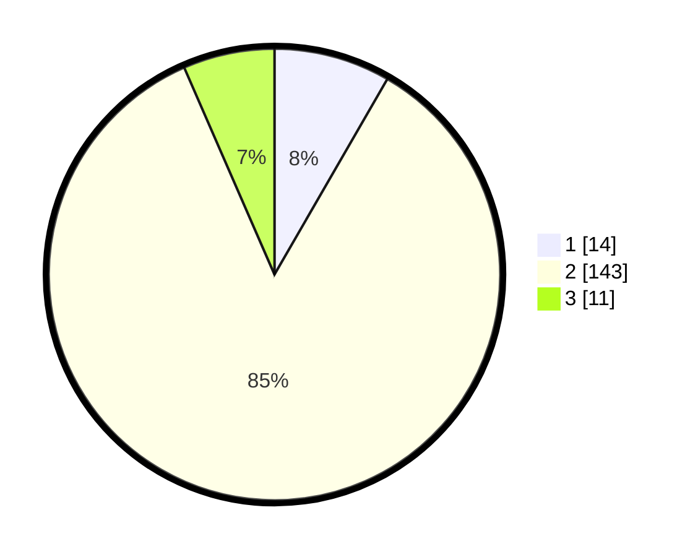

# Hasil

## Grafik

## Tabel

| No. | Nama Paslon    | Suara | Suara (raw) | Persentase |
|:--- |:-------------- | -----:| -----------:| ----------:|
| 1   | ANIES MUHAIMIN | 14    | [14][p-1]   | 8,33       |
| 2   | PRABOWO GIBRAN | 143   | [143][p-2]  | 85,12      |
| 3   | GANJAR MAHFUD  | 11    | [11][p-3]   | 6,55       |

[p-1]: https://github.com/gigit-pemilu/pemilu-2024/blob/main/pilpres/hitung-suara/sub/63-kalimantan-selatan/sub/02-kotabaru/sub/17-kelumpang-hilir/sub/2001-serongga/sub/005-tps/sub/paslon-1.txt
[p-2]: https://github.com/gigit-pemilu/pemilu-2024/blob/main/pilpres/hitung-suara/sub/63-kalimantan-selatan/sub/02-kotabaru/sub/17-kelumpang-hilir/sub/2001-serongga/sub/005-tps/sub/paslon-2.txt
[p-3]: https://github.com/gigit-pemilu/pemilu-2024/blob/main/pilpres/hitung-suara/sub/63-kalimantan-selatan/sub/02-kotabaru/sub/17-kelumpang-hilir/sub/2001-serongga/sub/005-tps/sub/paslon-3.txt

## Foto C Plano

https://sirekap-obj-formc.kpu.go.id/8d9c/pemilu/ppwp/63/02/17/20/01/6302172001005-20240214-232349--c267cc49-2910-4874-8321-23581d1d1141.jpg

https://sirekap-obj-formc.kpu.go.id/8d9c/pemilu/ppwp/63/02/17/20/01/6302172001005-20240214-223916--f8e164d6-d17d-4884-a08d-bc88f26e3e91.jpg

https://sirekap-obj-formc.kpu.go.id/8d9c/pemilu/ppwp/63/02/17/20/01/6302172001005-20240214-224425--0c84cac9-4efd-4067-b5cd-274fa108c34d.jpg

## Metadata

| Key        | Value               |
| ---------- | ------------------- |
| Time Stamp | 2024-02-19 06:16:00 |

