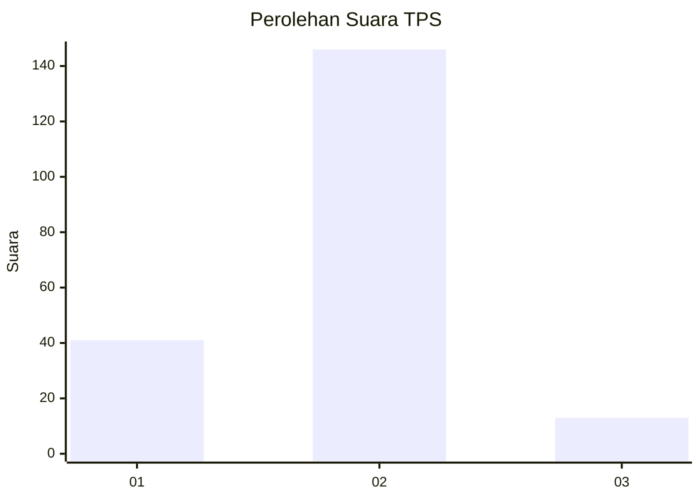

# Hasil

## Grafik

## Tabel

| No. | Nama Paslon    | Suara | Suara (raw) | Persentase |
|:--- |:-------------- | -----:| -----------:| ----------:|
| 1   | ANIES MUHAIMIN | 41    | [41][p-1]   | 20,50      |
| 2   | PRABOWO GIBRAN | 146   | [146][p-2]  | 73,00      |
| 3   | GANJAR MAHFUD  | 13    | [13][p-3]   | 6,50       |

[p-1]: https://github.com/gigit-pemilu/pemilu-2024-63-kalimantan-selatan/blob/main/pilpres/hitung-suara/sub/63-kalimantan-selatan/sub/02-kotabaru/sub/19-pamukan-barat/sub/2001-sengayam/sub/005-tps/sub/paslon-1.txt
[p-2]: https://github.com/gigit-pemilu/pemilu-2024-63-kalimantan-selatan/blob/main/pilpres/hitung-suara/sub/63-kalimantan-selatan/sub/02-kotabaru/sub/19-pamukan-barat/sub/2001-sengayam/sub/005-tps/sub/paslon-2.txt
[p-3]: https://github.com/gigit-pemilu/pemilu-2024-63-kalimantan-selatan/blob/main/pilpres/hitung-suara/sub/63-kalimantan-selatan/sub/02-kotabaru/sub/19-pamukan-barat/sub/2001-sengayam/sub/005-tps/sub/paslon-3.txt

## Foto C Plano

https://sirekap-obj-formc.kpu.go.id/ad87/pemilu/ppwp/63/02/19/20/01/6302192001005-20240217-125737--8e4a982f-96c8-47e5-8db9-de02ee5bbe99.jpg

https://sirekap-obj-formc.kpu.go.id/ad87/pemilu/ppwp/63/02/19/20/01/6302192001005-20240217-110408--1faee7b0-b8d6-4f43-90c2-f71ecab54f05.jpg

https://sirekap-obj-formc.kpu.go.id/ad87/pemilu/ppwp/63/02/19/20/01/6302192001005-20240217-110506--0f224e98-bacb-4c8a-b45b-6b59bd37043b.jpg

## Metadata

| Key        | Value               |
| ---------- | ------------------- |
| Time Stamp | 2024-02-17 16:52:47 |

