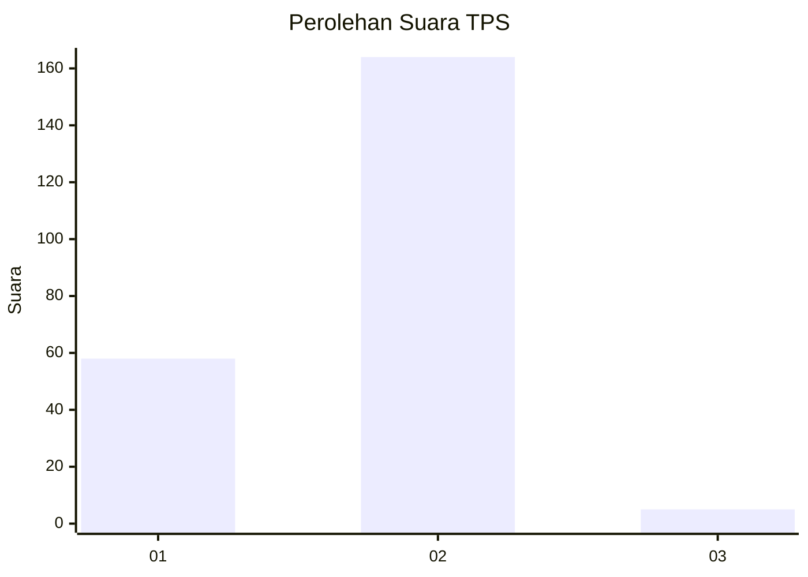
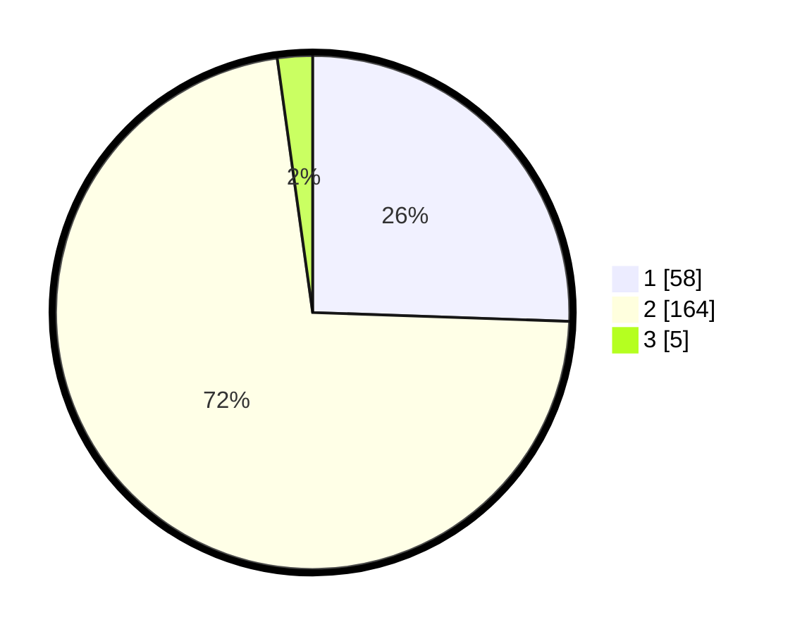

# Hasil

## Grafik

## Tabel

| No. | Nama Paslon    | Suara | Suara (raw) | Persentase |
|:--- |:-------------- | -----:| -----------:| ----------:|
| 1   | ANIES MUHAIMIN | 58    | [58][p-1]   | 25,55      |
| 2   | PRABOWO GIBRAN | 164   | [164][p-2]  | 72,25      |
| 3   | GANJAR MAHFUD  | 5     | [5][p-3]    | 2,20       |

[p-1]: https://github.com/gigit-pemilu/pemilu-2024-63-kalimantan-selatan/blob/main/pilpres/hitung-suara/sub/63-kalimantan-selatan/sub/02-kotabaru/sub/20-pulau-laut-kepulauan/sub/2001-tanjung-lalak-utara/sub/003-tps/sub/paslon-1.txt
[p-2]: https://github.com/gigit-pemilu/pemilu-2024-63-kalimantan-selatan/blob/main/pilpres/hitung-suara/sub/63-kalimantan-selatan/sub/02-kotabaru/sub/20-pulau-laut-kepulauan/sub/2001-tanjung-lalak-utara/sub/003-tps/sub/paslon-2.txt
[p-3]: https://github.com/gigit-pemilu/pemilu-2024-63-kalimantan-selatan/blob/main/pilpres/hitung-suara/sub/63-kalimantan-selatan/sub/02-kotabaru/sub/20-pulau-laut-kepulauan/sub/2001-tanjung-lalak-utara/sub/003-tps/sub/paslon-3.txt

## Foto C Plano

https://sirekap-obj-formc.kpu.go.id/916d/pemilu/ppwp/63/02/20/20/01/6302202001003-20240215-111307--7aca2793-d129-47ec-80ca-da818c15602f.jpg

https://sirekap-obj-formc.kpu.go.id/916d/pemilu/ppwp/63/02/20/20/01/6302202001003-20240215-111401--14f1d0a4-1c3a-4b82-a690-459446ce82be.jpg

https://sirekap-obj-formc.kpu.go.id/916d/pemilu/ppwp/63/02/20/20/01/6302202001003-20240215-111525--e7b891c4-6ffc-4cb1-9455-0d873c62f082.jpg

## Metadata

| Key        | Value               |
| ---------- | ------------------- |
| Time Stamp | 2024-02-16 06:30:27 |

