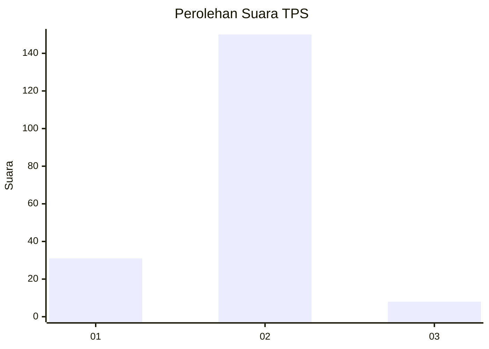
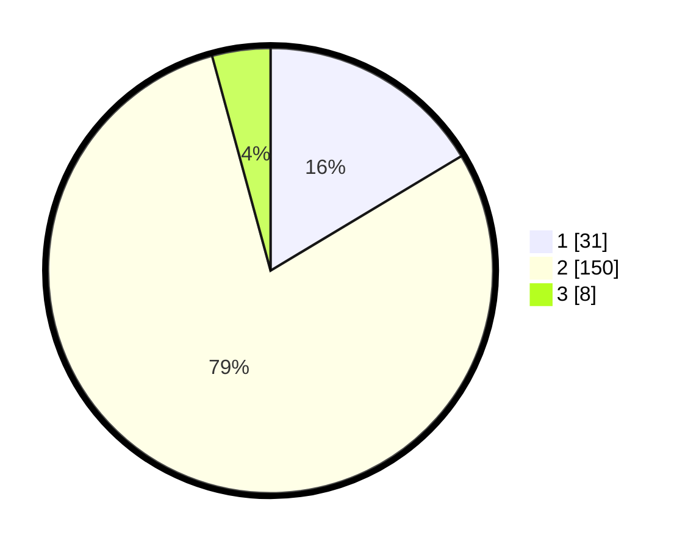

# Hasil

## Grafik

## Tabel

| No. | Nama Paslon    | Suara | Suara (raw) | Persentase |
|:--- |:-------------- | -----:| -----------:| ----------:|
| 1   | ANIES MUHAIMIN | 31    | [31][p-1]   | 16,40      |
| 2   | PRABOWO GIBRAN | 150   | [150][p-2]  | 79,37      |
| 3   | GANJAR MAHFUD  | 8     | [8][p-3]    | 4,23       |

[p-1]: https://github.com/gigit-pemilu/pemilu-2024/blob/main/pilpres/hitung-suara/sub/63-kalimantan-selatan/sub/02-kotabaru/sub/20-pulau-laut-kepulauan/sub/2002-tanjung-lalak-selatan/sub/002-tps/sub/paslon-1.txt
[p-2]: https://github.com/gigit-pemilu/pemilu-2024/blob/main/pilpres/hitung-suara/sub/63-kalimantan-selatan/sub/02-kotabaru/sub/20-pulau-laut-kepulauan/sub/2002-tanjung-lalak-selatan/sub/002-tps/sub/paslon-2.txt
[p-3]: https://github.com/gigit-pemilu/pemilu-2024/blob/main/pilpres/hitung-suara/sub/63-kalimantan-selatan/sub/02-kotabaru/sub/20-pulau-laut-kepulauan/sub/2002-tanjung-lalak-selatan/sub/002-tps/sub/paslon-3.txt

## Foto C Plano

https://sirekap-obj-formc.kpu.go.id/a4b4/pemilu/ppwp/63/02/20/20/02/6302202002002-20240215-010012--8b415cd5-eb14-4dce-abf2-485e32a38981.jpg

https://sirekap-obj-formc.kpu.go.id/a4b4/pemilu/ppwp/63/02/20/20/02/6302202002002-20240215-010142--150b1a72-7fff-4ae2-b696-32b3a1131f8c.jpg

https://sirekap-obj-formc.kpu.go.id/a4b4/pemilu/ppwp/63/02/20/20/02/6302202002002-20240215-010228--64efc6de-02ba-40e7-aa23-dc6e467c56a5.jpg

## Metadata

| Key        | Value               |
| ---------- | ------------------- |
| Time Stamp | 2024-02-19 06:16:00 |

