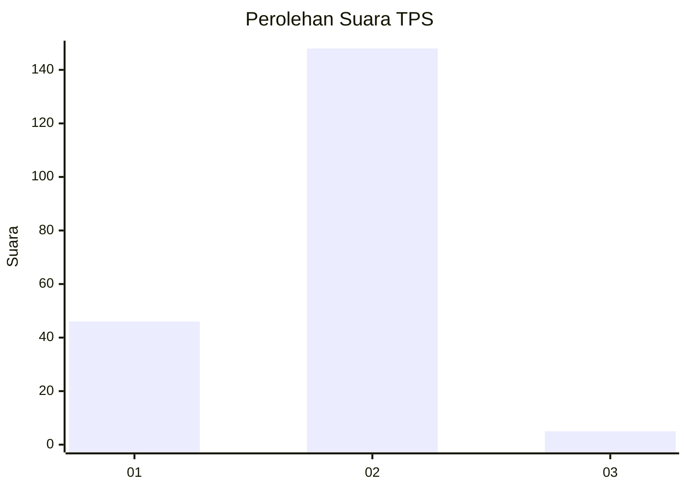
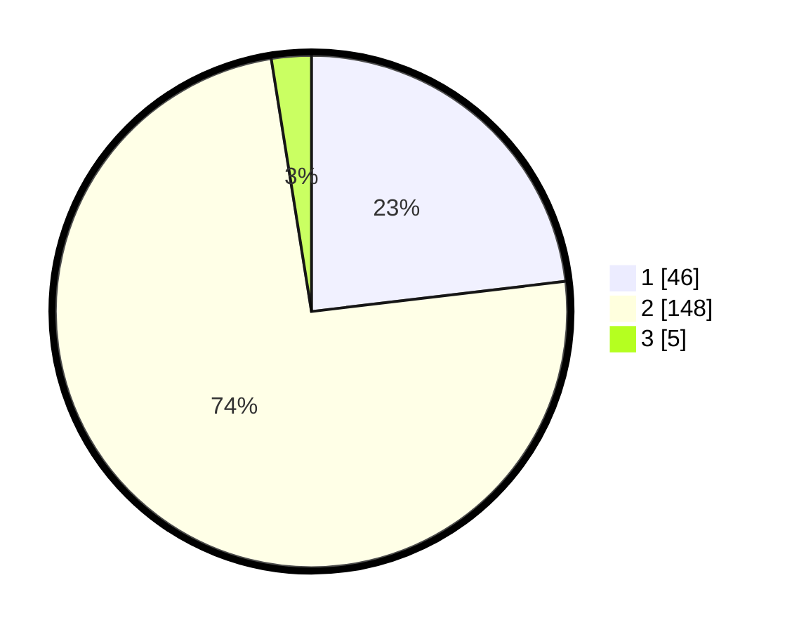

# Hasil

## Grafik

## Tabel

| No. | Nama Paslon    | Suara | Suara (raw) | Persentase |
|:--- |:-------------- | -----:| -----------:| ----------:|
| 1   | ANIES MUHAIMIN | 46    | [46][p-1]   | 23,12      |
| 2   | PRABOWO GIBRAN | 148   | [148][p-2]  | 74,37      |
| 3   | GANJAR MAHFUD  | 5     | [5][p-3]    | 2,51       |

[p-1]: https://github.com/gigit-pemilu/pemilu-2024/blob/main/pilpres/hitung-suara/sub/63-kalimantan-selatan/sub/02-kotabaru/sub/20-pulau-laut-kepulauan/sub/2003-pulau-kerayaan/sub/001-tps/sub/paslon-1.txt
[p-2]: https://github.com/gigit-pemilu/pemilu-2024/blob/main/pilpres/hitung-suara/sub/63-kalimantan-selatan/sub/02-kotabaru/sub/20-pulau-laut-kepulauan/sub/2003-pulau-kerayaan/sub/001-tps/sub/paslon-2.txt
[p-3]: https://github.com/gigit-pemilu/pemilu-2024/blob/main/pilpres/hitung-suara/sub/63-kalimantan-selatan/sub/02-kotabaru/sub/20-pulau-laut-kepulauan/sub/2003-pulau-kerayaan/sub/001-tps/sub/paslon-3.txt

## Foto C Plano

https://sirekap-obj-formc.kpu.go.id/9fd2/pemilu/ppwp/63/02/20/20/03/6302202003001-20240215-013120--19310141-7509-4cca-bcb9-2c622d6817a8.jpg

https://sirekap-obj-formc.kpu.go.id/9fd2/pemilu/ppwp/63/02/20/20/03/6302202003001-20240215-011126--94e6cebb-9452-4db9-8d99-971e6a12f445.jpg

https://sirekap-obj-formc.kpu.go.id/9fd2/pemilu/ppwp/63/02/20/20/03/6302202003001-20240215-013454--d6dbfe61-9196-449f-9b95-a81a4dda50d3.jpg

## Metadata

| Key        | Value               |
| ---------- | ------------------- |
| Time Stamp | 2024-02-19 06:16:00 |

