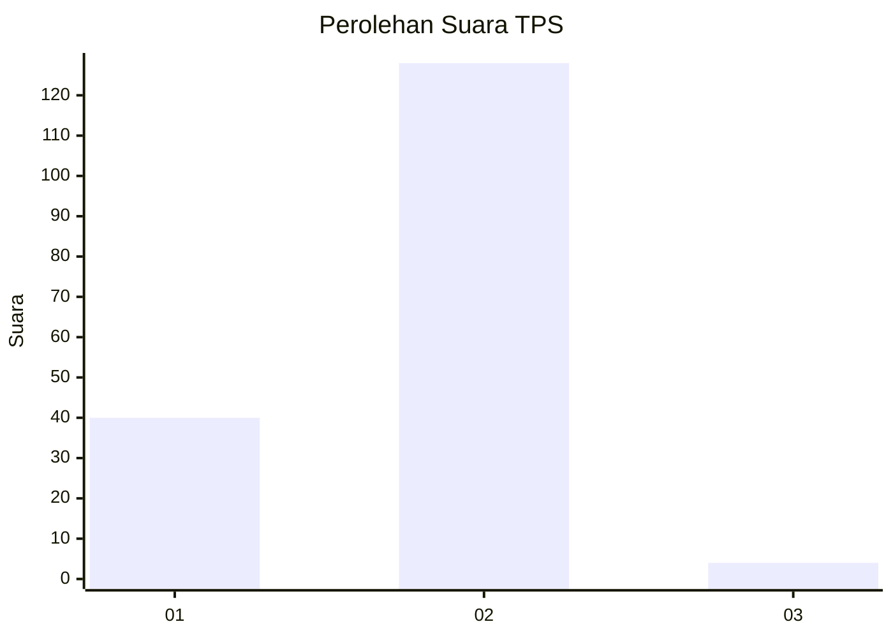
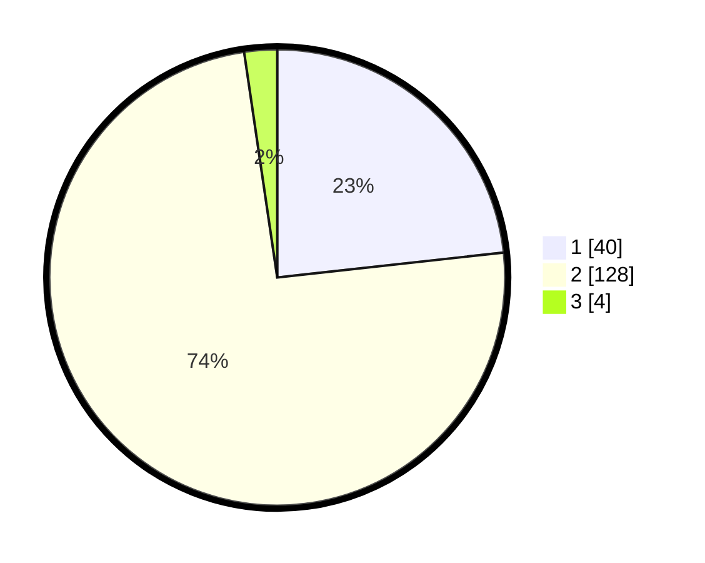

# Hasil

## Grafik

## Tabel

| No. | Nama Paslon    | Suara | Suara (raw) | Persentase |
|:--- |:-------------- | -----:| -----------:| ----------:|
| 1   | ANIES MUHAIMIN | 40    | [40][p-1]   | 23,26      |
| 2   | PRABOWO GIBRAN | 128   | [128][p-2]  | 74,42      |
| 3   | GANJAR MAHFUD  | 4     | [4][p-3]    | 2,33       |

[p-1]: https://github.com/gigit-pemilu/pemilu-2024-63-kalimantan-selatan/blob/main/pilpres/hitung-suara/sub/63-kalimantan-selatan/sub/02-kotabaru/sub/21-pulau-laut-tanjung-selayar/sub/2002-tanjung-sungkai/sub/004-tps/sub/paslon-1.txt
[p-2]: https://github.com/gigit-pemilu/pemilu-2024-63-kalimantan-selatan/blob/main/pilpres/hitung-suara/sub/63-kalimantan-selatan/sub/02-kotabaru/sub/21-pulau-laut-tanjung-selayar/sub/2002-tanjung-sungkai/sub/004-tps/sub/paslon-2.txt
[p-3]: https://github.com/gigit-pemilu/pemilu-2024-63-kalimantan-selatan/blob/main/pilpres/hitung-suara/sub/63-kalimantan-selatan/sub/02-kotabaru/sub/21-pulau-laut-tanjung-selayar/sub/2002-tanjung-sungkai/sub/004-tps/sub/paslon-3.txt

## Foto C Plano

https://sirekap-obj-formc.kpu.go.id/4131/pemilu/ppwp/63/02/21/20/02/6302212002004-20240214-141227--64d6ba13-3eca-470a-8722-c1a60a876617.jpg

https://sirekap-obj-formc.kpu.go.id/4131/pemilu/ppwp/63/02/21/20/02/6302212002004-20240214-141357--401326c7-bc83-460f-8c3d-10869bd5cd70.jpg

https://sirekap-obj-formc.kpu.go.id/4131/pemilu/ppwp/63/02/21/20/02/6302212002004-20240215-073753--1ecb5490-5295-4db7-846c-89fd74a6c8e0.jpg

## Metadata

| Key        | Value               |
| ---------- | ------------------- |
| Time Stamp | 2024-02-17 16:52:47 |

