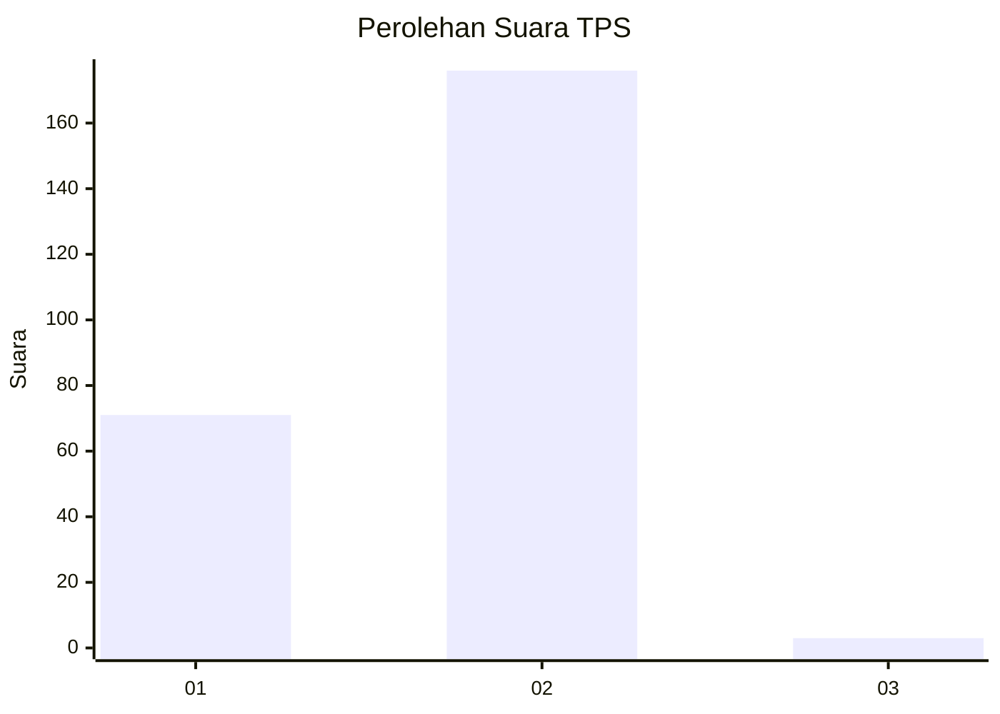
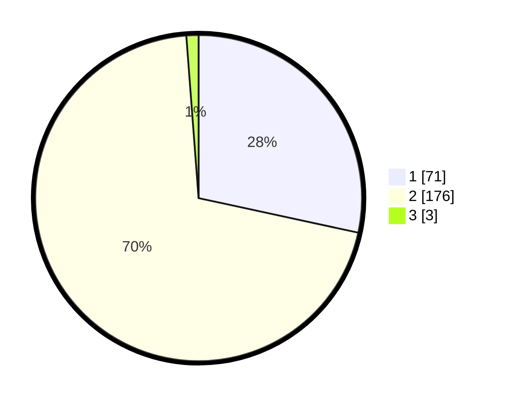

# Hasil

## Grafik

## Tabel

| No. | Nama Paslon    | Suara | Suara (raw) | Persentase |
|:--- |:-------------- | -----:| -----------:| ----------:|
| 1   | ANIES MUHAIMIN | 71    | [71][p-1]   | 28,40      |
| 2   | PRABOWO GIBRAN | 176   | [176][p-2]  | 70,40      |
| 3   | GANJAR MAHFUD  | 3     | [3][p-3]    | 1,20       |

[p-1]: https://github.com/gigit-pemilu/pemilu-2024-63-kalimantan-selatan/blob/main/pilpres/hitung-suara/sub/63-kalimantan-selatan/sub/02-kotabaru/sub/21-pulau-laut-tanjung-selayar/sub/2003-tanjung-tengah/sub/004-tps/sub/paslon-1.txt
[p-2]: https://github.com/gigit-pemilu/pemilu-2024-63-kalimantan-selatan/blob/main/pilpres/hitung-suara/sub/63-kalimantan-selatan/sub/02-kotabaru/sub/21-pulau-laut-tanjung-selayar/sub/2003-tanjung-tengah/sub/004-tps/sub/paslon-2.txt
[p-3]: https://github.com/gigit-pemilu/pemilu-2024-63-kalimantan-selatan/blob/main/pilpres/hitung-suara/sub/63-kalimantan-selatan/sub/02-kotabaru/sub/21-pulau-laut-tanjung-selayar/sub/2003-tanjung-tengah/sub/004-tps/sub/paslon-3.txt

## Foto C Plano

https://sirekap-obj-formc.kpu.go.id/200a/pemilu/ppwp/63/02/21/20/03/6302212003004-20240215-120858--03910ef1-5ae7-4f92-b3ba-41d0dea39ed5.jpg

https://sirekap-obj-formc.kpu.go.id/200a/pemilu/ppwp/63/02/21/20/03/6302212003004-20240215-120920--0b896728-c585-4584-a23f-8598c20fc3ee.jpg

https://sirekap-obj-formc.kpu.go.id/200a/pemilu/ppwp/63/02/21/20/03/6302212003004-20240215-120941--d92b4893-fc3e-4daf-9de5-3554c0acb526.jpg

## Metadata

| Key        | Value               |
| ---------- | ------------------- |
| Time Stamp | 2024-02-17 16:52:47 |

