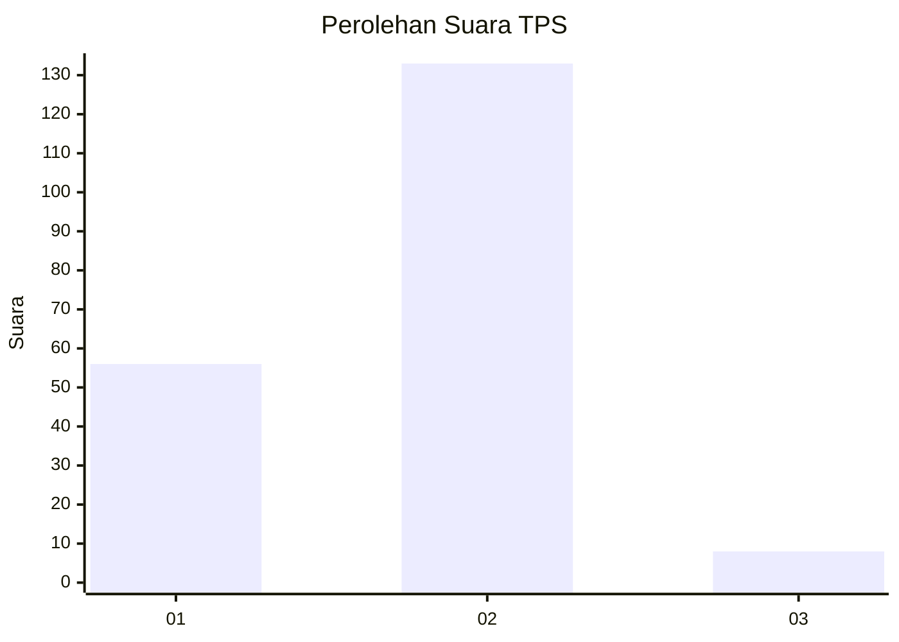
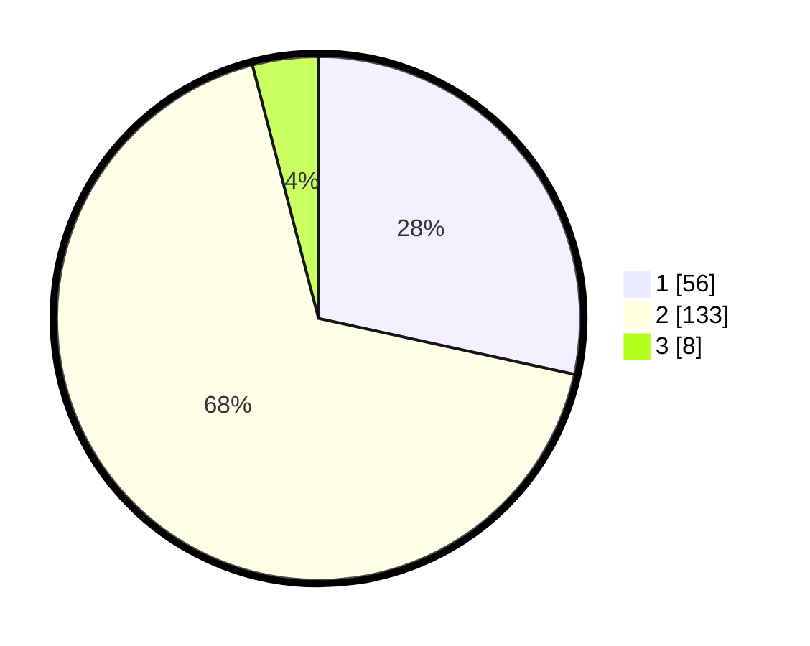

# Hasil

## Grafik

## Tabel

| No. | Nama Paslon    | Suara | Suara (raw) | Persentase |
|:--- |:-------------- | -----:| -----------:| ----------:|
| 1   | ANIES MUHAIMIN | 56    | [56][p-1]   | 28,43      |
| 2   | PRABOWO GIBRAN | 133   | [133][p-2]  | 67,51      |
| 3   | GANJAR MAHFUD  | 8     | [8][p-3]    | 4,06       |

[p-1]: https://github.com/gigit-pemilu/pemilu-2024-63-kalimantan-selatan/blob/main/pilpres/hitung-suara/sub/63-kalimantan-selatan/sub/02-kotabaru/sub/22-pulaulaut-sigam/sub/1009-baharu-selatan/sub/005-tps/sub/paslon-1.txt
[p-2]: https://github.com/gigit-pemilu/pemilu-2024-63-kalimantan-selatan/blob/main/pilpres/hitung-suara/sub/63-kalimantan-selatan/sub/02-kotabaru/sub/22-pulaulaut-sigam/sub/1009-baharu-selatan/sub/005-tps/sub/paslon-2.txt
[p-3]: https://github.com/gigit-pemilu/pemilu-2024-63-kalimantan-selatan/blob/main/pilpres/hitung-suara/sub/63-kalimantan-selatan/sub/02-kotabaru/sub/22-pulaulaut-sigam/sub/1009-baharu-selatan/sub/005-tps/sub/paslon-3.txt

## Foto C Plano

https://sirekap-obj-formc.kpu.go.id/1b4a/pemilu/ppwp/63/02/22/10/09/6302221009005-20240214-184710--052da6a4-f95d-4495-a665-830e3992a847.jpg

https://sirekap-obj-formc.kpu.go.id/1b4a/pemilu/ppwp/63/02/22/10/09/6302221009005-20240214-185119--1fd2e515-8709-44e4-986d-12144757af6d.jpg

https://sirekap-obj-formc.kpu.go.id/1b4a/pemilu/ppwp/63/02/22/10/09/6302221009005-20240214-185500--c1dd8e31-9993-4846-bea0-fea7c6f9e994.jpg

## Metadata

| Key        | Value               |
| ---------- | ------------------- |
| Time Stamp | 2024-02-17 18:00:00 |

