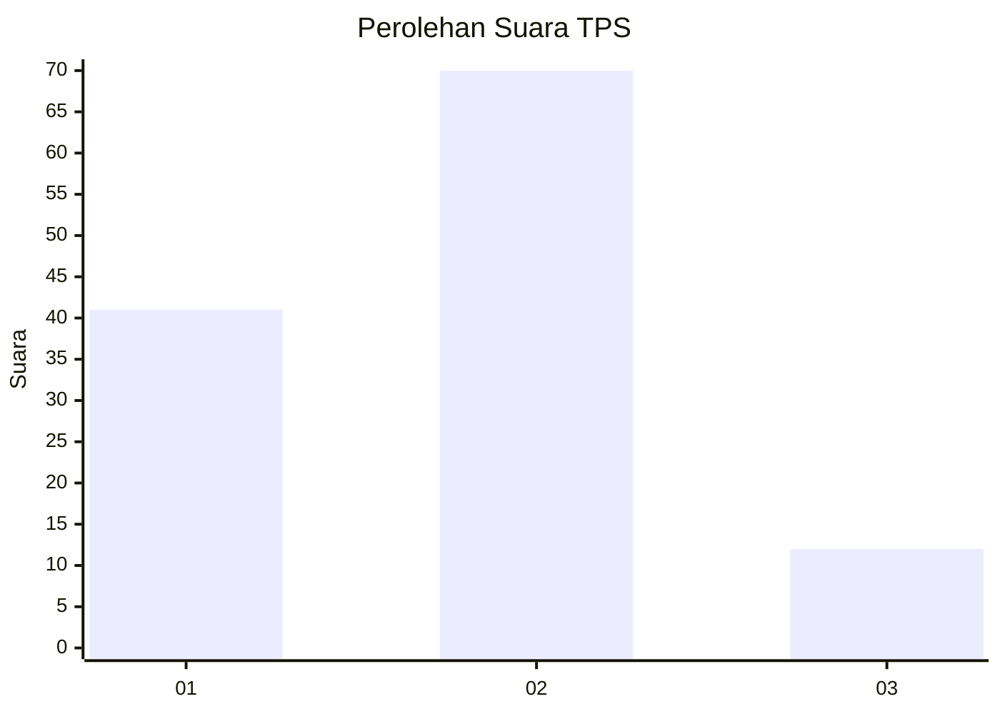
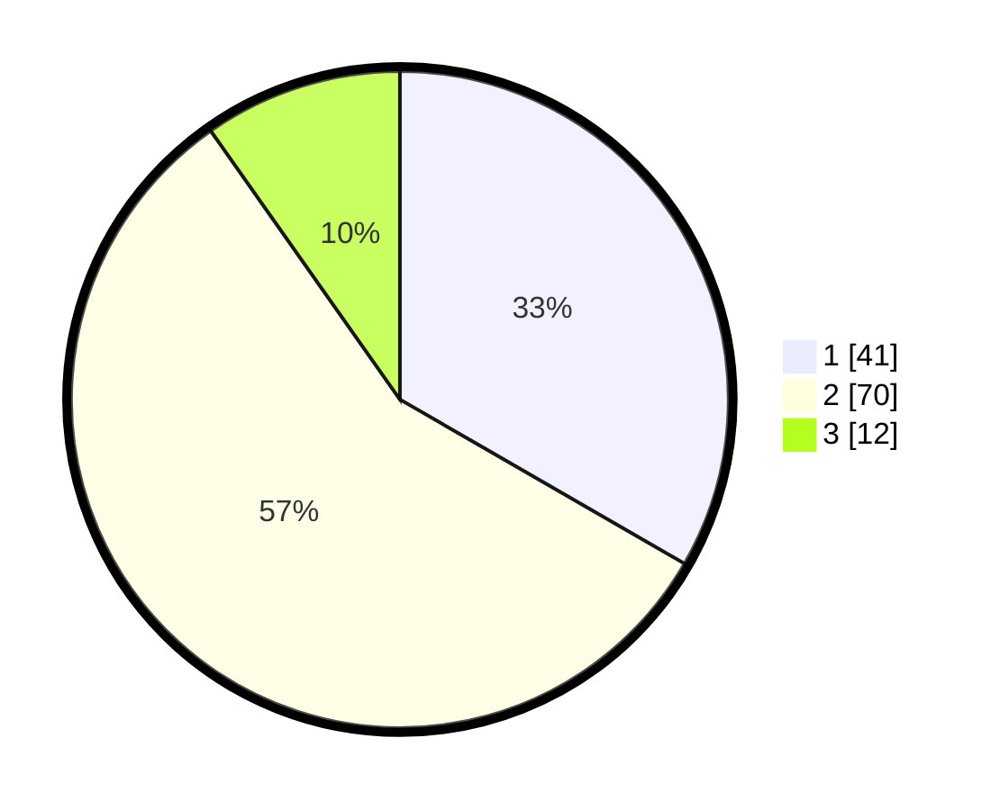

# Hasil

## Grafik

## Tabel

| No. | Nama Paslon    | Suara | Suara (raw) | Persentase |
|:--- |:-------------- | -----:| -----------:| ----------:|
| 1   | ANIES MUHAIMIN | 41    | [41][p-1]   | 33,33      |
| 2   | PRABOWO GIBRAN | 70    | [70][p-2]   | 56,91      |
| 3   | GANJAR MAHFUD  | 12    | [12][p-3]   | 9,76       |

[p-1]: https://github.com/gigit-pemilu/pemilu-2024/blob/main/pilpres/hitung-suara/sub/63-kalimantan-selatan/sub/03-banjar/sub/02-kertak-hanyar/sub/1001-kertak-hanyar-i/sub/003-tps/sub/paslon-1.txt
[p-2]: https://github.com/gigit-pemilu/pemilu-2024/blob/main/pilpres/hitung-suara/sub/63-kalimantan-selatan/sub/03-banjar/sub/02-kertak-hanyar/sub/1001-kertak-hanyar-i/sub/003-tps/sub/paslon-2.txt
[p-3]: https://github.com/gigit-pemilu/pemilu-2024/blob/main/pilpres/hitung-suara/sub/63-kalimantan-selatan/sub/03-banjar/sub/02-kertak-hanyar/sub/1001-kertak-hanyar-i/sub/003-tps/sub/paslon-3.txt

## Foto C Plano

https://sirekap-obj-formc.kpu.go.id/38ab/pemilu/ppwp/63/03/02/10/01/6303021001003-20240215-100653--2b118328-0cd1-425f-a0b9-950fc275ce2a.jpg

https://sirekap-obj-formc.kpu.go.id/38ab/pemilu/ppwp/63/03/02/10/01/6303021001003-20240215-100736--fd797667-0543-4c45-a654-4317b69cfda1.jpg

https://sirekap-obj-formc.kpu.go.id/38ab/pemilu/ppwp/63/03/02/10/01/6303021001003-20240215-100816--16969f20-b3ee-46a9-ab33-9efb7aad4664.jpg

## Metadata

| Key        | Value               |
| ---------- | ------------------- |
| Time Stamp | 2024-02-25 18:00:00 |

