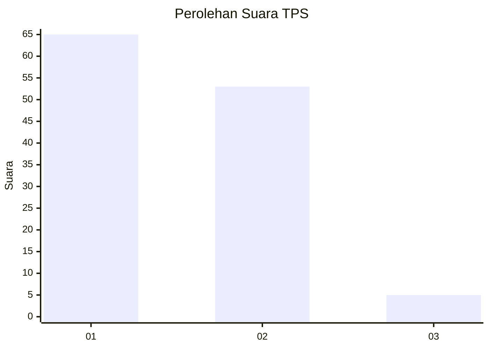
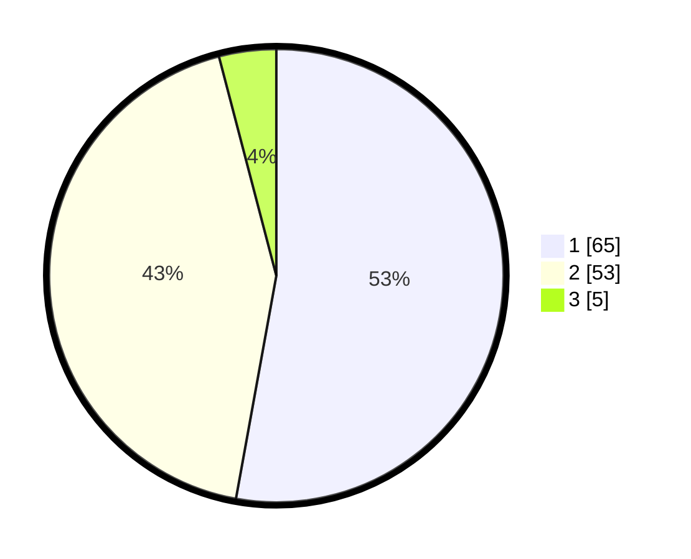

# Hasil

## Grafik

## Tabel

| No. | Nama Paslon    | Suara | Suara (raw) | Persentase |
|:--- |:-------------- | -----:| -----------:| ----------:|
| 1   | ANIES MUHAIMIN | 65    | [65][p-1]   | 52,85      |
| 2   | PRABOWO GIBRAN | 53    | [53][p-2]   | 43,09      |
| 3   | GANJAR MAHFUD  | 5     | [5][p-3]    | 4,07       |

[p-1]: https://github.com/gigit-pemilu/pemilu-2024/blob/main/pilpres/hitung-suara/sub/63-kalimantan-selatan/sub/03-banjar/sub/02-kertak-hanyar/sub/1001-kertak-hanyar-i/sub/013-tps/sub/paslon-1.txt
[p-2]: https://github.com/gigit-pemilu/pemilu-2024/blob/main/pilpres/hitung-suara/sub/63-kalimantan-selatan/sub/03-banjar/sub/02-kertak-hanyar/sub/1001-kertak-hanyar-i/sub/013-tps/sub/paslon-2.txt
[p-3]: https://github.com/gigit-pemilu/pemilu-2024/blob/main/pilpres/hitung-suara/sub/63-kalimantan-selatan/sub/03-banjar/sub/02-kertak-hanyar/sub/1001-kertak-hanyar-i/sub/013-tps/sub/paslon-3.txt

## Foto C Plano

https://sirekap-obj-formc.kpu.go.id/9daa/pemilu/ppwp/63/03/02/10/01/6303021001013-20240215-035245--5659ed4d-854f-4b30-8b07-49a245bfbf00.jpg

https://sirekap-obj-formc.kpu.go.id/9daa/pemilu/ppwp/63/03/02/10/01/6303021001013-20240215-035307--8cbf0243-2b29-4629-b4b5-e5cf417bb599.jpg

https://sirekap-obj-formc.kpu.go.id/9daa/pemilu/ppwp/63/03/02/10/01/6303021001013-20240215-035322--8095a95d-be53-4edb-b271-89dbded316de.jpg

## Metadata

| Key        | Value               |
| ---------- | ------------------- |
| Time Stamp | 2024-02-24 22:31:28 |

